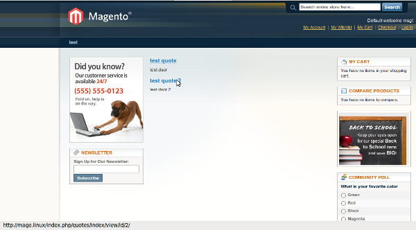

Magento - это одна из самых сложных для программиста платформ. Но это только на первый взгляд. В следующих нескольких статьях я опровергну это на примере создания CRUD модуля цитат! Итак поехали :)

## Начало

Создадим структуру директорий и файлов для нашего модуля

```bash
|-app
|---code
|-----local
|-------Freaks
|---------Quotes
|-----------Block
|-------------Content.php
|-----------controllers
|-------------IndexController.php
|-----------etc
|-------------config.xml
|-----------Model
|---design
|-----frontend
|-------base
|---------default
|-----------layout
|-------------freaks
|---------------quotes.xml
|---etc
|-----modules
|-------Freaks_All.xml
```

Создаем файл **config.xml**

```xml
<?xml version="1.0"?>
<config>
    <modules>
        <Freaks_Quotes>
            <version>0.1.0</version>
        </Freaks_Quotes>
    </modules>
    <global>
        <blocks>
            <freaks_quotes>
                <class>Freaks_Quotes_Block</class>
            </freaks_quotes>
        </blocks>
    </global>
    <frontend>
        <routers>
            <Freaks_Quotes>
                <use>standard</use>
                <args>
                    <module>Freaks_Quotes</module>
                    <frontName>quotes</frontName>
                </args>
            </Freaks_Quotes>
        </routers>
        <layout>
            <updates>
                <freaks_quotes>
                    <file>freaks/quotes.xml</file>
                </freaks_quotes>
            </updates>
        </layout>
    </frontend>
</config>
```

Немного объясню что это все значит:

*   секция _modules_ отвечают за версию вашего модуля. Это нужно, чтобы потом можно было обновить модуль, когда будет выпущена новая версия
*   _blocks_ - указывает движку, где находятся блоки для отображения (по своей сути Magento отображает весь контент у виде вложеных блоков, что-то похожее на [_Drupal_](http://drupal.org/), если кто-то сталкивался)
*   _frontend/routes_ - указываем _routing_, наш модуль на frontend-е будет доступен по адресу "/quotes"
*   _frontend/layout/updates_ - указывает, какой файл отвечает за изменение макета, когда наш модуль включен

Чтобы модуль можно было начать тестировать, нужно для начала его включить. Открываем файл **app/etc/modules/Freaks\_All.xml**

```xml
<?xml version="1.0"?>
<config>
    <modules>
        <Freaks_Quotes>
            <active>true</active>
            <codePool>local</codePool>
        </Freaks_Quotes>
    </modules>
</config>
```

Открываем файл **app/design/frontend/base/default/layout/freaks/quotes.xml**. Это layout-файл, который отвечает за отображение блоков при запросе пользователя.

```xml
<?xml version="1.0"?>
<layout version="0.1.0">
    <freaks_quotes_index_index>
        <reference name="content">
            <block type="freaks_quotes/content" name="quotes.all" />
        </reference>
    </freaks_quotes_index_index>
</layout>
```

_freaks\_quotes\_index\_index_ - это один из _handle_\-ов, которые генерирует Magento, когда открывается страница. В нашем случае мы говорим, что когда в нас модуль = freaks\_quotes, контроллер = index и действие = index, тогда обращаемся к блоку контент посредством директивы _reference_ и добавляем в него новый блок, который мы создали.

Теперь создаем контроллер, в нашем случае он очень простой, так как все что нужно сделать описано в layout файле.

```php
<?php
class Freaks_Quotes_IndexController extends Mage_Core_Controller_Front_Action
{
    public function indexAction()
    {
        $this->loadLayout()
            ->renderLayout();
    }
}
```

Создадим блок, который будет выводит наш контент. Для тестирования просто выведем название нашего модуля

```php
<?php
class Freaks_Quotes_Block_Content extends Mage_Core_Block_Template
{
    protected function _toHtml()
    {
        return 'Freaks_Quotes';
    }
}
```

И последнее - заходим в панель администратора и там **System** \> **Configuration** \> **Advanced** \> **Advanced** . Нажимаем кнопку **Save Config** (это нужно, чтобы разрешить выводить контент на сайте для нашего модуля.). Чистим кэш и заходим на нашу страничку цитат. На моем локальном компьютере - это http://mage.linux/quotes.

Если все работает я Вас поздравляю, если нет можете написать мне на почту, я с удовольствием Вам помогу.

## База данных и модели

Изменим структуру директорий следующим образом

```bash
|-app
|---code
|-----local
|-------Freaks
|---------Quotes
|-----------Block
|-----------controllers
|-----------etc
|-----------Helper
|-------------Data.php
|-----------Model
|-------------Resource
|---------------Quote
|-----------------Collection.php
|---------------Quote.php
|-------------Quote.php
|-----------sql
|-------------freaks_quotes_setup
|---------------mysql4-install-0.2.0.php
```

Для управлением данными в Magento используются модели. Для одной таблицы нужно создать 3 модели, одна для управления бизнес логикой, вторая - называется _resource_ модель, используется для непосредственной работы с базой данных и третья - для управления обновлениями. Вся информация о связях моделей находится в **config.xml**. Изменим его с учетом этого

```xml
<?xml version="1.0"?>
<config>
    <modules>
        <Freaks_Quotes>
            <version>0.2.0</version>
        </Freaks_Quotes>
    </modules>
    <global>
        <blocks>
            <freaks_quotes>
                <class>Freaks_Quotes_Block</class>
            </freaks_quotes>
        </blocks>
        <helpers>
            <freaks_quotes><class>Freaks_Quotes_Helper</class></freaks_quotes>
        </helpers>
        <models>
            <freaks_quotes>
                <class>Freaks_Quotes_Model</class>
                <resourceModel>quotes_resource</resourceModel>
            </freaks_quotes>
            <quotes_resource>
                <class>Freaks_Quotes_Model_Resource</class>
                <entities>
                    <quote>
                        <table>freaks_quotes</table>
                    </quote>
                </entities>
            </quotes_resource>
        </models>
        <resources>
            <freaks_quotes_setup>
                <setup>
                    <module>Freaks_Quotes</module>
                </setup>
                <connection>
                    <use>core_setup</use>
                </connection>
            </freaks_quotes_setup>
            <freaks_quotes_write>
                <connection>
                    <use>core_write</use>
                </connection>
            </freaks_quotes_write>
            <freaks_quotes_read>
                <connection>
                    <use>core_read</use>
                </connection>
            </freaks_quotes_read>
        </resources>
    </global>
    <frontend>
        <routers>
            <freaks_quotes>
                <use>standard</use>
                <args>
                    <module>Freaks_Quotes</module>
                    <frontName>quotes</frontName>
                </args>
            </freaks_quotes>
        </routers>
        <layout>
            <updates>
                <freaks_quotes>
                    <file>freaks/quotes.xml</file>
                </freaks_quotes>
            </updates>
        </layout>
    </frontend>
</config>
```

Теперь посмотрим, что и зачем было добавлено в конфигурацию

*   _helpers_ - указывает суфикс класса-помощника, который понадобится в дальнейшем в шаблонах і блоках
*   _models_ - модели для работы с базой данных и связь ресурс-модели и бизнес модели. _resourceModel_ - это имя элемента xml-конфигурации, в котором описывается ресурс-модель
*   _resources_ - указывает, модели для работы с данными для записи, чтения и обновления (или установки модуля)

Будьте внимательны и не забудьте поменять версию модуля в настройках, иначе файли установки модуля не будут выполнены!

Создадим модели. Открываем **app/code/local/Freaks/Quotes/Model/Quote.php**

```php
<?php
class Freaks_Quotes_Model_Quote extends Mage_Core_Model_Abstract
{
    protected function _construct()
    {
        $this->_init('freaks_quotes/quote');
    }
}
```

этот код на самом деле почти ничего не делает :). Он всего лишь привязывает ресурс-модель к бизнес-модели. Создадим же теперь ресурс-модель в **app/code/local/Freaks/Quotes/Model/Resource/Quote.php**

```php
<?php
class Freaks_Quotes_Model_Resource_Quote extends Mage_Core_Model_Mysql4_Abstract
{
    protected function _construct()
    {
        $this->_init('freaks_quotes/quote', 'id');
    }
}
```

На удивление код почти идентичен :), но делает он совсем другое... Эти строки значат, что нужно обратится в xml-конфигурацию по пути `**config** > **global** > **models** > **quotes_resource** > **entities** > **quote**`, чтобы узнать имя таблицы.

Теперь создадим модель-коллекции ресурс-модели. На самом деле, это обычный класс, который отвечает за работу с набором моделей, поэтому я не упоминал об этом классе, как об отдельной модели. Редактируем **app/code/local/Freaks/Quotes/Model/Resource/Quote/Collection.php**

```php
<?php
class Freaks_Quotes_Model_Resource_Quote_Collection extends Mage_Core_Model_Mysql4_Collection_Abstract
{
    protected function _construct()
    {
        $this->_init('freaks_quotes/quote');
    }
}
```

В конструкторе задаем набор каких моделей будет содержать наша коллекция.

На конец осталось создать только файли установки модуля. Открываем **app/code/local/Freaks/Quotes/sql/quotes\_setup****/mysql4-install-0.2.0.php**

```php
<?php
$installer = $this;
$installer->startSetup();

$installer->run("
CREATE TABLE `{$this->getTable('freaks_quotes/quote')}` (
 `id` int(10) unsigned NOT NULL AUTO_INCREMENT,
 `name` varchar(255) NOT NULL,
 `dscr` mediumtext NOT NULL,
 PRIMARY KEY (`id`)
) ENGINE=InnoDB DEFAULT CHARSET=utf8
");

$installer->endSetup();
```

После первого запроса на сайт, этот файл будет выполнен. Пробуем и смотрим, что же получилось. Добавим несколько строк тестовых данных в базу через любой удобный для вас UI (я, например, использую [phpMyAdmin](http://www.phpmyadmin.net/home_page/downloads.php)).

## Блоки и шаблоны

По сколько модели созданы теперь можно работать с данными через очень простой интерфейс. Отредактируем наш блок (**app/code/local/Freaks/Quotes/Block/Content.php**)

```php
<?php
class Freaks_Quotes_Block_Content extends Mage_Core_Block_Template
{
    protected function _construct()
    {
        $this->setTemplate('freaks/quotes/view.phtml');
    }

    public function getRowUrl(Freaks_Quotes_Model_Quote $quote)
    {
        return $this->getUrl('*/*/view', array(
            'id' => $quote->getId()
        ));
    }

    public function getCollection()
    {
        return Mage::getModel('freaks_quotes/quote')->getCollection();
    }
}
```

В конструкторе блока устанавливаем ему шаблон, который будет отображать список цитат. Давайте создадим же этот файл (**app/design/frontend/base/default/template/freaks/quotes/view.phtml**)

```php
<?php foreach ($this->getCollection() as $quote): ?>
<div class="quote-item">
    <h4><a href="<?php echo $this->getRowUrl($quote) ?>"><?php echo $quote->getName() ?></a></h4>
    <p><?php echo $quote->getDscr() ?></p>
</div>
<?php endforeach ?>
```

У меня он очень простой, вы же можете пофантазировать и поработать творчески ;) Обновим нашу страничку и смотрим результат

Чтобы просматривать цытаты нужно создать _viewAction_ в контроллере, блок и еще один шаблон. Приступим, редактируем **app/code/local/Freaks/Quotes/controllers/indexController.php**

```php
<?php
class Freaks_Quotes_IndexController extends Mage_Core_Controller_Front_Action
{
     public function indexAction()
     {
        $this->loadLayout()
            ->renderLayout();
     }

     public function viewAction()
     {
         $quote_id = (int)$this->getRequest()->getParam('id');
         if (!$quote_id) {
             $this->_forward('noRoute');
         }
         $this->loadLayout();
         $this->getLayout()
            ->getBlock('quote.item')
            ->setQuoteId($quote_id);
         $this->renderLayout();
     }
}
```

Поскольку блоки наследуются от _Varien\_Object_ класса, то в него можно передать любое значение посредством сеттеров и геттеров. Именно таким образом передаем идентификатор цитаты в блок.

Создадим _helper_ для модуля, так как в шаблонах нам нужно будет переводить строки. Открываем **app/code/local/Freaks/Quotes/Helper/Data.php**

```php
<?php
class Freaks_Quotes_Helper_Data extends Mage_Core_Helper_Abstract
{
}
```

Да вот такой у нас "сложный" _helper_ :)

В _layout_\-конфигурации создадим _handle_ для _viewAction_\-а, в котором в контент подключим блок для отображения одной цитаты (**app/design/frontend/base/default/layout/freaks/quotes.xml**)

```xml
<?xml version="1.0"?>
<layout version="0.1.0">
    <freaks_quotes_index_index>
        <reference name="content">
            <block type="freaks_quotes/content" name="quotes.all" />
        </reference>
    </freaks_quotes_index_index>

    <freaks_quotes_index_view>
        <reference name="content">
            <block type="freaks_quotes/quote_content" name="quote.item" />
        </reference>
    </freaks_quotes_index_view>
</layout>
```

Создаем блок **app/code/local/Freaks/Quotes/Block/Quote/Content.php**

```php
<?php
class Freaks_Quotes_Block_Quote_Content extends Mage_Core_Block_Template
{
    protected function _construct()
    {
        $this->setTemplate('freaks/quotes/quote/view.phtml');
    }

    public function getQuote()
    {
        return Mage::getModel('freaks_quotes/quote')->load($this->getQuoteId());
    }
}
```

Ну и последнее - шаблон **app/design/frontend/base/default/template/freaks/quotes/quote/view.phtml**

```php
<?php $quote = $this->getQuote() ?>
<h1><?php echo Mage::helper('freaks_quotes')->__('View quote "%s"', $quote->getName()) ?></h1>
<p><?php echo $quote->getDscr() ?></p>
```

Проверяем результат :)


Вот и все. В следующей статье создадим модуль для редактирования цитат в административной панели.

Этот модуль можно скачать [ЗДЕСЬ](./FreaksQuotes.tar.bz2).
