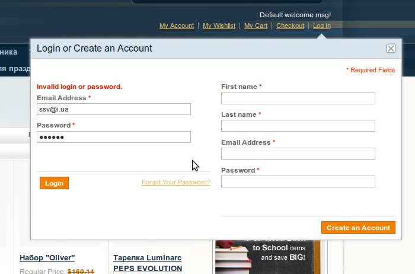

[В одной из предыдущих статтей](../ajax-formy-v-magento) был создан JavaScript класс формы, которая умеет отправлять данные AJAX-ом. Самое время задействовать его на практике.

## Как всегда

Все начинается из [создания нового модуля](../../2011-01/magento-sozdanie-crud-modulya). Стандартный модуль, в котором добавляем новый путь в роутинге (ajax) и добавляем layout-update, который подключает на страницу css и js отвечающие за работу всплывающего окна логин формы.

## Контроллер и Защита

Создадим контроллер, который наследуется от `Mage_Customer_AccountController`. Работа с AJAX в Magento достаточна проста, благодаря гибкому механизму и универсальному классу `Varien_Object`. Пример реализации ответа может выглядеть следующим образом

```php
class Freaks_Ajax_Customer_AccountController extends Mage_Customer_AccountController
{
    public function loginCustomerAction()
    {
        $response = $this->getResponse();
        $request  = $this->getRequest();
        $result   = new Varien_Object();

        if ($this->_getSession()->isLoggedIn() || !$request->isPost()) {
            $result->redirect = Mage::getUrl('*/*/');
            return $response->setBody($result->toJSON());
        }

        $login = $request->getPost('login');
        if (empty($login['username']) || empty($login['password'])) {
            $result->error = $this->__('Login and password are required.');
            return $response->setBody($result->toJSON());
        }

        // do login and there are a few lines of code

        return $response->setBody($result->toJSON());
    }
}
```

Еще очень важным моментом является то, что имена методов регистрации и авторизации должны начинаться с **create** и **login** соответственно. Если открыть и посмотреть исходный код класса `Mage_Customer_AccountController`, увидим что у него метод **preDispatch** проверяет имя метода и если оно не соответствует одному из списка разрешенных (доступных без авторизации), то мы получим ошибку в ответе.

Далее в моем тяжелом деле помог копипаст, потому что изначально разработчики Magento не продумали возможность авторизации с помощью AJAX, пришлось скопировать обычные методы логина и регистрации и немного их подправить.

Хотя данные и отправляются асинхронным методом, это не значит, что какой-то спам-бот не будет забивать нам базу новыми пользователями. Поэтому я реализовал защиту з помощью скрытого поля или [honey protection](http://en.wikipedia.org/wiki/Honeypot_(computing)) (или [здесь](http://habrahabr.ru/blogs/spam/127604/)).

## Клиентская часть

Исходники приводить не буду так как там ничего интересного. Просто создается 2 объекта класса **FreaksForm**, а также логика отвечающая за появление и скрытие логин попапа. Вот что получилось



Исходники модуля можно скачать [здесь](./Freaks_Ajax.zip)
