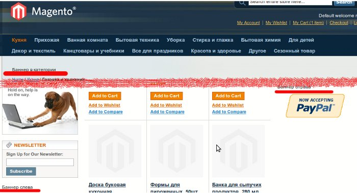

Проблемы - неотъемлемая часть прогресса. Одна из них возникла передо мной, когда заказчик захотел размещать банеры на сайте под управлением Magento. Думаю большинство из нас знает любимые слова великого Цезаря: Разделяй и Властвуй. Так давайте же последуем его совету.

## Разделяем на группы

Для начала добавим возможность разделять статические блоки на группы через административную панель. Наверно ни для кого не секрет, что все начнется из [создания модуля](../../2011-01/magento-sozdanie-crud-modulya) и закончится [готовым решением](./Freaks_Banners.zip).

Для начала напишем **sql-install** для модуля. С его помощью добавим новое поле в mysql таблицу cms\_block и поставим на него индекс. Для того, чтобы этот код выполнился не забываем указать в конфигурационном файле модуля в секции **resources** setup модель!

```php
 /* @var $installer Mage_Core_Model_Resource_Setup */
$installer = $this;

$installer->startSetup();

$installer->run("
ALTER TABLE {$this->getTable('cms/block')}
    ADD COLUMN frk_group_id VARCHAR(255),
    ADD INDEX frk_group_idx(frk_group_id);
");

$installer->endSetup();
```

Поле текстовое, потому что в будущем понадобится прописывать имя группы в layout-update-ах. Думаю не очень читабельным будет увидеть цифру посреди xml.

Поскольку переписыванием (реврайтом) коровских классов занятие довольно стремное, может повлечь за собой конфликты с другими расширениями, нужно найти подходящее событие на которое можно повесить обсервера. Более подходящего чем **adminhtml\_block\_html\_before** к сожалению найти не удалось.

Обсервер просто добавит новое поле в форму, но сложность в том что нужно определить, какой из блоков наша форма, именно та которая нужна

```php
<?php
class Freaks_Banners_Model_Observer
{
    /**
     * Add a customer order comment when the order is placed.
     * Listen "adminhtml_block_html_before" event
     *
     * @param Varien_Event_Observer $observer
     * @return Freaks_Banners_Model_Observer
     */
    public function addGroupField(Varien_Event_Observer $observer)
    {
        $block  = $observer->getEvent()->getBlock();
        $parent = $block->getParentBlock();

        if (!$parent || 'cms_block_edit' != $parent->getNameInLayout()) {
            return $this;
        }

        $model = Mage::registry('cms_block');
        $form  = $block->getForm();
        $form->getElement('base_fieldset')->addField('frk_group_id', 'select', array(
            'label'     => Mage::helper('freaks_banners')->__('Group'),
            'title'     => Mage::helper('freaks_banners')->__('Group'),
            'name'      => 'frk_group_id',
            'required'  => false,
            'options'   => Mage::helper('freaks_banners')->getBannerGroups(),
        ), 'identifier');
        $form->setValues($model->getData());

        return $this;
    }
}
```

Все формы в админке Magento состоят из 2 частей: контейнера и блока отвечающего за вывод формы. Контейнер определен в layout-е и имеет имя в нашем случае **cms\_block\_edit**. Поскольку он является родителем для блока контейнера формы, то можно достаточно просто его определить и добавить новое поле.

Метод **getBannerGroups** хелпера модуля возвращает массив групп. Группы просто прописаны в коде для основных регионов в layout-е.

```php
class Freaks_Banners_Helper_Data extends Mage_Core_Helper_Abstract
{
    public function getBannerGroups()
    {
        return array(
            ''             => $this->__('Ungrouped'),
            'main.top'     => $this->__('Main Page Top'),
            'category.top' => $this->__('Category Top'),
            'search.top'   => $this->__('Search Top'),
            'cart.top'     => $this->__('Cart Top'),
            'left'         => $this->__('Left Column'),
            'right'        => $this->__('Right Column'),
        );
    }
}
```

Работа в административной части завершена. Приступим за написания класса, который умеет выводить статические блоки по группе.

## Властвуем блоками

Блок класса наследуется от **Mage\_Core\_Block\_Template** и имеет установленный по умолчанию файл шаблона. Так же имеет геттер и сеттер для указания группы. Чтобы получить блоки из группы - существует метод **getBannersCollection**.

Теперь добавим в layout блоки, которые будут выводить специфическую группу баннеров.

```xml
<?xml version="1.0"?>
<layout version="0.1.0">
    <default>
        <reference name="left">
            <block type="freaks_banners/group" name="banner.left">
                <action method="setGroup"><group>left</group></action>
            </block>
        </reference>
        <reference name="right">
            <block type="freaks_banners/group" name="banner.right">
                <action method="setGroup"><group>right</group></action>
            </block>
        </reference>
    </default>

    <cms_index_index>
        <reference name="content">
            <block type="freaks_banners/group" name="banner.main.top" before="-">
                <action method="setGroup"><group>main.top</group></action>
            </block>
        </reference>
    </cms_index_index>

    <catalogsearch_result_index>
        <reference name="root">
            <block type="freaks_banners/group" name="banner.top" as="banner_top">
                <action method="setGroup"><group>search.top</group></action>
            </block>
        </reference>
    </catalogsearch_result_index>

    <catalog_category_view>
        <reference name="root">
            <block type="freaks_banners/group" name="banner.top" as="banner_top">
                <action method="setGroup"><group>category.top</group></action>
            </block>
        </reference>
    </catalog_category_view>

    <checkout_cart_index>
        <reference name="root">
            <block type="freaks_banners/group" name="banner.top" as="banner_top">
                <action method="setGroup"><group>cart.top</group></action>
            </block>
        </reference>
    </checkout_cart_index>
</layout>
```

Чтобы баннеры выводились сверху на таких страницах, как просмотр категории, просмотр корзины и страница поиска придется изменить стандартные файлы layout-от страницы, добавив сразу после

```php
..........................................................................................................
        <?php echo $this->getChildHtml('header') ?>
        <div class="main-container col1-layout" id="content">
            <div class="main">
```

строку

```php
<?php echo $this->getChildHtml('banner_top') ?>
```

Вот и все. Теперь можно создавать баннеры из админки и отображать у выбранных регионах на сайте. Результат, который получился у меня



Скачать модуль можно [здесь](./Freaks_Banners.zip).
