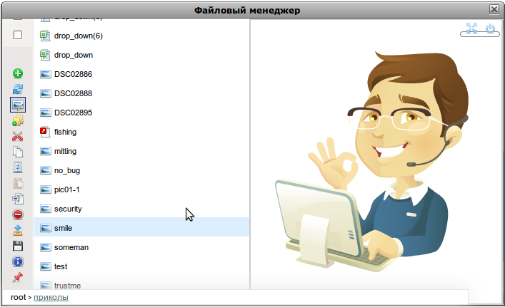

Когда-то, давным давно все началось с [этого](../../2011-01/sjfilemanager-besplatnyi-ajax-fail-menedzher) и [этого](http://habrahabr.ru/blogs/javascript/113257/). Вообще-то благодаря тому, что я написал файловый менеджер я завел блог и получил аккаунт на [Хабре](http://habrahabr.ru/). С тех пор много чего изменилось и произошло.



## Начнем с примера

**Update**: все примеры удалены в связи с переездом на статический движок. Переносить на какой-то codesandbox нет желаний :)

Думаю для начала все хотят попробовать, что-там интересного

* ~~здесь~~, только файловый менеджер на странице
* ~~здесь~~, только редактор изображений на странице
* ~~здесь~~, только файловый менеджер в попапе
* ~~здесь~~, файловый менеджер и редактор изображений в попапе

Об основных изменениях можно почитать на [Хабре](http://habrahabr.ru/blogs/javascript/131489/), а здесь поговорим о настройках

## Установка

Установить можно скачав с [GIT](http://ru.wikipedia.org/wiki/Git) репозитория git://github.com/stalniy/sjFilemanager.git

## Обратная связь

Просьба все найденные баги и предложения писать [здесь](https://github.com/stalniy/sjFilemanager/issues "sjFilemanager bug tracker") или в комментариях

## Конфигурация

Теперь, чтобы инициализировать файловый менеджер нужно намного меньше строчек кода. Все лишнее удалено или перенесено в настройки по умолчанию. Будем рассматривать пример с полным функционалом, где файловый менеджер работает вместе с редактором рисунков. Как всегда нужно что-то подключить, а именно ряд файлов. Так как нам нужно для продакшена, то будем подключать уменьшенный вариант _css_ и _javascript_. Если нужна локализация на другой язык, то подключаем также файл переводов.

```html
<!DOCTYPE html PUBLIC "-//W3C//DTD XHTML 1.0 Transitional//EN" "http://www.w3.org/TR/xhtml1/DTD/xhtml1-transitional.dtd">
<html xmlns="http://www.w3.org/1999/xhtml">
<head>
    <meta http-equiv="Content-Type" content="text/html; charset=utf-8" />
    <title>Файловый и медиа менеджеры в окне</title>
    <meta http-equiv="imagetoolbar" content="no" />
    <script type="text/javascript" src="/demos/sj_filemanager/js/lang/lang_ru.js"></script>
    <script type="text/javascript" src="/demos/sj_filemanager/js/sjFilemanager.full.js"></script>
    <link href="/demos/sj_filemanager/css/sjFilemanager.full.css" rel="stylesheet" type="text/css" />
    <script type="text/javascript" src="/weCmsPlugin/js/tiny_mce/tiny_mce.js"></script>
    <script type="text/javascript">
        sjs.ready(function(){
            sjWindow.renderView();
            MediaManager.renderView($_LANG);

            var baseUrl = '/demos/sj_filemanager/';

            var w = FileManage.getInstance(null, baseUrl + "?tmpl=window&show_actions=1", {
                actionUrl: baseUrl,
                rootUrl: '/uploads/sjFilemanager'
            },{
                move: true,
                resizable: true
            }).attachListeners({
                ready: function() {
                    this.setUploader(FileManage.getUploader(baseUrl));
                    MediaManager.getInstance(sjs('#sjMediamanager').insertBefore('#sjWrapper').find('.sjMediaWrapper'), {
                         lazy: true,
                        saveUrl: baseUrl
                    }).syncWithFileManager(this, 'refresh');
                },
                click: function() {
                    var mm = MediaManager.getInstance(), files;
                    this.makeStek();
                    if (!mm.isSleepy && (files = this.getFiles())) {
                        mm.setFiles(files).showFile();
                    }
                }
            });
        });

        tinyMCE.init({
            // General options
            mode : "textareas",
            theme : "advanced",
            plugins : "media,pagebreak,style,layer,table,save,advhr,advimage,advlink,emotions,iespell,inlinepopups,insertdatetime,preview,media,searchreplace,print,contextmenu,paste,directionality,fullscreen,noneditable,visualchars,nonbreaking,xhtmlxtras",
            editor_selector : "mceEditor",
            language : "en",
            convert_urls: false,
            theme : "advanced",
            debug : false,
            paste_auto_cleanup_on_paste : true,
            paste_convert_headers_to_strong : true,
            // Theme options
            theme_advanced_buttons1 :"undo,redo,|,bold,italic,underline,strikethrough,forecolor,backcolor,|,sub,sup,charmap,|,hr,removeformat",
            theme_advanced_buttons2 : "pastetext,pasteword,|,search,|,bullist,numlist,|,outdent,indent,|,link,unlink,image,media,cleanup,code,fullscreen",
            theme_advanced_buttons3 : "tablecontrols",
            //theme_advanced_buttons4 : "styleselect,formatselect,fontselect,fontsizeselect",
            theme_advanced_toolbar_location : "top",
            theme_advanced_toolbar_align : "left",
            theme_advanced_statusbar_location : false,
            file_browser_callback: function(field, url, type, win){
                if (window.FileManage) {
                    sjWindow.max_zIndex=301000;
                    FileManage.choiseCallback(field, '', type, win);
                }
            }
        });
    </script>
</head>
<body>
        <h2>sjFilemanager + sjMediamanager + tinyMCE</h2>
        <textarea cols="60" rows="20" class="mceEditor"></textarea>
</body>
```

Когда все _DOM_ объекты загрузятся на странице, начинаем инициализацию менеджера. Но сначала рисуем шаблоны для попапа и редактора рисунков

```javascript
sjWindow.renderView();
MediaManager.renderView($_LANG);
```

Потом устанавливаем базовый **URL** - это путь к директории **web** файлового менеджера. У меня на сайте, сам код библиотеки не доступен через _http_, а директория _demos/sj\_filemanager_ является символьной ссылкой на каталог _web_.

Если на странице нужен только один файловый менеджер (так бывает в большинстве случаев), то для этого реализован интерфейс [Singleton](http://ru.wikipedia.org/wiki/%D0%9E%D0%B4%D0%B8%D0%BD%D0%BE%D1%87%D0%BA%D0%B0_%28%D1%88%D0%B0%D0%B1%D0%BB%D0%BE%D0%BD_%D0%BF%D1%80%D0%BE%D0%B5%D0%BA%D1%82%D0%B8%D1%80%D0%BE%D0%B2%D0%B0%D0%BD%D0%B8%D1%8F%29) в методе **getInstance**. При первом вызове метода, нужно передать конфигурационные параметры. Рассмотрим их

*   первый параметр - это _callback_ функция для _insert_ экшена. Необходимо в тех случаях, когда нужно передать информацию о файлах куда-то, например, в [tinyMCE](http://www.tinymce.com/) или на страницу
*   второй параметр - это _url_ по-которому получаем список файлов, в основном он всегда остается одним и тем же
*   третий параметр - это хэш конфигурации для файлового менеджера. Допустимые опции:
    *   _actionUrl_ - обязательный, _url_ к файлу, который обрабатывает все действия
    *   _dirUrl_ - необязательный, _url_ к файлу, который отвечает за чтение директорий, по умолчанию равно **actionUrl**
    *   _rootUrl_ - необязательный, _url_ к директории, где лежат файлы. В основном необходим для связки с редактором рисунков и _tinyMCE_
    *   _actionSel_ - необязательный, селектор, по которому можно найти блок, в котором находятся все экшены, по умолчанию равно **#sjFmActions**
    *   _uploader_ - необязательный, объект отвечающий за загрузку файлов
    *   _rowTemplate_ - необязательный, шаблон строки файла, по умолчанию **<tr>....</tr>**
*   четвертый параметр - необязательный, конфигурация _window_ менеджера. Настроек здесь очень много, думаю в большинстве случаев подойдут дефолтные

Потом привязываем _listener-и_ на события, на самом деле это просто _callback_ функции, т.е. на одно событие можно повесить только одну функцию, думаю большего пока не нужно. Но благодаря абстракции в будущем это можно просто изменить.

Так как мы хотим объединить работу файлового менеджера и редактора рисунков, то в момент когда инициализируется первый, нужно создать второй и познакомить их. Что мы и делаем при помощи события **ready**. Также в этом _listener_\-е на это событие, создаем объект _uploader-а_, в данном случае - это [SWFUpload](http://swfupload.org/). Если нужно переопределить какие-то стандартные настройки _uploader-а_, то в метод _FileManage.getUploader_ втором параметром можно передать _hash_.

Редактор рисунков, я его назвал медиа менеджер, инициализируется по аналогии к файловому менеджеру. Но прежде, создаем для него (медиа менеджера) шаблон и переносим в попап окно к файловому менеджеру. Рассмотрим параметры конфигурации медиа менеджера

*   первый параметр - обязательный, **DOM** объект, в котором будет содержатся контент редактора
*   второй параметр - необязательный, конфигурация

    *   _panel_ - необязательный, селектор, по-которому можно найти панель экшенов для редактора. По умолчанию **.sjMediaPanel**

    *   _lazy_ - необязательный, указывает, что нужно инициализировать редактор частично. По умолчанию **false**
    *   _mode_ - необязательный, указывает поведение редактора. Возможны 2 варианта: **preview**, **full**. По умолчанию **preview**
    *   _files_ - необязательный, список обрабатываемых файлов

Потом вызываем метод медиа менеджера **syncWithFileManager**, который позволяет добавить кнопку открытия редактора в панель файлового менеджера. На событие **click** по файлу или папке, проверяем включен ли медиа менеджер, если включен, то передаем ему выбранные файлы и показываем первый из них.

Для работы с _tinyMCE_ используется все тот же метод _FileManage.choiseCallback_, в который передается _DOM_ объект **input** поля и _url_, по-которому можно получить доступ к файлам (по умолчанию берется _rootUrl_ из файлового менеджера). Для _window_ менеджера устанавливается большой **zIndex**, для того чтобы перекрить окно _tinyMCE_, в котором _zIndex_ очень большой.

Для упрощения совместной инициализации был написан простой метод, т.е. чтобы инициализировать менеджер достаточно передать _url_ к его _web_ директории и _url_ к директории, где находятся файлы, которые находятся под ответственностью менеджера

```ts
FileManage.createAndAttachMedia(baseUrl, rootUrl, translations?);
```

Конфигурация в серверной части не изменилась, она находится в _lib/php/config.php_. Более детально о ней можно узнать [здесь](../../2011-01/sjfilemanager-konfighuriruem-failovyi-menedzher)

**UPDATE**:

*   исправлен баг: отсутствие сообщения при попытке создать каталог не имея на это прав доступа
*   добавлена возможность передавать настройки для загрузчика _SWFUpload_

    ```javascript
    FileManage.createAndAttachMedia(baseUrl, rootUrl[, translations[,uploaderConfig]]);
    ```

*   конфигурация на _backend_\-е вынесена _config.json_ файл
*   [архив](./sjfm_and_tinymce.tar.gz "sjFilemanger + TineMCE") с примером интеграции **sjFilemanger** + **TinyMCE** (достаточно розархивировать его в корне виртуального хоста)
