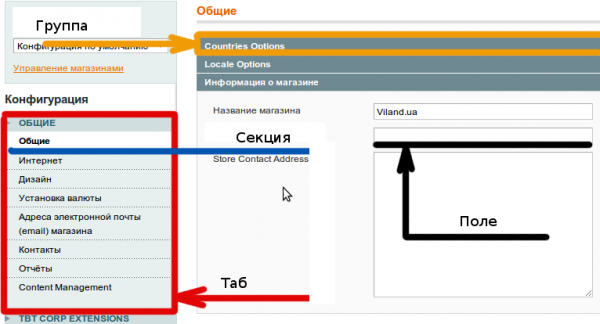
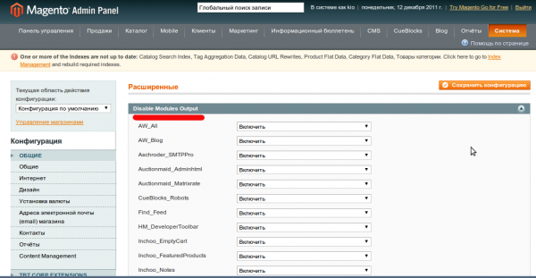
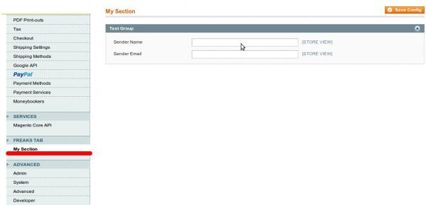
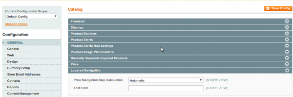

В Magento существует очень много настроек. Все они находятся в **System** -> **Configuration**. Любой модуль может добавить туда специфические параметры. Новые поля, группы и табы - все это делается при помощи конфигурационного файла _system.xml_.

## Структура файла

Все _system.xml_ конфигурационные файлы состоят из нескольких основных частей: табы -> секции -> группы -> поля. В пользовательском интерфейсе это все расположено как-то так



Все настройки в _Magento_ могут иметь одну из трех областей действия (_scope_): **default**, **website**, **store**. Настройка заданная в скоупе _store_ переопределяет значения заданные в _default_ и _website_. Аналогично параметр заданный в скоупе _website_ переопределяет значение по умолчанию, т.е. скоуп _default_. В начале это может показаться очень сложным, но окажется очень юзабильным, когда у Вас под управлением одной _Magento_ находится несколько сайтов. Область видимости (скоуп) можно переключать при помощи выпадающего списка в верхнем левом углу на странице конфигурации.

Конфигурационный файл выглядит так

```xml
<config>
    <tabs>............</tabs>
    <sections>........</sections>
</config>
```

Чтобы создать таб достаточно просто задать ему имя и порядок сортировки. Например, открыв _Mage\_Core_ модуль можно увидеть

```xml
<config>
    <tabs>
        <general translate="label" module="core">
            <label>General</label>
            <sort_order>100</sort_order>
        </general>
        <service translate="label" module="core">
            <label>Services</label>
            <sort_order>99999</sort_order>
        </service>
        <advanced translate="label" module="core">
            <label>Advanced</label>
            <sort_order>999999</sort_order>
        </advanced>
    </tabs>
............................................................
</config>
```

В этом файле определено 3 таба. При создании таба основным его параметром является код - имя тега. Он понадобится в дальнейшем, чтобы указать секции к какому табу она принадлежит. Например в том же файле

```xml
<sections>
    <advanced translate="label" module="core">
        <label>Advanced</label>
        <tab>advanced</tab>
        <sort_order>910</sort_order>
        <show_in_default>1</show_in_default>
        <show_in_website>1</show_in_website>
        <show_in_store>1</show_in_store>
        <groups>.......</groups>
    </advanced>
</sections>
```

можно определить по тегу **tab**, что секция **Advanced** относится к табу **Advanced**. Секция определяется следующими тегами:

*   _label_ - название секции
*   _tab_ - таб к которому она относится (необязательный)
*   _class_ - задает css класс для ссылки секции, как пример секция _PayPal_\-а (необязательный)
*   _header\_css_ - задает css класс для тега h3, на странице редактирования секции. В качестве примера - тот же _PayPal_ (необязательный)
*   _sort\_order_ - порядковый номер
*   _groups_ - группы, которые относятся к этой секции
*   _show\_in\_default_ - показывать в дефолтном скоупе
*   _show\_in\_website_ - показывать в скоупе вебсайта
*   _show\_in\_store_ - показывать в скоупе стора

Атрибут **translate** указывает (через пробел), содержимое каких тегов является мультиязычным. Атрибут **module** указывает, какой модуль ответственный за данную секцию, в основном используется, чтобы создать объект хелпера этого модуля.

Секция содержит в себе группы, например в _advanced_

```xml
<modules_disable_output translate="label">
    <label>Disable Modules Output</label>
    <frontend_model>adminhtml/system_config_form_fieldset_modules_disableOutput</frontend_model>
    <sort_order>2</sort_order>
    <show_in_default>1</show_in_default>
    <show_in_website>1</show_in_website>
    <show_in_store>1</show_in_store>
</modules_disable_output>
```

Эта группа отвечает за отключение вывода блоков определенного модуля. Посмотрим на ее _UI_



Обычно в группе задаются поля, но также можно указать _frontend\_model_. Она отвечает за вывод всех полей и должна реализовать интерфейс _Varien\_Data\_Form\_Element\_Renderer\_Interface_. В контексте _Magento_ - это на самом деле блок, а не модель.

Группа задается следующими тегами

*   _label_ - название группы
*   _sort\_order_ - порядковый номер
*   _frontend\_model_ - блок, отвечающий за вывод группы (необязательный)
*   _expanded_ - указывает открыта ли группа по умолчанию
*   _comment_ - комментарий к группе
*   _fields_ - структура полей
*   _show\_in\_default_ - показывать в дефолтном скоупе
*   _show\_in\_website_ - показывать в скоупе вебсайта
*   _show\_in\_store_ - показывать в скоупе стора

Если посмотреть в секцию **design**, то увидим, что ее группы имеют тег _fields_, в котором задаются параметры для полей. Например, группа _package_

```xml
<package translate="label">
    <label>Package</label>
    <sort_order>1</sort_order>
    <show_in_default>1</show_in_default>
    <show_in_website>1</show_in_website>
    <show_in_store>1</show_in_store>
    <fields>.........</fields>
</package>
```

Для задания поля нужно указать следующие теги

*   _label_ - название поля
*   _sort\_order_ - порядковый номер
*   _frontend\_model_ - блок, отвечающий за вывод поля (необязательный)
*   _frontend\_type_ - тип поля (необязательный, по умолчанию _text_)
*   _backend\_model_ - модель отвечающая за валидацию поля на сервере, должна быть объектом класса _Mage\_Core\_Model\_Config\_Data_. Ей передаются определенные данные: _path_, _value_, _website\_code_, _store\_code._ Должна реализовать метод _\_beforeSave_ (вызывается перед сохранением поля). Также можно реализовать методы _afterLoad_ или _getValue_, которые вызываются перед тем как отобразить поле. Это нужно, если например в базе поле сохранено как сериализированный массив, т.е. строка, а для его отображения нужно, чтобы оно было массивом (необязательный)
*   _comment_ - комментарий под полем (необязательный)
*   _sort\_fields_ - указывает как сортировать поля (необязательный, по умолчанию сортирует по _sort\_order_)
    *   _by_ - имя тега по-которому нужно отсортировать
    *   _direction\_desc_ - указывает сортировать обратном порядке (по умолчанию сортировка А-Я)
*   _config\_path_ - указывает специфический путь для параметра, например _package/name_ (необязательный, если не указан, то путь будет _%SECION\_NAME%_ / _%GROUP\_NAME%_ / _%FIELD\_NAME%_, где _\*\_NAME_ - имена тегов)
*   _validate_ - задает класс полю, благодаря, которому можно будет валидировать поле на клиенте с помощью _JavaScript_ и _varienForm_ класса
*   _source\_model_ - задает модель-источник, используется для типов полей _select_ и _multiselect_. Если модель является объектом _Varien\_Object_, то ей устанавливается путь к полю (доступ можно получить при помощи метода _getPath()_). Например, группа _debug_ из секции _dev_ имеет поле _profiler_, в котором задана сорс модель **adminhtml/system\_config\_source\_yesno**. По умолчанию модель должна реализовать метод _toOptionArray_, который возвращает массив с опциями. Если Вы хотите использовать специфический метод, то в конце имени ставите 2 раза двоеточие и потом имя метода, например _adminhtml/system\_config\_source\_yesno::myMethoName_.
*   _depends -_ указывает поля зависимые от значения данного поля. Пример можно посмотреть в секции каталог, группа _Layered Navigation_ поле _Price Navigation Step Calculation_
*   _tooltip_ - всплывающая подсказка может быть как просто текстом, так и _Magento_ путем к блоку
*   _show\_in\_default_ - показывать в дефолтном скоупе
*   _show\_in\_website_ - показывать в скоупе вебсайта
*   _show\_in\_store_ - показывать в скоупе стора

В большинстве случает _source_, _backend_ и _frontend_ модели писать не прийдется. Нужно просто пройтись по всем настройкам, посмотреть есть ли то что нужно, потом открыть конфигурационный файл и скопировать уже готовые директивы.

Тег _frontend\_type_ может содержать любое значение из полей формы, которые определены в _lib/Varien/Data/Form/Element/_ директории.

## Создание своих настроек

Чтобы создать свои настройки для начала нужно [написать модуль](../../2011-01/magento-sozdanie-crud-modulya). В модуле в директории _etc_ создаем файл _system.xml_. Создадим свой таб и секцию, а также добавим новое поле в секцию Каталог, группу _Layered Navigation_.

Так как _Magento_ объединяет все конфиг файлы в один большой _XML_, то чтобы добавить новый таб нужно всего лишь написать

```xml
<config>
    <tabs>
        <my_tab>
            <label>Freaks Tab</label>
            <sort_order>100000</sort_order>
        </my_tab>
    </tabs>
    <sections>
        <my_section translate="label">
            <label>My Section</label>
            <tab>my_tab</tab>
            <frontend_type></frontend_type>
            <sort_order>910</sort_order>
            <show_in_default>1</show_in_default>
            <show_in_website>1</show_in_website>
            <show_in_store>1</show_in_store>
            <groups>
                <test_group translate="label">
                    <label>Test Group</label>
                    <sort_order>4</sort_order>
                    <show_in_default>1</show_in_default>
                    <show_in_website>1</show_in_website>
                    <show_in_store>1</show_in_store>
                    <fields>
                        <email translate="label">
                            <label>Sender Email</label>
                            <frontend_type>text</frontend_type>
                            <backend_model>adminhtml/system_config_backend_email_address</backend_model>
                            <validate>validate-email</validate>
                            <sort_order>2</sort_order>
                            <show_in_default>1</show_in_default>
                            <show_in_website>1</show_in_website>
                            <show_in_store>1</show_in_store>
                        </email>
                        <name translate="label">
                            <label>Sender Name</label>
                            <frontend_type>text</frontend_type>
                            <backend_model>adminhtml/system_config_backend_email_sender</backend_model>
                            <validate>validate-emailSender</validate>
                            <sort_order>1</sort_order>
                            <show_in_default>1</show_in_default>
                            <show_in_website>1</show_in_website>
                            <show_in_store>1</show_in_store>
                        </name>
                    </fields>
                </test_group>
            </groups>
        </my_section>
    </sections>
</config>
```

Теперь, чтобы это заработало нужно очистить кэш, а также создать права доступа для этих параметров (_ACL_) иначе будете попадать на 404 страницу. В нашем случае добавим _ACL_ только для одной секции _my\_section_. Добавляем информацию об этом в конфиг модуля (config.xml)

```xml
<adminhtml>
    <acl>
        <resources>
            <admin>
                <children>
                    <system>
                        <children>
                            <config>
                                <children>
                                    <my_section>
                                        <title>My Section</title>
                                    </my_section>
                                </children>
                            </config>
                        </children>
                    </system>
                </children>
            </admin>
        </resources>
    </acl>
</adminhtml>
```

Более детально об _ACL_ можно прочитать [здесь](../../2011-11/magento-konfighuratsiia-ot-a-do-ia-bazovye-nastroiki-modulia).

Выходим из админки, чтобы сессия очистилась, заходим обратно и вот что видим



Все настройки сохраняются в базу в таблицу _core\_config\_data_. Чтобы получить доступ к настройкам используется конструкция

```php
$config = Mage::getStoreConfig('path/to/config'[, $storeId]);

// in our situation
$email = Mage::getStoreConfig('my_section/test_group/email');
$name  = Mage::getStoreConfig('my_section/test_group/name');
```

Теперь добавим новое поле в уже существующую группу. На самом деле все делается по аналогии и довольно таки просто. Сначала откроем файл _system.xml_ модуля _Mage\_Catalog_. Найдем там группу которая отвечает за _Layered Navigation_, чтобы скопировать ее код. И потом добавляем новую _XML_ структуру в тег _sections_

```xml
<catalog>
    <groups>
        <layered_navigation>
            <fields>
                <test_field>
                    <label>Test Field</label>
                    <frontend_type>text</frontend_type>
                    <sort_order>100</sort_order>
                    <show_in_default>1</show_in_default>
                    <show_in_website>1</show_in_website>
                    <show_in_store>1</show_in_store>
                </test_field>
            </fields>
        </layered_navigation>
    </groups>
</catalog>
```

Чистим кэш и заходим через админку в секцию Каталог, группу _Layered Navigation_



**P.S.**: по ходу изучения моделей в следующих статьях мы вернемся к конфигурации и таким понятиям, как реврайты моделей и как обходится без них при помощи событий.
