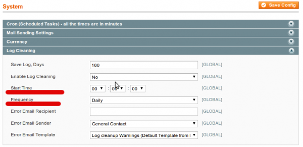

Системные администраторы часто встречаются с вопросом запуска каких-либо действий в определенное время. В _Linux_\-е это можно сделать при помощи команды _crontab -e_. Crontab имеет свой специфический формат, достаточно простой. Чтобы не зависеть от операционной системы и формата конфигурационного файла разработчики _Magento_ реализовали свой функционал [cron](http://ru.wikipedia.org/wiki/Cron)\-а.

В стандартном наборе _Magento_ есть 2 файла **cron.sh** и **cron.php**. Если у Вас _Unix_ подобная операционная система, то в крон нужно ставить первый скрипт (в идеальном случае его нужно запускать каждую секунду, но достаточно раз в 5-10 мин). Почему первый? Потому что он проверяет не запущен ли еще один точно такой же процесс, что предотвращает конфликты.

## Конфигурация Cron-а

Роботу _cron_\-а можно слегка оптимизировать под свои нужды в настройках **System -> Configuration -> System -> Cron**. Рассмотрим их назначение

*   генерировать задачи каждые (_A_ минут) - новые задания (при запуске _cron.php_) будут создаваться не чаще чем через _A_ минут
*   генерировать задачи наперед (на _В_ минут) - задачи будут наперед генерироватся на _B_ минут
*   задача будет считаться утеряной (через _C_ минут) - если _cron_ будет запущен меньше чем через _C_ минут после того как какая-то задача была запланирована, то она выполнится; если позже то она получит статус утеряной, пропущеной
*   очистка истории каждые (_D_ минут)
*   время жизни успешно завершенных операций
*   время жизни заданий которые провались при выполнении

## Способы установки задачи в cron

Первый способ через конфигурацию модуля объяснен [в одной из предыдущих статей](../../2011-11/magento-konfighuratsiia-ot-a-do-ia-bazovye-nastroiki-modulia "Magento module configuration"). Это подходит для задач, в которых пользователь не берет участия. Но иногда нужно чтобы была возможность менять время запуска. Рассмотрим пример этого функционала на примере конфигурации **Sytem -> Configuration -> Advanced -> Sytem -> Log Cleaning** - очистка таблиц логов.



Для нас здесь важными являются 2 поля: _Start Time_ и _Frequency_. Первый задает время запуска (хотя можно указать и секунды, но на самом деле они не будут учитываться, никогда), второй - частоту (каждый день, каждую неделю, каждый месяц).

Чтобы понять, что происходит со всем этим при нажатии на кнопку "_Save Config_", нужно понимать как создаются поля для конфигурации. А об этом написано [в этой статье](../../2011-12/magento-konfiguratsiya-ot-a-do-ya-systemxml).

Посмотрим _system.xml_ файл модуля `Mage_Log`, чтобы узнать какие классы отвечают за вывод и обработку этих полей.

```xml
<time translate="label">
    <label>Start Time</label>
    <frontend_type>time</frontend_type>
    <sort_order>3</sort_order>
    <show_in_default>1</show_in_default>
    <show_in_website>0</show_in_website>
    <show_in_store>0</show_in_store>
</time>
<frequency translate="label">
    <label>Frequency</label>
    <frontend_type>select</frontend_type>
    <source_model>adminhtml/system_config_source_cron_frequency</source_model>
    <backend_model>adminhtml/system_config_backend_log_cron</backend_model>
    <sort_order>4</sort_order>
    <show_in_default>1</show_in_default>
    <show_in_website>0</show_in_website>
    <show_in_store>0</show_in_store>
</frequency>
```

Первый неинтересен, так просто выводит время. Во-втором видим определена **backend** модель, которая запустит метод _\_afterSave_ при сохранении конфигурации. Рассмотрим этот метод более детально

```php
protected function _afterSave()
{
    $enabled    = $this->getData('groups/log/fields/enabled/value');
    $time       = $this->getData('groups/log/fields/time/value');
    $frequncy   = $this->getData('groups/log/fields/frequency/value');
    $errorEmail = $this->getData('groups/log/fields/error_email/value');

    $frequencyDaily     = Mage_Adminhtml_Model_System_Config_Source_Cron_Frequency::CRON_DAILY;
    $frequencyWeekly    = Mage_Adminhtml_Model_System_Config_Source_Cron_Frequency::CRON_WEEKLY;
    $frequencyMonthly   = Mage_Adminhtml_Model_System_Config_Source_Cron_Frequency::CRON_MONTHLY;

    if ($enabled) {
        $cronDayOfWeek = date('N');
        $cronExprArray = array(
            intval($time[1]),                                   # Minute
            intval($time[0]),                                   # Hour
            ($frequncy == $frequencyMonthly) ? '1' : '*',       # Day of the Month
            '*',                                                # Month of the Year
            ($frequncy == $frequencyWeekly) ? '1' : '*',        # Day of the Week
        );
        $cronExprString = join(' ', $cronExprArray);
    } else {
        $cronExprString = '';
    }

    try {
        Mage::getModel('core/config_data')
            ->load(self::CRON_STRING_PATH, 'path')
            ->setValue($cronExprString)
            ->setPath(self::CRON_STRING_PATH)
            ->save();

        Mage::getModel('core/config_data')
            ->load(self::CRON_MODEL_PATH, 'path')
            ->setValue((string) Mage::getConfig()->getNode(self::CRON_MODEL_PATH))
            ->setPath(self::CRON_MODEL_PATH)
            ->save();
    } catch (Exception $e) {
        Mage::throwException(Mage::helper('adminhtml')->__('Unable to save the cron expression.'));
    }
}
```

Вначале проверяется включена ли очистка логов. Если да, тогда создаем _cron expression_ базируясь на времени и частоте введенными пользователем (как видно 3-ий элемент массива, отвечающий за секунды, не используется). Потом просто сохраняем 2 строки в таблицу _core\_config\_data_.

При первом запуске скрипта _cron_\-а, он сгенерирует для себя задачи на ближайшее время и сохранит их в таблице **cron\_schedule**. Этот факт можно использовать при отладке. Но стоит помнить, что все даты в базе _Magento_ cохраняются в _GMT_ формате.

При следующем запуске, если есть задачи _cron_ будет их выполнять по очереди.

Этот способ является полностью аналогичным первому (через конфигурацию), потому что, на сколько известно, все настройки _Magento_ мерджатся, это относится и к тем, которые лежат в базе данных.
