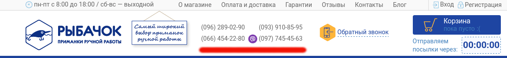

Давненько я не писал статей на своем блоге :) Много изучал, пробовал, полностью перебрался в Frontend разработку... Ну да ладно, сейчас не об этом.

История началось с того, что мой хороший друг попросил сделать ему интернет магазин. Отказать другу тяжело, вот я и решил тряхнуть стариной :) Как и любой другой сайт, этот имел несколько форм взаимодействия с пользователем. Во-первых, там есть формы запроса прайс-листов, форма перезвонить, отзывы и все остальное, что в данном контексте я могу просто назвать "формы". Во-вторых, номера телефонов и E-mail адресса. Соответственно все это нужно защитить от спамеров, поскольку те ребята и в формы всякого напишут и номера стырят и потом будут СМС-ки слать, что не очень приятно.

Если с формами все понятно - просто поставить капчу (я использовал Google Recaptcha для Magento), то с номерами телефонов и email совсем другое дело. Ведь нельзя просить пользователя заполнить капчу перед тем как увидеть контактную информацию, это плохо для продаж. Что же делать? Клиент должен видеть контакты, а спам-боты - нет.

## Client side protection

Существует несколько разных способов защиты, например, отображать email и телефоны через html entities (такие слова, которые начинаются с "&" и заканчиваются ";", например &#48; - число 1). Как вариант защиты - неплохо, точно защитит от тупых ботов, но насколько сложно это обойти? Очень просто, т.е. автору бота достаточно использовать что-то на подобии html\_entity\_decode в PHP. Так что защита так себе.

Тогда я нашел другой, очень интересный способ защиты - при помощи CSS. Суть его заключается в том, что сервер выводит телефон/email задом наперед, а браузер через CSS делает тоже самое и для конечного пользователя все отображается правильно, но роботу найти контакты уже намного тяжелее. Более технически это выглядит вот так:

```php
<!-- HTML -->
<span class="reverse"><?php echo strrev($email) ?></span>
```

```css
/* CSS */
.reverse {
  direction: rtl;
  unicode-bidi: bidi-override;
}
```

Вариант прост и хорош, но я подумал что даже с этим "умный" робот сможет справится, если постарается.

Тогда я и вспомнил инцидент со старым интернет магазином, в котором номера телефонов были отображены картинкой. На этот раз мои мысли все дружно кричали "гениально!". Ведь кто будет распознавать рисунок для того, чтобы получить номер? Понятно что можно это делать, понятно что есть методы и новое крутое словосочетание "machine learning", но это ведь колоссальные затраты ресурсов. Так что этот способ показался самым "правильным", так как отсеивает большинство ботов ...ну и еще потому что я хотел сделать что-то интересное при помощи canvas :)

## Решение

Основная идея заключалась в том, чтобы в местах где нужно отображать телефон или email, я буду вставлять canvas элемент и потом по завершению загрузки страницы, скрипт будет писать контактную информацию через canvas метод fillText. Все вроде бы просто, но в скрипт нужно как-то передать номер телефона, и передать так чтобы спам-бот не смог его увидеть, т.е. ни текст, ни атрибут, ни скрипт сразу после canvas элемента не подходили. Возникали идеи с AJAX и прочими штучками, но тогда это дополнительный запрос на сервер, дополнительное время загрузки страницы и дополнительная причина для Google понизить поисковый индекс для сайта.

И я решил, чтобы передавать информацию я буду использовать data-draw атрибут. Но он будет содержать не просто номер телефона, а закодированный номер телефон. Алгоритм шифровки не имеет значения, единственное что, он должен быть простым, в идеале уже быть доступным и в PHP и в JavaScript, чтобы не писать ничего самому, поэтому мой выбор пал на base64 (т.е., base64\_encode в PHP и atob в JavaScript).

И потом при помощи jQuery пишем не большой скрипт:

```javascript
jQuery(function($) {
  $('canvas[data-draw]').each(function(i, canvas) {
    var content = atob(canvas.getAttribute('data-draw'));
    var $parent = $(canvas.parentNode);
    var styles = {
      textBaseline: 'top',
      fillStyle: $parent.css('color'),
      font: $parent.css('font-size') + ' ' + $parent.css('font-family'),
    };
    var context = canvas.getContext('2d');

    canvas.width = Math.ceil(measureText(content, styles, context).width);
    Object.assign(context, styles);
    context.fillText(content, 0, 0);
  });

  function measureText(text, styles, context) {
    return Object.assign(context, styles).measureText(text);
  }
});
```

В целом скрипт ищет все canvas элементы на странице с атрибутом data-draw, декодирует значение этого телефона, устанавливает стили шрифта, которые указаны в CSS, меряет текст и печатает его на canvas. Получаем то же самое что и в HTML, но в виде растрового изображения :)

Думаю недели через 2 конечный вариант можно будет посмотреть на сайте [ruba4ok.com](http://ruba4ok.com), а пока можно посмотреть на этот рисунок:

