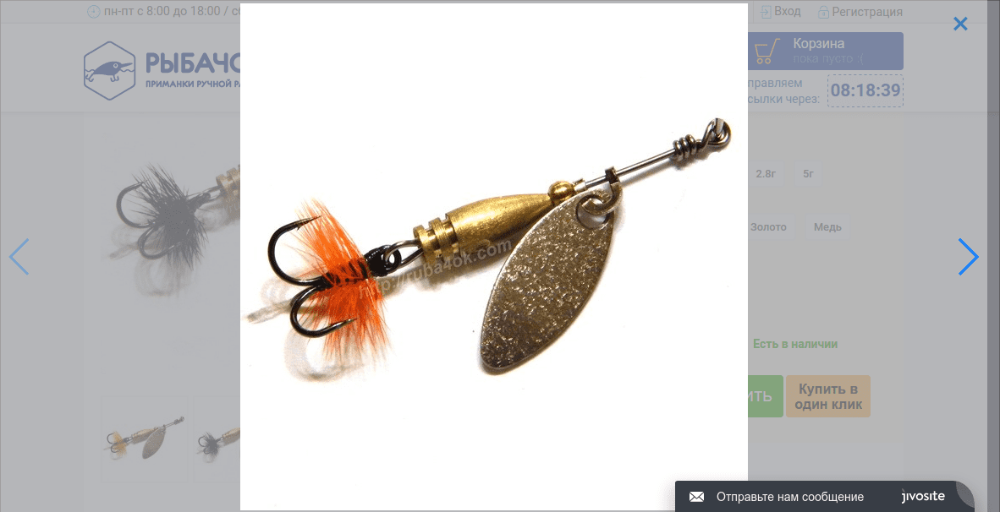

[Swiper.io](http://idangero.us/swiper/#.WSZZ8SF96b9) написан создателем [Framework7](https://framework7.io/). На гитхабе оба эти проекта имею 9000+ звезд, что очень хорошо (всего в 3 раза меньше чем [ionic](http://ionicframework.com)). А автор сам из России поэтому можно гордится умами своей родины :) Погордились? Ну все давайте вернемся к делу.

## Значит swiper, зачем он мне?

Помните в Magento есть страничка продукта? Там есть рисунки продукта, которые можно и нужно просматривать. Magento по умолчанию предлагаю использовать scriptaculus slider и zoom из той же библиотеки, что не всегда подходит под современные требования. Поэтому существует множество lightbox модулей для просмотра рисунков. Один из таких модулей написал и я на базе библиотеки [swiper.i](http://idangero.us/swiper/#.WSZZ8SF96b9)o.

## Почему Swiper.io?

Тут ответ достаточно очевиден:

Во-первых, он мобайл фрэндли и позволяет пользователям на планшетах использовать их палец для перелистывания слайдов, что очень удобно.

Во-вторых, он оптимизирован использовать минимальное количество ресурсов при перелистывании слайдов, за что пользователи скажут Вам спасибо, опять таки, потому что ничего не глючит.

В-третих, в нем есть встроенная функция ленивое загрузки рисунков (рисунок загружается только в момент когда слайд стал виден).

Если этот список не убедил Вас, рекомендую почитать список возможностей [на официальном сайте](http://idangero.us/swiper/#.WSZaeCF96b-) и обязательно [посмотрите демки](http://idangero.us/swiper/demos/).

Из минусов можно сказать, что он работает только с последними браузерами и весит 86кБ в минифицированном виде. Для меня это не было проблемой, так как я уже давно пишу под самые новые браузеры и IE11+. Если Вы до сих пор пишете под старые IE, то могу только посочувствовать :)

## Что в конечном итоге?

Для нетерпеливых вставлю скриншот того, что получится в конце.



Теперь перейдем к деталям.

## Подготавливаем Magento

Для начала нужно создать отдельную тему и отдельный skin. В теме я переопределю шаблон catalog/product/view/media.phtml и подключу swiper в local.xml, а в новом skin-е размещу дополнительные JavaScript файлы. Но сначала немного лирики об идеи для реализации :)

В HTML5 появились data-\* атрибуты, основная задача таких атрибутов - это передавать клиентские данные из сервера в клиентский код. Т.е., у нас есть swiper, который в разных местах, может иметь разные настройки и одну логику по инициализации. Вот эту самую идею data атрибутов я обычно использую не в Single Page Application-ах, потому что это позволяет писать структурный, widget-based код на jQuery.

Для начала, положим исходники swiper-а (которые можно узнать как скачать [здесь](http://idangero.us/swiper/get-started/#.WSZlJiF96b8)) в директорию skin/frontend/slides/vendor/swiper. Здесь будут находится и CSS файлы и JavaScript файлы этой библиотеки. Также нам понадобятся jquery.3.1.slim и 2 JavaScript файла из библиотеки [bootstrap 3.x](http://getbootstrap.com/): transition.js и modal.js. Дополнительно добавлю пустой файл в skin/frontend/slides/js/media\_modal.js, где потом и напишу логику отвечающую за открытие swiper-a в модальном окне.

После изменений мой local.xml выглядит вот так:

```xml
<?xml version="1.0"?>
<layout version="0.1.0">
    <default>
        <reference name="head">
            <action method="removeItem"><type>js</type><name>scriptaculous/slider.js</name></action>
            <action method="addItem"><type>skin_js</type><name>vendor/jquery.3.1.slim.min.js</name><params/></action>
            <action method="addItem"><type>skin_js</type><name>vendor/swiper/js/swiper.jquery.min.js</name><params/></action>
            <action method="addItem"><type>skin_js</type><name>vendor/bootstrap/transition.js</name><params/></action>
            <action method="addItem"><type>skin_js</type><name>vendor/bootstrap/modal.js</name><params/></action>
            <action method="addItem"><type>skin_js</type><name>js/media_modal.js</name><params/></action>
        </reference>
    </default>
</layout>
```

Теперь нужно скопировать себе в тему файл app/design/frontend/base/catalog/product/view/media.phtml -> app/design/frontend/swiper/catalog/product/view/media.phtml и добавить data атрибуты в на все картинки, вот так:

```php
<?php
  $product = $this->getProduct();
  $output = $this->helper('catalog/output');
  $baseImageIndex = 0;
  $baseImage = $product->getImage();
  $index = 0;

  foreach ($this->getGalleryImages() as $image) {
    if ($image->getFile() === $baseImage) {
      $baseImageIndex = $index;
      break;
    }

    $index++;
  }
?>
<div data-widget="mediaModal">
  <div class="photo-product product-image" data-item data-index="<?php echo $baseImageIndex ?>">
    <div class="product-hints">
      <?php if ($this->helper('freaks_ruba4ok')->isBestseller($product)): ?>
      <i class="icon icon-bestseller" title="<?php echo $this->__('Bestseller') ?>"></i>
      <?php endif ?>
      <?php if ($product->getFinalPrice() < $product->getPrice()): ?>
      <i class="icon icon-discount" title="<?php echo $this->__('Discount') ?>"></i>
      <?php endif ?>
    </div>
    <?php
      $_img = 'helper('catalog/image')->init($product, 'image').'" alt="'.$this->escapeHtml($this->getImageLabel()).'" title="'.$this->escapeHtml($this->getImageLabel()).'" />';
      echo $output->productAttribute($product, $_img, 'image');
    ?>
  </div>
  <?php if (count($this->getGalleryImages()) > 0): ?>
    <div class="other-photos">
    <?php foreach ($this->getGalleryImages() as $_image): ?>
      <?php $originalImageUrl = $this->helper('catalog/image')->init($this->getProduct(), 'thumbnail', $_image->getFile()) ?>
      <div class="clip-img" data-item data-url="<?php echo $originalImageUrl ?>" title="<?php echo $this->escapeHtml($_image->getLabel()) ?>">
        helper('catalog/image')->init($product, 'thumbnail', $_image->getFile())->resize(100); ?>" alt="<?php echo $this->escapeHtml($_image->getLabel()) ?>" />
      </div>
    <?php endforeach ?>
    </div>
  <?php endif ?>
</div>
```

Давайте теперь разберем где и зачем добавлены атрибуты.

Во-первых, самый важный атрибут - это data-widget="mediaModal", именно по нему я буду находить все элементы, к которым нужно применить мой слайдер. Во-вторых, атрибуты data-item указывают непосредственно на нахождение картинок внутри нашего виджета. Каждый data-item должен иметь data-url атрибут, который содержит URL на большую картинку или же data-index атрибут, который содержит порядковый номер рисунка внутри списка. Именно поэтому, вверху шаблона, я искал индекс большого рисунка.

JavaScript готов, шаблон тоже подготовлен, давайте добавим еще css прежде чем начинать. В local.xml добавляю CSS для модалки и swiper-a

```xml
<!-- ... -->
            <action method="addItem"><type>skin_js</type><name>js/widget/media_modal.js</name><params/></action>
            <action method="addItem"><type>skin_css</type><name>vendor/swiper/css/swiper.min.css</name><params/></action>
            <action method="addItem"><type>skin_css</type><name>css/modal.css</name><params/></action>
<!-- ... -->
```

css/modal.css я вырезал из соответствующего [файла в bootstrap на github-е](https://github.com/twbs/bootstrap-sass/blob/v3.3.7/assets/stylesheets/bootstrap/_modals.scss) и упростил его, SCSS аналог должен выглядеть вот так:

```css
.fade {
  opacity: 0;
  transition: opacity .15s linear;
}

.in {
  opacity: 1;
}

.modal-open {
  overflow: hidden;

  .modal {
    overflow-x: hidden;
    overflow-y: auto;
  }
}

.modal {
  position: fixed;
  top: 0;
  right: 0;
  bottom: 0;
  left: 0;
  z-index: 10001;
  display: none;
  overflow: hidden;

  &.fade .modal-dialog {
    transition: transform .2s ease-out;
    transform: translate(0, -50%);
  }
  &.in .modal-dialog { transform: translate(0, 0); }

  &-dialog {
    position: relative;
    margin: 30px auto;
  }

  &-scrollbar-measure {
    position: absolute;
    top: -9999px;
    width: 50px;
    height: 50px;
    overflow: scroll;
  }
}

.modal-backdrop {
  position: fixed;
  top: 0;
  right: 0;
  bottom: 0;
  left: 0;
  background-color: map-get($colors, opacity-bg);
  opacity: .55;
  z-index: 3000;

  &.fade {
    opacity: 0;
    transition: opacity .15s linear;
  }

  &.in {
    opacity: .55;
  }
}

.pure-modal {
  .modal-dialog {
    margin: 0;
    height: 100%;
  }

  .btn-close {
    position: absolute;
    right: 0;
    z-index: 100;
  }

  .modal-dialog {
    text-align: center;
  }

  .modal-content {
    background: #fff;
    background: rgba(255, 255, 255, 0.4);
  }
}
```

Дополнительно я добавил класс pure-modal - он растягивает модалку на весь экран и ставит прозрачный background на контент.

## Внедрение Swiper.io

Пришло время добавить код в файл media\_modal.js. Самое главное - это нужно вызвать noConflict в jQuery, иначе половина сайта не будет работать, так как jQuery может конфликтовать с библиотекой Prototype.js. И сразу же добавлю стандартный шаблон для модального окна, которое в конечно итоге будет отображаться пользователю

```javascript
jQuery.noConflict();
jQuery(function($) {
  var $template = $([
    '<div class="modal pure-modal fade" tabindex="-1">',
      '<div class="modal-dialog">',
        '<button type="button" class="btn btn-close" data-dismiss="modal">×</button>',
        '<div class="swiper-container full-height modal-content">',
          '<div class="swiper-wrapper"></div>',
          '<div class="swiper-button-next"></div>',
          '<div class="swiper-button-prev"></div>',
        '</div>',
      '</div>',
    '</div>'
  ].join(''));
})
```

Обычная модалка, со стандартным шаблоном для swiper-a, но обратите внимание на модальном окне стоит дополнительно класс pure-modal и на swiper-container стоит класс full-height. pure-modal я уже описал выше, а full-height для swiper-a выглядит вот так:

```css
.swiper-container.full-height {
  height: 100%;

  .swiper-slide {
    display: flex;
    align-items: center;
    justify-content: center;
    background: transparent;
  }

  img {
    max-height: 100%;
    max-width: 100%;
  }
}
```

Теперь нужно найти все элементы на странице с атрибутом data-widget="mediaModal" и добавить обработчик на событие click по элементам с data-item атрибутом. По клику на любой из таких элементов (которые по сути являются картинками), нужно отрисовать слайды для swiper-a, инициализировать свайпер, вставить модалку в тэг body и перелистать свайпер к элементу на который нажал пользователь.

Все вместе выглядит вот так:

```javascript
jQuery(function($) {
  var $template = $([
    '<div class="modal pure-modal fade" tabindex="-1">',
      '<div class="modal-dialog">',
        '<button type="button" class="btn btn-close" data-dismiss="modal">×</button>',
        '<div class="swiper-container full-height modal-content">',
          '<div class="swiper-wrapper"></div>',
          '<div class="swiper-button-next"></div>',
          '<div class="swiper-button-prev"></div>',
        '</div>',
      '</div>',
    '</div>'
  ].join(''));

  $('[data-widget=mediaModal]').on('click', '[data-item]', function(e) {
    e.preventDefault();
    var $modal = $template.clone(true);
    var $swiper = $modal.find('.swiper-wrapper');
    var $clickedItem = $(e.currentTarget);

    $(e.delegateTarget).find('[data-item]').each(function(i, element) {
      var $item = $(element);

      if (typeof $item.data('index') === 'undefined') {
        renderSlideItem($(element)).appendTo($swiper);
      }
    });

    var swiper = createSwiper($swiper.parent());
    $modal.appendTo('body')
      .modal({ keyboard: true })
      .one('hidden.bs.modal', function() {
        $modal.remove();
      })
      .one('shown.bs.modal', function() {
        swiper.update();
        swiper.slideTo($clickedItem.data('index') || $clickedItem.index());
      });
  });

  function renderSlideItem($mediaItem) {
    var $slide = $('<div class="swiper-slide"></div>');

    return $slide.append('');
  }

  function createSwiper($container) {
    var $buttons = $container.find('.swiper-button-next, .swiper-button-prev');
    return new Swiper($container[0], {
      nextButton: $buttons[0],
      prevButton: $buttons[1],
      spaceBetween: 30,
      preloadImages: false,
      lazyLoading: true,
      lazyLoadingOnTransitionStart: true,
      keyboardControl: true,
    });
  }
});
```

После сохранение и обновления кэша Вы получите ожидаемый результат, который удобный как для пользователей ПК так и для пользователей планшетов и других мобильных устройств :)