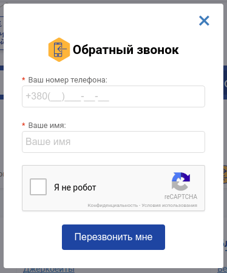
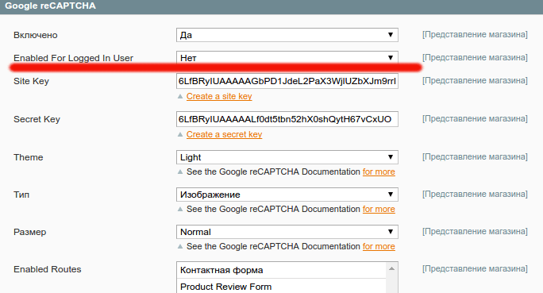

По просьбам в комментариях к [статье о подключении Google Recaptcha](../kak-vklyuchit-google-recaptcha-v-magento-1x), я решил написать статью о том как можно улучшить модуль StudioForty9\_Recaptcha, а именно:

*   подключить капчу к форме, которая показывается на каждой странице
*   отключить капчу для авторизированных пользователей
*   как подключить несколько Google Recaptcha на одной странице

В этой статья я буду рассказывать о своем модуле FI\_Recaptcha, который я начал писать в предыдущей статье. Так что рекомендую с ней [ознакомится](../kak-vklyuchit-google-recaptcha-v-magento-1x).

## reCaptcha на любую форму

В предыдущей статья я рассказывал о подключении капчи в форму комментариев и в том случае мне повезло, потому что имя action-а, который создает комментарий, точно такое же, как имя action-а, который отображает статью. Но что делать если имена не совпадают или если нужно выводить форму на всех страницах (например форма "перезвонить")?

Нужно изменить шаблон reCaptcha. Скопируйте из шаблонов директорию studioforty9 со всем содержимым в свою тему. Теперь изменим там первые пару строчек:

```php
<?php
$id = $this->getRecaptchaId();
?>
<?php if ($this->isAllowed($this->getAction()->getFullActionName())): ?>
<!-- .... -->
```

на

```php
<?php
$id = $this->getRecaptchaId();
$actionName = $this->hasActionName() ? $this->getActionName() : $this->getAction()->getFullActionName();
?>
<?php if ($this->isAllowed($actionName)): ?>
<!-- ... -->
```

Этим я добавил возможность указывать название action-а (первый параметр в $routes->add) для которого нужно показывать и валидировать капчу.

Давайте теперь используем это на воображаемой форме обратного звонка, которая должна выводится на каждой странице в шапке

```xml
<default>
    <reference name="header">
        <block type="studioforty9_recaptcha/explicit" name="captchaCallback" template="studioforty9/recaptcha/explicit.phtml">
            <action method="setActionName"><name>fi_recaptcha_index_callback</name></action>
        </block>
    </reference>
</default>
```

И добавим поддержку в админке:

```php
// code inside FI_Recaptcha_Model_Observer
$routes->add('fi_recaptcha_index_callback', Mage::helper('core')->__('Callback Form'));
```

В результате может получится что-то не мнимое :)



Все это отлично защищает сайт от не авторизированных пользователей, но зарегистрированных то мы знаем, они ввели свой email и пароль, зачем их напрягать и показывать капчу? Даже не смотря на то, что она такая простая - это слишком!

## Нет reCaptch-е для зарегистрированных пользователей

Чтобы добиться то, что я задумал сначала добавим новое поле в админку, которое будет позволять показывать или скрывать капчу для авторизированных пользователей. Для этого добавим [файл system.xml](../../2011-12/magento-konfiguratsiya-ot-a-do-ya-systemxml) в наш модуль с таким содержимым:

```xml
<?xml version="1.0"?>
<config>
    <sections>
        <google>
            <groups>
                <recaptcha>
                    <fields>
                        <enabled_for_loggedin translate="label">
                            <label>Enabled For Logged In User</label>
                            <frontend_type>select</frontend_type>
                            <source_model>adminhtml/system_config_source_yesno</source_model>
                            <sort_order>15</sort_order>
                            <show_in_default>1</show_in_default>
                            <show_in_website>1</show_in_website>
                            <show_in_store>1</show_in_store>
                        </enabled_for_loggedin>
                    </fields>
                </recaptcha>
            </groups>
        </google>
    </sections>
</config>
```

Почистим кэш и получим следующий результат:



Теперь использую [Magento rewrite](../../2012-02/magento-modeli-ot-a-do-ya-sobytiya-i-rewrite-klassov) переопределю хелпер класс оригинального модуля Recaptcha своим:

```xml
<helpers>
    <fi_recaptcha>
        <class>FI_Recaptcha_Helper</class>
    </fi_recaptcha>
    <studioforty9_recaptcha>
        <rewrite>
            <data>FI_Recaptcha_Helper_Data</data>
        </rewrite>
    </studioforty9_recaptcha>
</helpers>
```

И внутри своего класса наследуем оригинальный хелпер, переопределим метод isAllowed, в котором добавим проверку на необходимость показывать капчу авторизированным пользователям

```php
<?php
class FI_Recaptcha_Helper_Data extends Studioforty9_Recaptcha_Helper_Data
{
  public function isAllowed($route)
  {
    $isAllowed = parent::isAllowed($route);

    if ($isAllowed && Mage::helper('customer')->isLoggedIn()) {
      return $this->isAllowedForLoggedIn();
    }

    return $isAllowed;
  }

  public function isAllowedForLoggedIn()
  {
    return Mage::getStoreConfig('google/recaptcha/enabled_for_loggedin');
  }
}
```

Вот и все, теперь если пользователей зарегистрирован и вошел в свою учетную запись, то капча ему не будет показываться нигде :)

## Поддержка нескольких reCaptch на одной странице

Модуль StudioForty9\_Recaptcha из коробки поддерживать только 1 reCaptcha на одной странице. Это результат того, что имя callback функции захардкоджено внутри шаблона и для всех блоков имеет одинаковое значение. Также блок каждый раз добавляет новый скрипт на google, что может плохо отобразится на скорости загрузки страницы. Это и нужно исправить.

Для начала нужно создать отбельный блок, для этого в config.xml добавим

```xml
<global>
    <blocks>
        <fi_recaptcha>
            <class>FI_Recaptcha_Block</class>
        </fi_recaptcha>
    </blocks>
</global>
```

и соответственно создаем класс FI\_Recaptcha\_Block\_Explicit, который наследует StudioForty9\_Recaptcha\_Block\_Explicit

```php
<?php
class FI_Recaptcha_Block_Explicit extends Studioforty9_Recaptcha_Block_Explicit
{
  static protected $_isCaptchaRendered = false;

  public function renderCaptchaScript()
  {
    if ($this->isCaptchaRendered()) {
      return '';
    }

    self::$_isCaptchaRendered = true;
    return $this->getRecaptchaScript();
  }

  public function isCaptchaRendered()
  {
    return self::$_isCaptchaRendered;
  }
}
```

В этот класс я добавил статическое свойство $\_isCaptchaRendered, для того чтобы выводить скрипт для Google reCaptcha только один раз и соответствующий метод renderCaptchaScript, который спрячет эти детали внутри себя.

Открываем файл studioforty9/recaptcha/explicit.phtml и меняем вызов

```php
<?php echo $this->getRecaptchaScript(); ?>
```

на

```php
<?php echo $this->renderCaptchaScript() ?>
```

Теперь напишем единственный JavaScript обработчик для всех капч

```php
<?php if ($this->isAllowed($actionName)): ?>
<div class="recaptcha" style="overflow:hidden;position:relative;margin-bottom:10px;">
  <input type="checkbox" name="cb-<?php echo $id ?>" class="hide required-entry" />
  <div class="recaptcha-placeholder"></div>
  <?php if (!$this->isCaptchaRendered()): ?>
    <script type="text/javascript">
      function onloadCallback() {
        var elements = document.querySelectorAll('.recaptcha-placeholder');

        Array.prototype.forEach.call(elements, function(element) {
          var widgetId = grecaptcha.render(element, {
            'sitekey': "<?php echo $this->getSiteKey() ?>",
            'theme': "<?php echo $this->getTheme() ?>",
            'type': "<?php echo $this->getType() ?>",
            'size': "<?php echo $this->getSize() ?>",
            'callback': function(response) {
              if (response.length > 0) {
                var input = $(element).previous();
                input.setAttribute('value', 'checked');
                input.checked = true;
              }
            }
          });
          element.setAttribute('data-recaptcha-id', widgetId);
        });
      };
    </script>
    <?php echo $this->renderCaptchaScript() ?>
  <?php endif ?>
</div>
<?php endif ?>
```

Вместо того, чтобы инициализировать одну капчу по id, я обрабатываю сразу все капчи на странице. Нахожу их по CSS классу "recaptcha-placeholder" и рисую капчу при помощи grecaptcha.render метода. callback вызывается в момент когда пользователь нажимает чекбокс и если response - это строка с длинной больше 0, то устанавливаем чекбокс в состояние "отмечен". Также записываем recaptcha instance id (т.е., widgetId) в data атрибут. Это позволит управлять виджетом другими JavaScript скриптами (например, заресетить капчу).

## Заключение

Спасибо всем за интерес к данной теме! Пишите в комментариях если что-то не понятно, уточняйте и предлагайте темы для следующих статей.
