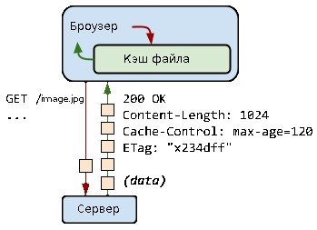

Скачивать одни и те же файлы каждый раз, когда браузер заходит на страничку, как минимум странно. Это увеличивает количество трафика, а также увеличивает загрузку страниц, что плохо отображается на нашем с Вами психологическом здоровье :) Именно для того, чтобы люди были счастливыми, а сервера занимались полезной работой и было придумано HTTP кэширование.

Все браузеры поддерживают HTTP кэш. Все что нужно сделать - это правильно настроить сервер. Давайте же разберемся какие именно должны быть эти заголовки и как броузер ведет себя в разных ситуациях.

## HTTP Кэширование

Когда Вы заходите на любой сайт, броузер тут же отправляет запрос на сервер. Сервер же обычно возвращает в ответ HTML код, в котором могут быть ссылки на другие рисунки, CSS стили и JavaScript файлы.

Рассмотрим небольшой пример запроса рисунка GET /image.jpg:

В ответ на запрос сервер возвращает заголовки и содержимое файла. Cache-Control заголовок указывает на сколько времени в секундах рисунок должен быть закэширован. Если на протяжении последующих 2 минут браузер будет заходить на эту же страницу, то вместо того чтобы запрашивать рисунок заново с сервера, он просто возьмет его из локальной файловой системы. И уже минус 1 запрос. А если таких рисунков 20?

Что же происходит после окончания "жизни" файла? Как всегда браузер сначала проверяет кэш, срок действия последнего истек и он больше не может быть использован. Тогда шлется запрос на сервер и рисунок опять попадает в кэш.

Все вроде нормально, но можно подумать и задать следующий вопрос: а что если по истечению времени жизни, файл не поменялся, зачем опять тратить время на его загрузку, если он уже у меня есть? Хороший вопрос! Именно для этого придуман заголовок ETag, который в общем-то является просто уникальным идентификатором ресурса. Если меняется ресурс (в нашем случае рисунок), то меняется и его ETag.

Если веб-сервер настроен возвращать такой заголовок для файлов, то браузер его запоминает. После того, как кэш устарел браузер отправляет запрос с заголовком If-None-Match: x234dff, где x234dff - ETag нашего рисунка. Потом сервер проверяет, если ETag совпадает с тем, который есть у него, то он возвращает стандартный набор заголовков со статусом 304 Found (найден) и не отправляет содержимое самого файла в ответ! Другими словами, он говорит браузеру, что файл не поменялся и что нужно просто продолжить его жизнь в кэше.

## Оптимизация HTTP кэш

Все это работает хорошо, но если Ваш сайт посещают много клиентов, сервер будет тратить время на запросы по обновлению клиентского кэша. Так как это совсем не то, на что мы хотим тратить серверное время, то желательно было бы уменьшить количество таких запросов до 0. Все что нужно сделать - это обновлять имя файла каждый раз когда обновляется его контент. Т.е., по сути мы зашиваем значение ETag в имя файла и указываем срок кэширования на год или два.

Это выглядит примерно так:

```
GET /styles.v1.css

Status: 200 OK
Cache-control: 316887646
```

На протяжении года браузер больше не будет запрашивать этот файл.

Правильно настроив веб-сервер мы можем указать параметры кэширования для определенных запросов. Обычно рекомендуют кэшировать рисунки, таблицы стилей, JavaScript скрипты, шрифты, т.е. ресурсы, которые будут меняться достаточно редко.

Понимая механизм работы, и зная что нужно оптимизировать давайте теперь настроим наш сервер правильно!

## Настройка HTTP кэша в Nginx

Кэш включается  при помощи директивы expires. expires max - задает время жизни на 10 лет, expires epoch - сбрасывает кэш, а expires off - просто убирает все заголовки относящиеся к кэшу. Например следующая конфигурация виртуального хоста указывает кэшировать все рисунки, css, js, xml, svg и файлы шрифтов на 30 дней. Более детально о [директиве expires можно прочесть в документации Nginx](http://nginx.org/ru/docs/http/ngx_http_headers_module.html#expires).

```php
server {
  # .... other directives

  location ~* ^.+.(jpg|jpeg|gif|css|png|js|ico|xml|svg|ttf|eot|woff|woff2)$ {
    expires 30d;
  }
}
```

В Nginx также есть директива etag, которая включает или выключает добавление заголовка ETag. Ее прописывать не нужно, так как по умолчанию она включена. Больше информации о стандартных настройках можно найти в [Github репозитории HTML5 boilerplate](https://github.com/h5bp/server-configs-nginx).

## Настройка HTTP кэша в Apache

В Apache кэш включается при помощи модуля mod\_expires и его директив: ExpiresActive, ExpiresDefault, ExpiresByType. Пример использования (можно вставить в .htaccess файл в корне проекта):

```xml
<IfModule mod_expires.c>
    ExpiresActive on
    ExpiresDefault                                      "access plus 1 month"

    ExpiresByType text/css                              "access plus 1 year"
    ExpiresByType text/html                             "access plus 0 seconds"
    ExpiresByType application/javascript                "access plus 1 year"


  # Media files
    ExpiresByType image/gif                             "access plus 1 month"
    ExpiresByType image/jpeg                            "access plus 1 month"
    ExpiresByType image/png                             "access plus 1 month"
</IfModule>
```

Таким образом можно закэшировать файлы, указать стандартное время жизни при помощи ExpiresDefault и потом переопределить значение для отдельных типов файлов. ETag, также как и в Nginx включен по умолчанию, и его можно настраивать при помощи директивы FileETag. Больше информации о стандартных настройках Apache можно найти в [Github репозитории HTML5 boilerplate](https://github.com/h5bp/server-configs-apache/).

## Заключение

Настройка веб сервера не занимает много времени, но может принести очень серьезные улучшения производительности Вашего веб сайта, что в свою очередь повлечет больший поток трафика с поисковых систем и соответственно, больше заказав, посещений и известности для Вас.
