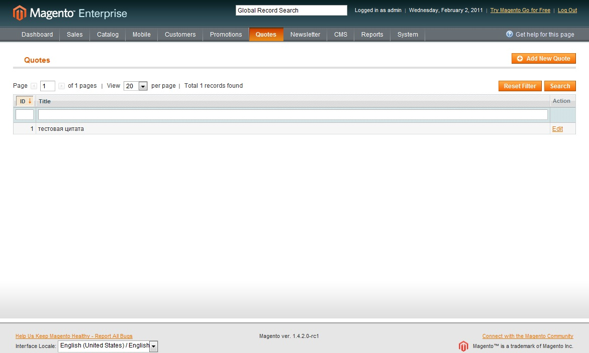
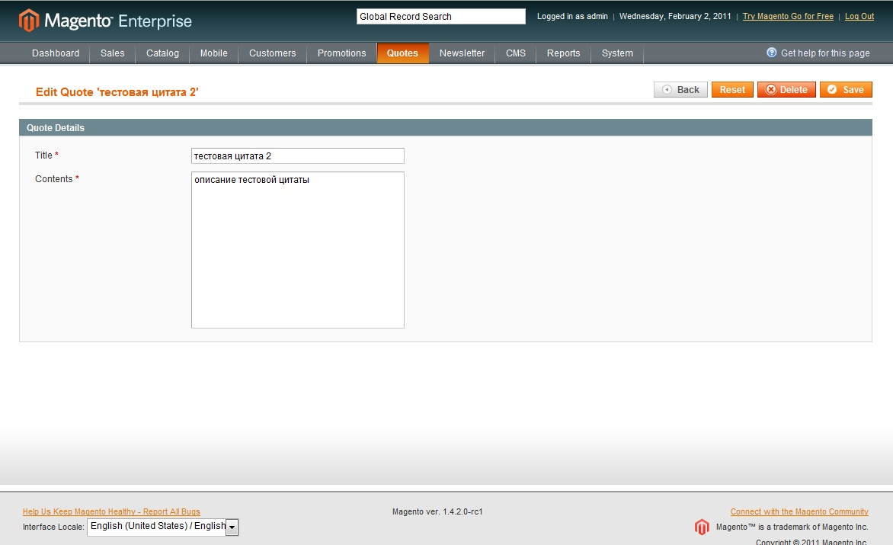

Если Вы пропустили предыдущую статью, то нужно скачать вот [ЭТО](./Freak_Quotes_All.zip).

## Реконфигуринг

Как всегда начнем работу с добавления файлов/папок в структуру нашего модуля.

```bash
|-app
|---code
|-----local
|-------Freaks
|---------Quotes
|-----------Block
|-------------Adminhtml
|---------------Edit
|-----------------Form.php
|---------------Quotes
|-----------------Grid.php
|---------------Edit.php
|---------------Quotes.php
|-----------controllers
|-------------Adminhtml
|---------------QuotesController.php
|-----------etc
|-------------config.xml
|-------------adminhtml.xml
|-----------Helper
|-----------Model
|-----------sql
|---design
|-----adminhtml
|-------default
|---------default
|-----------layout
|-------------freaks
|---------------quotes.xml
```

Добавим в файл конфигурации (**app/code/local/Freaks/Quotes/etc/config.xml**) новые настройки

```xml
<?xml version="1.0"?>
<config>
...........................................
    <adminhtml>
        <layout>
            <updates>
                <freaks_quotes>
                    <file>freaks/quotes.xml</file>
                </freaks_quotes>
            </updates>
        </layout>
    </adminhtml>
   <admin>
        <routers>
             <adminhtml>
                 <args>
                     <modules>
                         <freaks_quotes before="Mage_Adminhtml">Freaks_Quotes_Adminhtml</freaks_quotes>
                     </modules>
                 </args>
             </adminhtml>
        </routers>
    </admin>
</config>
```

*   _adminhtml_/_layout_ - указывает на файл с изменения к макету, по аналогии, как на frontend-е.
*   _admin/routers_ - указывает способ работы роутинга. Эти директива означает, что модуль Freaks\_Quotes должен использоваться в тех случаях, когда обратится к админ части модуля. В параметр задаем префикс для всех классов, отвечающих за роботу с backend-ом

В директории настроек появился еще один странный файл с именем **adminhtml.xml**. Постмотрим что же в нем можна задать

```xml
<?xml version="1.0"?>
<config>
    <menu>
        <freaks_quotes translate="title" module="freaks_quotes">
            <title>Quotes</title>
            <sort_order>55</sort_order>
            <action>adminhtml/quotes</action>
        </freaks_quotes>
    </menu>
    <acl>
        <resources>
            <admin>
                <children>
                    <freaks_quotes translate="title" module="freaks_quotes">
                        <title>Quotes</title>
                        <sort_order>0</sort_order>
                    </freaks_quotes>
                </children>
            </admin>
        </resources>
    </acl>
</config>
```

Видим, что с его помощью можно добавить в меню новый пункт, переходя по-которому сможем попасть на список всех цитат. В директиве _menu_ думаю все понятно, за исключением _action_. Он указывает Magento, какой нужно использовать URL для index страницы модуля. После "adminhtml/" идет название контроллера в директории **controllers/Adminhtml**.

_acl_ - это access level, который можно изменять на Magento backend-е - **Sytem** \> **Permissions** \> **Roles**. В нашем случае права или даются на весь модуль или вообще не даются.

Создадим layout-файл для backend-а (**app/design/adminhtml/default/default/layout/freaks/quotes.xml**)

```xml
<?xml version="1.0"?>
<layout version="0.1.0">
    <adminhtml_quotes_index>
        <reference name="content">
            <block type="freaks_quotes/adminhtml_quotes" name="quotes.grid_container" />
        </reference>
    </adminhtml_quotes_index>

    <adminhtml_quotes_new>
        <update handle="adminhtml_quotes_edit"/>
    </adminhtml_quotes_new>

    <adminhtml_quotes_edit>
        <reference name="content">
            <block type="freaks_quotes/adminhtml_edit" name="quotes.edit" />
        </reference>
    </adminhtml_quotes_edit>
</layout>
```

В этой конфигурации появилась новая директива - "update". Все что он делает - это указывает, настройки из какого _handle-а_ нужно использовать здесь.

## Контролируем

Создаем то без чего ничего не работает - вот он контроллер

```php
<?php
class Freaks_Quotes_Adminhtml_QuotesController extends Mage_Adminhtml_Controller_Action
{
    public function indexAction()
    {
        $this->_title($this->__('Quotes'));

        $this->loadLayout();
        $this->_setActiveMenu('freaks_quotes');
        $this->_addBreadcrumb(Mage::helper('freaks_quotes')->__('Quotes'), Mage::helper('freaks_quotes')->__('Quotes'));
        $this->renderLayout();
    }

    public function newAction()
    {
        $this->_title($this->__('Add new quote'));
        $this->loadLayout();
        $this->_setActiveMenu('freaks_quotes');
        $this->_addBreadcrumb(Mage::helper('freaks_quotes')->__('Add new quote'), Mage::helper('freaks_quotes')->__('Add new quote'));
        $this->renderLayout();
    }

    public function editAction()
    {
        $this->_title($this->__('Edit quote'));

        $this->loadLayout();
        $this->_setActiveMenu('freaks_quotes');
        $this->_addBreadcrumb(Mage::helper('freaks_quotes')->__('Edit quote'), Mage::helper('freaks_quotes')->__('Edit Quote'));
        $this->renderLayout();
    }

    public function deleteAction()
    {
        $tipId = $this->getRequest()->getParam('id', false);

        try {
            Mage::getModel('freaks_quotes/quote')->setId($tipId)->delete();
            Mage::getSingleton('adminhtml/session')->addSuccess(Mage::helper('freaks_quotes')->__('Quote successfully deleted'));

            return $this->_redirect('*/*/');
        } catch (Mage_Core_Exception $e){
            Mage::getSingleton('adminhtml/session')->addError($e->getMessage());
        } catch (Exception $e) {
            Mage::logException($e);
            Mage::getSingleton('adminhtml/session')->addError($this->__('Somethings went wrong'));
        }

        $this->_redirectReferer();
    }

    public function saveAction()
    {
        $data = $this->getRequest()->getPost();
        if (!empty($data)) {
            try {
                Mage::getModel('freaks_quotes/quote')->setData($data)
                    ->save();
                Mage::getSingleton('adminhtml/session')->addSuccess(Mage::helper('freaks_quotes')->__('Quote successfully saved'));
            } catch (Mage_Core_Exception $e) {
                Mage::getSingleton('adminhtml/session')->addError($e->getMessage());
            } catch (Exception $e) {
                Mage::logException($e);
                Mage::getSingleton('adminhtml/session')->addError($this->__('Somethings went wrong'));
            }
        }
        return $this->_redirect('*/*/');
    }

    public function gridAction()
    {
        $this->loadLayout();
        $this->getResponse()->setBody(
            $this->getLayout()->createBlock('freaks_quotes/adminhtml_quotes_grid')->toHtml()
        );
    }
}
```

_index_, _new_, _edit_ екшены - аналогичные. Я не усложнял код выносом общей логики в в отдельную функцию, потому что я хочу ясно показать что и кто и где делает. Эти методы просто ставят _title_ для страницы, загружают _layout_ объект, устанавливают активное меню и отображают макет.

Более интересная информация скрыта в методах _delete_, _save_ и _grid_.

Самый простой _deleteAction_ - получает идентификатор цитаты через объект _Request,_ устанавливает его для модели и пытается удалить. Если все произошло успешно добавляем в сессию сообщение об успешном завершении. Если же получаем _Mage\_Core\_Exception_ - это значит, что он брошен разработчиками и в нем понятный для пользователя текст, поэтому устанавливаем его нотайс в сессию также. При условии что поймалась какая-то другая ошибка, вероятнее всего что это логическая или еще какая-то ошибки, которая понятна только разработчикам. Поэтому вызываем метод _logException_, который запишет ошибку на файловою систему если это разрешено в **System** \> **Developer** \> **Log Settings**. И в конце перенаправляем пользователя на страницу с которой он пришел или главную страницу модуля.

_saveAction_ делает аналогичную работу с одним маленьким НО :) он принимает данные с формы и пробует сохранить цитату. Вся остальная процедура повторяется.

_gridAction_ нужен для обработки AJAX запросов на поиск и сортировку даных в таблице. По сути он загружает _layout,_ создает _grid-_блок, который мы создадим чуть позже, превращает блок в _html_ и устанавливает как тело ответа в объект _Response_.

## Делаем вид, что работаем

Пришло время создать блоки. Хочу сразу обрадовать, нам не придется писать _html_\-код, разработчики Magento, позаботились об этом и спасибо им:)

Создадим пару классов блоков. Для начала _Grid_ и _GridContainer_ блоки. Открываем **Block/Adminhtml/Quotes.php**, это и будет _GridContainer_

```php
<?php
class Freaks_Quotes_Block_Adminhtml_Quotes extends Mage_Adminhtml_Block_Widget_Grid_Container
{
    protected function _construct()
    {
        $this->_addButtonLabel = Mage::helper('freaks_quotes')->__('Add New Quote');

        $this->_blockGroup = 'freaks_quotes';
        $this->_controller = 'adminhtml_quotes';
        $this->_headerText = Mage::helper('freaks_quotes')->__('Quotes');
    }
}
```

Здесь все понятно за исключением того, что свойства объекта _\_blockGroup_ и _\_controller_ - очень важные. Они задают значения, с помощью которых Magento потом попытается найти _Grid_\-блок. _\_blockGroup -_ это просто имя вашего модуля, а контроллер указывает путь (через символ "\_") относительно корня модуля, где лежит ваш _Grid._ Посмотрев внимательно вначале статьи на структуру директорий, можно увидеть почему здесь именно такие значения. Документацию по методам можно найти [ЗДЕСЬ](http://docs.magentocommerce.com/Mage_Adminhtml/Mage_Adminhtml_Block_Widget_Grid_Container.html "Magento документация Grid Container").

Создадим _Grid_\-блок (**Block/Adminhtml/Quotes/Grid.php**)

```php
<?php
class Freaks_Quotes_Block_Adminhtml_Quotes_Grid extends Mage_Adminhtml_Block_Widget_Grid
{
    protected function _construct()
    {
        $this->setId('quotesGrid');
        $this->_controller = 'adminhtml_quotes';
        $this->setUseAjax(true);

        $this->setDefaultSort('id');
        $this->setDefaultDir('desc');
    }

    protected function _prepareCollection()
    {
        $collection = Mage::getModel('freaks_quotes/quote')->getCollection();
        $this->setCollection($collection);

        return parent::_prepareCollection();
    }

    protected function _prepareColumns()
    {
        $this->addColumn('id', array(
            'header'        => Mage::helper('freaks_quotes')->__('ID'),
            'align'         => 'right',
            'width'         => '20px',
            'filter_index'  => 'id',
            'index'         => 'id'
        ));

        $this->addColumn('name', array(
            'header'        => Mage::helper('freaks_quotes')->__('Title'),
            'align'         => 'left',
            'filter_index'  => 'name',
            'index'         => 'name',
            'type'          => 'text',
            'truncate'      => 50,
            'escape'        => true,
        ));

        $this->addColumn('action', array(
            'header'    => Mage::helper('freaks_quotes')->__('Action'),
            'width'     => '50px',
            'type'      => 'action',
            'getter'     => 'getId',
            'actions'   => array(
                array(
                    'caption' => Mage::helper('freaks_quotes')->__('Edit'),
                    'url'     => array(
                        'base'=>'*/*/edit',
                    ),
                    'field'   => 'id'
                )
            ),
            'filter'    => false,
            'sortable'  => false,
            'index'     => 'id',
        ));

        return parent::_prepareColumns();
    }

    public function getRowUrl($quote)
    {
        return $this->getUrl('*/*/edit', array(
            'id' => $quote->getId(),
        ));
    }

    public function getGridUrl()
    {
        return $this->getUrl('*/*/grid', array('_current'=>true));
    }
}
```

Здесь в конструкторе указываем некоторые параметры, такие как: сортировка по умолчанию, идентификатор grid-а в html, использование AJAX технологии.

_\_prepareCollection -_ подготавливаем коллекцию объектов которые нужно отображать. В нашем случае, просто берем объект коллекции для цитат и передаем его в _Grid._

_\_prepareColumns_ - в этом методе создаем колонки для таблицы. Для каждого типа колонки есть свой _renderer_ в **app/code/core/Mage/Adminhtml/Block/Widget/Grid/Column/Renderer**. Рассмотрим метод _addColumn_. Первый параметр метода - это идентификатор колонки, второй настройки ее отображения. В зависимости от _renderer-_а их может быть больше или меньше, поэтому рассмотрим только базовые, если хотите знать больше, то Вам [СЮДА](http://docs.magentocommerce.com/Mage_Adminhtml/Mage_Adminhtml_Block_Widget_Grid.html#addColumn "Magento документация Grid::addColumn").

*   _header_ - название колонки в таблице, отображается пользователю
*   _align_ - позиционирование текста в колонке
*   _filter\_index_ - индекс значения в объекте по-которому будет производится поиск в коллекции
*   _index_ - индекс значения объекта, который нужно вывести в каждой строке этой колонки
*   _type_ - задает _renderer_
*   _truncate_ - к-во символов, которые нужно выводить
*   _sortable_ - указывает можно ли делать сортировку по колонке
*   _filter_ - указывает можно ли делать поиск по колонке
*   _width_ - указывает ширину
*   _escape_ - вызывает метод htmlEscape для значения

_getRowUrl -_ возвращает URL для редактирования цитаты.

_getGridUrl -_ возвращает URL, на который нужно отправлять AJAX запросы.

Ну вот можете зайти на свой модуль и увидить очень даже симпотичную таблицу



Теперь создадим блоки отвечающие за редактирование и создание цитат. Используем только одну форму для этих действий. Открываем **Block/Adminhtml/Edit.php**

```php
<?php
class Freaks_Quotes_Block_Adminhtml_Edit extends Mage_Adminhtml_Block_Widget_Form_Container
{
    protected function _construct()
    {
        $this->_blockGroup = 'freaks_quotes';
        $this->_mode = 'edit';
        $this->_controller = 'adminhtml';

        $quote_id = (int)$this->getRequest()->getParam($this->_objectId);
        $quote = Mage::getModel('freaks_quotes/quote')->load($quote_id);
        Mage::register('current_quote', $quote);
    }

    public function getHeaderText()
    {
        $quote = Mage::registry('current_quote');
        if ($quote->getId()) {
            return Mage::helper('freaks_quotes')->__("Edit Quote '%s'", $this->escapeHtml($quote->getName()));
        } else {
            return Mage::helper('freaks_quotes')->__("Add new Quote");
        }
    }
}
```

Разбираем, что же здесь происходит... _Form\_Container_ по аналогии к _Grid\_Container_\-у будет искать класс формы с учетом _\_blockGroup_, _\_mode_ и _\_controller._ Единственная разница - это свойство _\_mode._ Имя класса формы будет формироваться следующим образом:

```php
$layout->createBlock($this->_blockGroup . '/' . $this->_controller . '_' . $this->_mode . '_form')
```

Поэтому здесь нужно быть особо внимательным. Если у Вас что-то не работает, скорее всего проблема именно здесь.

Потом берем идентификатор цитаты в запросе загружаем модель и добавляем ее в Magento реестр (реестр - это просто статической свойство в класса Mage, которое является массивом объектов и используется для передачи объектов между классами никак не связаными). Это нужно, чтобы потом обратится к этой цитате в объекте формы. Метод _getHeaderText_ \- просто выводит заголовок для екшена в зависимости от того добавляется цитата или редактируется.

Создаем класс формы (**Block/Adminhtml/Edit/Form.php**)

```php
<?php
class Freaks_Quotes_Block_Adminhtml_Edit_Form extends Mage_Adminhtml_Block_Widget_Form
{
    protected function _prepareForm()
    {
        $quote = Mage::registry('current_quote');
        $form = new Varien_Data_Form();
        $fieldset = $form->addFieldset('edit_quote', array(
            'legend' => Mage::helper('freaks_quotes')->__('Quote Details')
        ));

        if ($quote->getId()) {
            $fieldset->addField('id', 'hidden', array(
                'name'      => 'id',
                'required'  => true
            ));
        }

        $fieldset->addField('name', 'text', array(
            'name'      => 'name',
            'label'     => Mage::helper('freaks_quotes')->__('Title'),
            'maxlength' => '250',
            'required'  => true,
        ));

        $fieldset->addField('dscr', 'textarea', array(
            'name'      => 'dscr',
            'label'     => Mage::helper('freaks_quotes')->__('Contents'),
            'style'     => 'width: 98%; height: 200px;',
            'required'  => true,
        ));

        $form->setMethod('post');
        $form->setUseContainer(true);
        $form->setId('edit_form');
        $form->setAction($this->getUrl('*/*/save'));
        $form->setValues($quote->getData());

        $this->setForm($form);
    }
}
```

Метод _\_prepareForm_ подготавливает форму для отображения. Посмотрим, что там происходит... Берем нашу цитату из реестра, создаем объект _Varien\_Data\_Form_, добавляем к нему один _fieldset_ (в контексте данной разработки больше не нужно, но можно добавить и больше) и поля в него. Если это создание новой цитаты, тогда нам аоле _id_ не нужно, учитываем это. Передаем значения у форму методом _setValues._ Все остальное достаточно логично и понятно из самомого кода.



Ну вот создание модуля завершено, можете наслаждатся добавлением цитат :) Готовый вариант можно скачать [ЗДЕСЬ](./Freak_Quotes_All.zip "Magento custom module download").

В следующей статье я опишу, как создать атрибут quote для продукта и каким образом связать его з цитатой.
