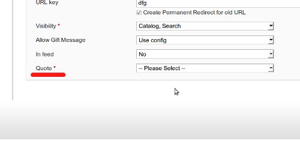
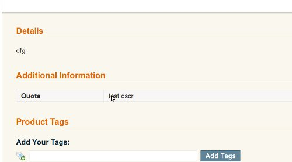

В этой статье мы свяжем цитаты и продукты в Magento, используя EAV модуль. Предыдущую версию модуля можно скачать [ЗДЕСЬ](./Freak_Quotes_With_Image.zip).

## Сапаем вазоны

Для начала нам нужно создать атрибут для продуктов, в котором будет сохранятся **ID** цитаты. Управление атрибутами реализовано в _Mage\_Eav\_Model\_Entity\_Setup_, поэтому нужно изменить **config.xml**. Открываем этот файл и добавляем всего одну строчку

```xml
..........................................
        <resources>
            <quotes_setup>
                <setup>
                    <module>Freaks_Quotes</module>
                    <class>Mage_Eav_Model_Entity_Setup</class>
                </setup>
                <connection>
                    <use>core_setup</use>
                </connection>
            </quotes_setup>
................................................
```

Теперь напишем сам upgrade. Создаем файл **app/code/local/Freaks/Quotes/sql/quotes\_setup/mysql4-upgrade-0.3.0-0.4.0.php**

```php
<?php
$installer = $this;
$installer->startSetup();

$installer->addAttribute('catalog_product', 'freaks_quotes_id', array(
    #'position'          => 1,
    #'user_defined'      => 1,
    #'searchable'        => 0,
    #'filterable'        => 0,
    #'comparable'        => 0,
    #'visible_on_front'  => 1,
    #'visible_in_advanced_search' => 0,
    #'is_configurable'   => 0,    
    #'unique'            => 0,
    'type'     => 'int',
    'label'    => 'Quote',
    'input'    => 'select',
    'source'   => 'freaks_quotes/link',
    'frontend' => 'freaks_quotes/frontend',
    'global'   => Mage_Catalog_Model_Resource_Eav_Attribute::SCOPE_STORE,
    'required' => true,
    'default'  => 0,
    'visible'           => 1,
    'visible_on_front'  => 1
));
 
$installer->endSetup();
```

С помощью метода _addAttribute_ добавляем новый атрибут для продуктов в таблицу _eav\_attribute_. Привел я все опции, для того, чтобы тот кто захочет поэкспериментировать, мог это сделать.

Чтобы заработал _backend_ нужно создать Source модель для атрибута. Сразу скажу, что этот класс должен реализовать методы интерфейса _Mage\_Eav\_Model\_Entity\_Attribute\_Source\_Interface_, хотя это и не проверится в нашем случае. Создаем файл **app/code/local/Freaks/Quotes/Model/Link.php**

```php
<?php
class Freaks_Quotes_Model_Link extends Varien_Object
{
    public function getAllOptions() {
        $options = Mage::getResourceModel('freaks_quotes/quote_collection')
            ->toOptionArray();
        array_unshift($options, array('value'=>'', 'label'=>Mage::helper('catalog')->__('-- Please Select --')));
        return $options;
    }
}
```

Здесь появился новый метод о котором я не рассказывал. _getResourceModel_ - возвращает Resource модель указанную в аргументе. В нашем случае берется коллекция цитат. Я использовал его только для того, чтобы уменьшить количество ненужных операций.

Заходим на создание/редактирование продукта и смотрим что у нас в группе "General" есть новое поле



Так як хочется вывести цитату на frontend-е, то нужно создать Frontend модель. Открываем файл **app/code/local/Freaks/Quotes/Model/Frontend.php**

```php
<?php
class Freaks_Quotes_Model_Frontend extends Mage_Eav_Model_Entity_Attribute_Frontend_Abstract
{
    public function getValue(Varien_Object $object)
    {
        $quote = Mage::getModel('freaks_quotes/quote')->load($object->getFreaksQuotesId());
        return $quote->getDscr();
    }
}
```

В метод _getValue_ в нашем случае передастся объект Mage\_Catalog\_Model\_Product (по скольку большинство моделей в Magento наследуются от Varien\_Object, то условие выполнится).

Вот и все идем на frontend и смотрим, что у нас выводится под продуктом



Готовое решение можно скачать [ЗДЕСЬ](./Freak_Quotes_Eav.zip)