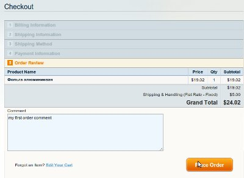

Есть несколько дополнений к Magento, которые делают возможным комментировать заказ, но в большинстве они просто добавляют новый атрибут к сущности ордера. Напрашивается вопрос зачем? Ведь в Magento уже есть достаточно хороший механизм комментирования.

## Ищем где приютится

Благодаря восхитительным возможностям Linux команды grep, было установлено существование события **checkout\_type\_onepage\_save\_order**. Чтобы установить комментарий на заказ, можно использовать код

```php
$order->setCustomerNote('мой первый комментарий');
# или же
$order->addStatusToHistory($order->getStatus(), 'мой первый комментарий', false);
```

Первый вариант более удобен, тем что после оформления заказа в отправленном письме (о новом заказе) Magento автоматически включит комментарий в текст сообщения.

## Приступаем к работе

Для начала нужно [создать модуль](../2011-01-29_magento-sozdanie-crud-modulya) с такой структурой

```
|-app
|---code
|-----local
|-------Freaks
|---------OrderComments
|-----------etc
|-------------config.xml
|-----------Model
|-------------Observer.php
|---design
|-----frontend
|-------default
|---------default
|-----------template
|-------------checkout
|---------------onepage
|-----------------agreements.phtml
|---etc
|-----modules
|-------Freaks_OrderComments.xml
```

В файле конфигурации ничего особенного, за исключением

```xml
<frontend>
    <events>
        <checkout_type_onepage_save_order>
            <observers>
                <Freaks_OrderComments>
                    <class>freaks_ordercomments/observer</class>
                    <method>addOrderComment</method>
                </Freaks_OrderComments>
            </observers>
        </checkout_type_onepage_save_order>
    </events>
.........................................................................................................
</frontend>
```

Это значит, что при возникновении события **checkout\_type\_onepage\_save\_order**, нужно вызвать метод обсервера **addOrderComment**.

Сам обсервер очень прост. Берем заказ из события, устанавливаем комментарий из запроса посредством выше упомянутых средств и все

```php
<?php
class Freaks_OrderComments_Model_Observer
{
    /**
     * Add a customer order comment when the order is placed.
     * Listen "checkout_type_onepage_save_order" event
     *
     * @param Varien_Event_Observer $observer
     * @return Freaks_OrderComments_Model_Observer
     */
    public function addOrderComment(Varien_Event_Observer $observer)
    {
        $order = $observer->getEvent()->getOrder();
        $request = Mage::app()->getRequest();

        $comments = strip_tags($request->getParam('customer_comment'));

        if(!empty($comments)){
            $order->setCustomerNote($comments);
        }

        return $this;
    }
}
```

Чтобы комментарий отправлялся на сервер, нужно переопределить шаблон платежных соглашений. Просто допишем в него еще одно поле textarea

```php
<form action="" id="checkout-agreements" onsubmit="return false;">
<?php if ($this->getAgreements()): ?>
    <ol class="checkout-agreements">
    <?php foreach ($this->getAgreements() as $_a): ?>
        <li>
            <div class="agreement-content"<?php echo ($_a->getContentHeight() ? ' style="height:' . $_a->getContentHeight() . '"' : '')?>>
                <?php if ($_a->getIsHtml()):?>
                    <?php echo $_a->getContent() ?>
                <?php else:?>
                    <?php echo nl2br($this->htmlEscape($_a->getContent())) ?>
                <?php endif; ?>
            </div>
            <p class="agree">
                <input type="checkbox" id="agreement-<?php echo $_a->getId()?>" name="agreement[<?php echo $_a->getId()?>]" value="1" title="<?php echo $this->htmlEscape($_a->getCheckboxText()) ?>" class="checkbox" /><label for="agreement-<?php echo $_a->getId()?>"><?php echo $this->htmlEscape($_a->getCheckboxText()) ?></label>
            </p>
        </li>
    <?php endforeach ?>
    </ol>
<?php endif ?>
    <ol class="checkout-comments" style="padding-left:9px;">
        <li>
            <label for="customer_comment"><?php echo $this->__('Comment') ?></label>
            <br/><textarea name="customer_comment" id="customer_comment" style="width:440px; height:100px"></textarea>
        </li>
    </ol>
</form>
```

Вот что получилось у меня



Не забываем, что комментарий появится только на странице OnePage чекаута. Скачать готовое решение можно [здесь](./Freaks_OrderComments.zip)
