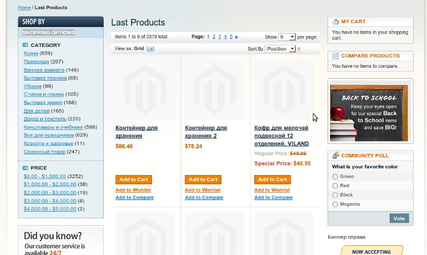

В одной из [предыдущих статей](../2011-10-03_bloki-kak-vyvesti-spisok-vsekh-novinok-ili-spets-predlozhenii-v-magento) я рассказывал, как можно вывести основные типы блоков для продуктов. Продолжая тему, хочу поделится идеей, как можно отобразить страницу категории с фильтрами, сортировкой и пейджингом для любых типов продуктов. Для простоты возьмем 2 типа: последние продукты (весь каталог обратном порядке) и продукты со спец. предложением.

## Фундамент - залог устойчивости

Идея очень проста и состоит в том, что мы будем отображать дефолтную категорию, которая содержит в себе все продукты, применив к ним необходимые фильтры. Обязательным условием является установка атрибута "Is Anchor" в **true**.

Из той же статьи, которая была упомянута выше я возьму модуль и расширю его функционал. По сути нужно написать всего один класс контроллера, поскольку правила роутинга я прописал заранее. Контролеры модуля будут доступны по url **products**. Сам класс является наследником **Mage\_Catalog\_CategoryController**.

Как говорится все уже написано до нас, но немного не так, по-этому придется скопировать метод **\_initCategory** и часть метода **viewAction** в новый контроллер из его родителя. В первом меняем строку

```php
if (!Mage::helper('catalog/category')->canShow($category)) {
    return false;
}
Mage::getSingleton('catalog/session')->setLastVisitedCategoryId($category->getId());
```

на

```php
$isRootCategory = !$category->isInRootCategoryList();
if (!$isRootCategory && !Mage::helper('catalog/category')->canShow($category)) {
    return false;
}

if (!$isRootCategory) {
    Mage::getSingleton('catalog/session')->setLastVisitedCategoryId($category->getId());
}
```

И тем самым позволяем инициализировать дефолтную категорию стора.

Создадим защищенный метод **\_prepareView**, точная копия метода **viewAction**, за исключением что он не вызывает рендеринг лейаута, а возвращает модель инициализированной категории.

И наконец ядром всей этой системы является метод **\_emulateCategory**, который принимает 2 аргумента: идентификатор категории (в нашем случае - это всегда рут категория, но может быть и любая другая!) и придуманное нами имя. Возвращает коллекцию продуктов или выбрасывает исключение, если на странице нет **product\_list** блока. На всякий случай (может понадобится в будущем) ставим категории флаг "Is Emulated", чтобы знать что это нереальная категория.

```php
protected function _emulateCategory($categoryId, $categoryTitle)
{
    $this->getRequest()->setParam('id', $categoryId);

    $category = $this->_prepareView();
    $category->setName($categoryTitle)
        ->setIsEmulated(true);

    // reset layout rendering
    if ($head = $this->getLayout()->getBlock('head')) {
        $head->setTitle($categoryTitle);
    }

    if ($breadcrumb = $this->getLayout()->getBlock('breadcrumbs')) {
        $breadcrumb->addCrumb('specials', array(
            'readonly' => true,
            'title'    => $categoryTitle,
            'label'    => $categoryTitle
        ));
    }

    if ($list = $this->getLayout()->getBlock('product_list')) {
        return $list->getLoadedProductCollection();
    }
    Mage::throwException($this->__('Unable to find products collection'));
}
```

Крепкий фундамент заложен, теперь можно приступить к реализации того, что нам нужно было изначально.

## Стены - уют и покой

Чтобы отобразить страницу, нужно создать метод-екшен с именем **lastAction**

```php
public function lastAction()
{
    $id   = Mage::app()->getStore()->getRootCategoryId();
    $name = Mage::helper('catalog')->__('Last Products');

    try {
        $productCollection = $this->_emulateCategory($id, $name);
        // filter products in some way
        $productCollection->setOrder('entity_id', 'desc');

        if ($layer = $this->getLayout()->getBlock('catalog.leftnav')) {
            // set visible filters
            #$layer->setVisibleFilters(array('price', 'manufacturer'));
        }
    } catch (Exception $e) {
        return $this->_redirect('');
    }

    $this->renderLayout();
}
```

Страница спец. предложений делается аналогичным образом. Думаю Вы заметили комментарий "**set visible filters**". Я немного усложнил задание и сделал возможность отображения только тех фильтров, которые мы хотим чтобы были видны на этой странице.

Чтобы это заработало придется еще переопределить стандартный шаблон **catalog/layer/view.phtml**. Добавив в него проверку на видимость фильтра, если установлено свойство **visible\_filters**, если нет - то показываем все фильтры. Страница доступна по url: /products/index/last. Вот что получилось у меня



Исходный код можно скачать [здесь](./Freaks_Product_Ext.zip).

**P.S.**: код фильтров для новых продуктов и спец. предложений можно найти [здесь](../2011-10-03_bloki-kak-vyvesti-spisok-vsekh-novinok-ili-spets-predlozhenii-v-magento), где все детально расписано.
