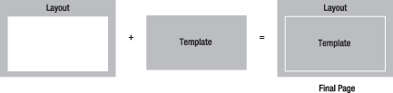

Думаю почти все начинают свое знакомство с _Magento_ с редактирования стандартной темы, добавления новых блоков или изменения старых. Это часть **View** из тройки букаф **MVC** и она достаточно сложная для новичков, по-этому предлагаю разобраться что это за файлы xml в директории _layout_.

## Страница - кирпичик к кирпичику

В Magento страницы строятся посредством блоков с использованием шаблонов, которые имеют расширение _\*.phtml_. Любой _phtml_ файл является валидным html кодом. Конечный результат создается путем декорации, т.е. вставки одного блока в другой. Хороший рисунок для понимания сути был найден в гайде по _Symfony1.4_

Здесь все работает точно также. В поставке стандартной темы есть 4 layout-a: 1 колонка, 2 колонки с leftbar, 2 колонки с rightbar, 3 колонки.

Почти каждый модуль имеет layout-update - xml файл, который вносит дополнительный функционал в часть **View**. Конфигурационные файлы layout-ов имеют несколько основных директив: handle, reference, block, action, remove. Рассмотрим каждый из них по отдельности.

## Handle

Дословно можно сказать, что это крючок, на который можно повесить несколько блоков. Но я себе это представляю, как событие, на которое вешается блок и при его (события) появлении блок будет обработан и выведен пользователю. _Handle_\-ы генерируются контроллером. Отрыв класс _Mage\_Core\_Controller\_Varien\_Action_ увидим, что на любой экшен генерируется 4 стандартных handle-а: _default_ (в методе **loadLayout**) и еще 3, один из которых отвечает за выбранную тему, второй за текущий модуль, контроллер и экшен и третий за текущий store (в методе **addActionLayoutHandles**)

```php
// load store handle
$update->addHandle('STORE_'.Mage::app()->getStore()->getCode());

// load theme handle
$package = Mage::getSingleton('core/design_package');
$update->addHandle(
    'THEME_'.$package->getArea().'_'.$package->getPackageName().'_'.$package->getTheme('layout')
);

// load action handle
$update->addHandle(strtolower($this->getFullActionName()));
```

Например, если у нас 1 store (магазин), стандартная тема и мы на странице просмотра списка продуктов в категории, то сгенерируется: _default_, _STORE\_default_, _THEME\_frontend\_default\_default_ и _catalog\_category\_view_.

Также посмотрев более детально на методы **loadLayout** и **renderLayout** можно догадаться, что **handle-ы** можно генерировать динамически в зависимости от определенных условий, как делается в _Mage\_Catalog\_CategoryController_

```php
$update = $this->getLayout()->getUpdate();
$update->addHandle('default');

if (!$category->hasChildren()) {
    $update->addHandle('catalog_category_layered_nochildren');
}

$this->addActionLayoutHandles();
$update->addHandle($category->getLayoutUpdateHandle());
$update->addHandle('CATEGORY_' . $category->getId());
$this->loadLayoutUpdates();

// apply custom layout update once layout is loaded
if ($layoutUpdates = $settings->getLayoutUpdates()) {
    if (is_array($layoutUpdates)) {
        foreach($layoutUpdates as $layoutUpdate) {
            $update->addUpdate($layoutUpdate);
        }
    }
}

$this->generateLayoutXml()->generateLayoutBlocks();
```

Основное описание всех страниц находится в _page.xml_. Если открыть его, то увидим наши _handle_\-ы (_default_, _print_, _page\_empty_, _page\_one\_column_, etc)

```xml
<layout version="0.1.0">
    <!-- Default layout, loads most of the pages -->

    <default translate="label" module="page">
        // default block structure
    </default>

    <print translate="label" module="page">
        // block structure
    </print>

     <!-- Custom page layout handles -->
    <page_empty translate="label">
        <label>All Empty Layout Pages</label>
        <reference name="root">
            <action method="setTemplate"><template>page/empty.phtml</template></action>
            <!-- Mark root page block that template is applied -->
            <action method="setIsHandle"><applied>1</applied></action>
        </reference>
    </page_empty>

    <page_one_column translate="label">
        <label>All One-Column Layout Pages</label>
        <reference name="root">
            <action method="setTemplate"><template>page/1column.phtml</template></action>
            <!-- Mark root page block that template is applied -->
            <action method="setIsHandle"><applied>1</applied></action>
        </reference>
    </page_one_column>
    <!-- another hanbles -->
</layout>
```

## Reference

С помощью данной директивы можно обратится к блоку и вызвать у него определенные экшены или добавить дочерние блоки, как например в примере выше, _handle_ = _page\_one\_column_. Мы обращаемся к самому верхнему по структуре блоку **root** и устанавливаем ему другой шаблон для отображения.

Эта директива имеет атрибут **name**, в котором указываем имя блока, к которому хотим обратится. Почти все блоки имеют свое уникальное имя. При написании своих _layout-update_\-ов давайте имена всем блокам, которые в будущем нужно будет изменять.

## Block

Блок - сердце всей структуры. Имеет несколько атрибутов:

*   _type_ - Magento путь, указывающий на класс блока. Например, "_cms/block_" указывает на класс _Mage\_Cms\_Block\_Block_, который находится в _app/code/core/Mage/Cms/Block/Block.php._ Если Вы не нуждаетесь в специфической логики обработки блока, а просто хотите вывести какой-то шаблон, то используйте "_core/template_"
*   _name_ - уникальное имя блока, нужно для того чтобы потом можно было обращаться к ему посредством директивы _reference_
*   _as_ - псевдоним для имени блока, нужно если хотим обратится к блоку из кода, при помощи методов родительского блока _getChild_ или _getChildHtml_.
*   _ifconfig_ - конфигурационный путь, блок будет показан только, если значение настройки равно _true_
*   _after_ - указывает имя блока после которого нужно вывести данный
*   _before_ - указывает имя блока перед которым нужно вывести данный. Если указать знак минуса ("-"), то блок будет выведен самым первым из всех в своем родителе
*   _template_ - указывает шаблон для блока
*   _translate_ - указывает теги(ноды, узлы), содержимое которых нужно перевести. Теги прописываются через пробел

Например, выведем на главной список всех новинок

```xml
<cms_index_index>
    <reference name="content">
        <block type="catalog/product_new" name="products.new" before="-" />
    </reference>
</cms_index_index>
```

Существует несколько стандартных имен блоков: _root_, _left_, _right_, _content_.

## Action

С помощью этой директивы можно вызывать методы блока, после его инициализации. Имеет атрибут **method**, в котором указывается имя метода. Аргументы перечисляются в тегах, имена тегов никак не используются. В метод аргументы передаются в такой очередности, в которой они были прописаны в xml файле, например установим другой шаблон руту

```xml
<reference name="root">
    <action method="setTemplate"><template>page/1column.phtml</template></action>
    <!-- Mark root page block that template is applied -->
    <action method="setIsHandle"><applied>1</applied></action>
</reference>
```

## Remove

С помощью этой директивы можно удалять блоки. Имеет один атрибут **name** - имя блока, который нужно удалить. Например, удалим назойливые баннеры из стандартной темы

```xml
<layout>
  <default>
     <remove name="right.permanent.callout" />
     <remove name="left.permanent.callout" />
  </default>
</layout>
```

## Ставим точки над і

Так как **handle** - это крючок (событие), значит он самый главный в иерархии. Все остальное должно обязательно находится внутри его! В нем (handle-е) может находится: block, remove, reference. **Reference** - это просто ссылка на блок, т.е. способ обновить содержимое блока. Объясню на примере блока с именем **content**. Если открыть файл _page.xml_, то там в **default handle**, можно найти такое

```xml
<default translate="label" module="page">
    <label>All Pages</label>
    <block type="page/html" name="root" output="toHtml" template="page/3columns.phtml">

        <block type="page/html_head" name="head" as="head">
        </block>

        <block type="page/html_header" name="header" as="header">
            // header block children
        </block>

        // some blocks
        
        <block type="core/text_list" name="content" as="content" translate="label">
            <label>Main Content Area</label>
        </block>
        
        // another blocks
    </block>
</default>
```

Что же делать, если нужно добавить дочерний блок в контент, но не исправляя файл _page.xml_? Нужно использовать **reference**!

```xml
<default>
    <reference name="content">
        <block type="core/template" name="test.block" template="test/some_text.phtml" />
    </reference>
</default>
```

Все что находится внутри _reference_ можно считать, что оно находится внутри блока с заданным именем.

**Block** может находится внутри другого блока или _reference_\-а (тогда он является дочерним блок и доступ к нему из родительского можно получить через метод **getChild**, первый параметр которого - элиас блока, т.е. содержимое атрибута **as**, по-этому если Вы планируете обратится к блоку из кода прописывайте ему элиас), также он может находится внутри **handle** (так как блок с именем **root**, смотреть _page.xml_).

**Action** может находится только в _reference_ или _block_, так как эта директива означает вызов метода из класса блока. Например, блок **head** имеет методы _addJs_, _addCss_, _addItem_ с помощью которых можно добавить на страницу файлы _javascript_ (из директории js обычно) и _css_ (из директории текущего скина).

Метод _addItem_ универсальный, с его помощью можно добавить _javascript_ (как из корневого каталога, так и с каталога скина) и _css_, а также задавать параметры для [_conditional comments_](http://en.wikipedia.org/wiki/Conditional_comment) в IE

```xml
<default translate="label" module="page">
    <label>All Pages</label>
    <block type="page/html" name="root" output="toHtml" template="page/3columns.phtml">
        <block type="page/html_head" name="head" as="head">
            <action method="addJs"><script>prototype/prototype.js</script></action>
            // add another files
            
            <action method="addCss"><stylesheet>css/styles.css</stylesheet></action>
            <action method="addItem"><type>skin_css</type><name>css/styles-ie.css</name><params/><if>lt IE 8</if></action>

            <action method="addItem"><type>js</type><name>lib/ds-sleight.js</name><params/><if>lt IE 7</if></action>
            <action method="addItem"><type>skin_js</type><name>js/ie6.js</name><params/><if>lt IE 7</if></action>
        </block>
    </block>
</default>
```

**P.S.**: вот и все. Надеюсь материал сильно поможет начинающим, по-скольку все это я сам проходил набивая собственные шишки. Планирую написать серию статей о конфигурационных файлах в _Magento_. Ждите продолжения

**UPD:** забыл упомянуть о теге **update**. Имеет один атрибут **handle**, да-да это имя именно той самой директивы, о которой говорилось выше. Директива может находится только внутри другого _handle_\-а, переносит все блоки из указанного _handle_\-а в тот, в котором она прописана, например

```xml
<customer_account_edit translate="label">
    <label>Customer Account Edit Form</label>

    <update handle="customer_account"/>

    // another directives
</customer_account_edit>
```

Все директивы из _customer\_account_ будут использованы и в _customer\_account\_edit handle_\-е. Применяется для того, чтобы избежать дублирования одинаковых директив.