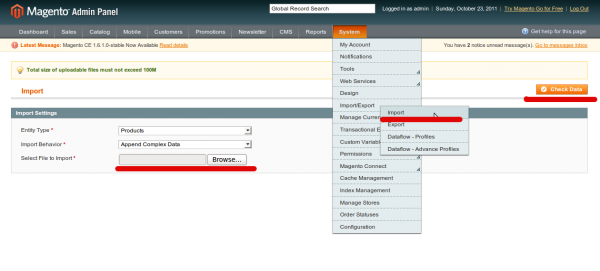

Думаю многие сталкивались с импортом/экспортом данных и думаю многие знают, что в _Magento_ - это одно из самых узких мест. Почему? Потому что структура базы данных достаточно сложная для того, чтобы вставлять данные через обычные _SQL_ запросы, потому что стандартный импорт/экспорт с использованием профайлов работает медленно. Но так было до версии 1.5. Начиная с этой версии появился новый модуль для импорта и экспорта продуктов и пользователей. Через веб интерфейс все отлично работает, но что если нужно импортировать/экспортировать товары по крону? Для этого нужно написать **cli** версию.

## Анализируем

Зайдем на страницу импорта (_System_ -> _Import/Export_ -> _Import_) и будем разбираться как все устроено.



Видим, что сначала нужно выбрать тип сущности, которую нужно импортировать, поведение импорта и файл. Существует 3 поведения импорта, в основном оно отвечает за то, как будут обработаны _Custom Options_ для продукта:

*   _append_ - всегда добавляет _Custom Options_ в продукт, даже если такие уже есть
*   _replace_ - удаляет старые и вставляет те, которые находятся в файле
*   _delete_ - удаляет все продукты, которые находятся в импортируемом файле

При нажатии на кнопку "_Check Data_" - программа проверит файл на наличие ошибок. Если файл полностью корректный или же имеет допустимое количество ошибок, то появится кнопка _Import_, нажав на которую будет запущен непосредственно процесс импорта.

Для того, чтобы написать **cli** вариант нужно по сути просто скопировать функционал контроллера импорта. Давайте откроем файл _app/code/core/Mage/ImportExport/controllers/Adminhtml/ImportController.php_

```php
class Mage_ImportExport_Adminhtml_ImportController extends Mage_Adminhtml_Controller_Action
{
    /**
     * Start import process action.
     *
     * @return void
     */
    public function startAction()
    {
        $data = $this->getRequest()->getPost();
        if ($data) {
            //prepare layout

            $importModel = Mage::getModel('importexport/import');

            try {
                $importModel->importSource();
                $importModel->invalidateIndex();
                $resultBlock->addAction('show', 'import_validation_container')
                    ->addAction('innerHTML', 'import_validation_container_header', $this->__('Status'));
            } catch (Exception $e) {
                $resultBlock->addError($e->getMessage());
                $this->renderLayout();
                return;
            }
            $resultBlock->addAction('hide', array('edit_form', 'upload_button', 'messages'))
                ->addSuccess($this->__('Import successfully done.'));
            $this->renderLayout();
        } else {
            $this->_redirect('*/*/index');
        }
    }

    /**
     * Validate uploaded files action.
     *
     * @return void
     */
    public function validateAction()
    {
        $data = $this->getRequest()->getPost();
        if ($data) {
            // prepare layout

            try {
                /** @var $import Mage_ImportExport_Model_Import */
                $import = Mage::getModel('importexport/import');
                $validationResult = $import->validateSource($import->setData($data)->uploadSource());

                // process validation result
            } catch (Exception $e) {
                $resultBlock->addNotice($this->__('Please fix errors and re-upload file'))
                    ->addError($e->getMessage());
            }
            $this->renderLayout();
        } else {
            $this->_getSession()->addError($this->__('Data is invalid or file is not uploaded'));
            $this->_redirect('*/*/index');
        }
    }
}
```

Я немного укоротил его. По сути нужно использовать код находящийся в конструкции **try**... **catch** и вместо того, чтобы устанавливать ошибки в сесию или блок просто выведем их на экран.

## Приступаем к работе

Прежде чем начать, нужно обсудить интерфейс скрипта. Нужно, чтобы ему можно было передавать опции: какую сущность импортировать (продукт, пользователь), какое поведение использовать, путь к импортируемому файлу, ну и конечно же опцию _verbose_, с помощью которой можно следить за работой импорта. Дадим опциям отвечающим за поведение и путь к файлу значения по умолчанию _replace_ и _var/import/%entity\_type%.csv_ соответственно.

Давайте напишем функцию, которая будет парсить опции из массива аргументов (работает только с длинными имена опций).

```php
function parseArgs(array $data) {
    $args    = array();
    $current = null;
    foreach ($data as $arg) {
        $match = array();
        if (preg_match('#^--([\w\d_-]{1,})$#', $arg, $match) || preg_match('#^-([\w\d_]{1,})$#', $arg, $match)) {
            $current = $match[1];
            $args[$current] = true;
        } else {
            if ($current) {
                $args[$current] = $arg;
            } else if (preg_match('#^([\w\d_]{1,})$#', $arg, $match)) {
                $args[$match[1]] = true;
            }
        }
    }

    return $args;
}
```

Чтобы работать с моделями _Magento_ в отдельном скрипте, достаточно подключить файл _app/Mage.php_ а также инициализировать объект приложения

```php
require 'app/Mage.php';

Mage::app('admin');
```

Также оставим возможность запускать скрипт через _http_, чтобы можно было проверить побыстрее и по-проще. Для этого установим такую проверку

```php
if (!empty($_SERVER['REQUEST_METHOD'])) {
    $args = $_GET;
} else {
    $args = parseArgs($_SERVER['argv']);
}
```

Посмотрим теперь на весь код скрипта

```php
<?php
require 'app/Mage.php';

// implementation 'parseArgs' function
// implementation 'reindexAll' function
// implementation 'printLog' function

// check is a web request
if (!empty($_SERVER['REQUEST_METHOD'])) {
    $args = $_GET;
} else {
    $args = parseArgs($_SERVER['argv']);
}

try {
    // initialize mage app
    Mage::app('admin');

    // add default options
    $args = $args + array(
        'behavior' => 'replace',
        'source'   => Mage::getBaseDir('var') . DS . 'import' . DS . $args['entity'] . '.csv'
    );

    if (empty($args['entity'])) {
        throw new Exception('Entity type is missed');
    }

    if (empty($args['source']) || !is_readable($args['source'])) {
        throw new Exception(sprintf('Invalid source file "%s"', $args['source']));
    }

    $import = Mage::getModel('importexport/import')->setData(array(
        'entity'   => $args['entity'],
        'behavior' => $args['behavior']
    ));

    $result   = $import->validateSource($args['source']);
    $import->setValidationResult($result);

    $canForce = $import->getProcessedRowsCount() != $import->getInvalidRowsCount();
    $canForce = $canForce && $import->getErrorsLimit() > $import->getErrorsCount();
    if ($canForce || $result) {
        $result = $import->importSource();
        reindexAll();
    }

    if (isset($args['verbose'])) {
        printLog($import);
    }
} catch (Exception $e) {
    echo 'Script has thrown an exception: ', $e->getMessage(), "\n";
}
```

Проанализируем работу. Сначала подключаем сердце скрипта - _Mage.php_, создаем 3 вспомогательные функции, дальше получаем аргументы из командной строки или через _http_ запрос, добавляем опции по умолчанию и проверяем их на корректность. Дальше создаем модель импорта с определенными параметрами и проверяем импортируемый файл на корректность. Потом проверяем можно ли сделать импорт, даже если есть ошибки в файле. Если файл успешно прошел проверку или можно импортировать с ошибками, то делаем это и реиндексируем данные в _Magento_. Если передана опция _verbose_, то выводим _log-trace_ на экран.

Пример использования в командной строке

```bash
enej@linux:/home/pub/www/vv$ php -f import.php -- --entity catalog_product --source ~/Downloads/catalog_product_20111023_163631.csv --verbose
1: Begin data validation
2: Validation finished successfully
3: Checked rows: 60, checked entities: 49, invalid rows: 0, total errors: 0
4: Done import data validation
5: Begin import of "catalog_product" with "replace" behavior
6: Checked rows: 60, checked entities: 49, invalid rows: 0, total errors: 0
7: Import has been done successfuly.
```

Исходник можно скачать [здесь](./import.zip "Import/Export"). Реализация **cli** версии экспорта полностью аналогична импорту.