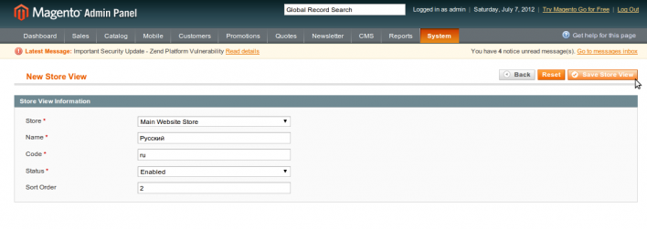
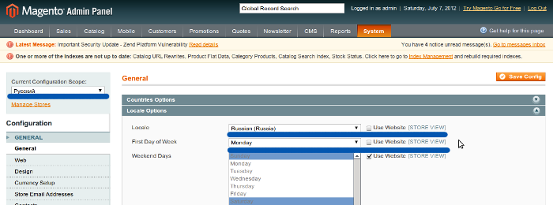

Мультиязычность уже давно стала обычным делом для сайтов направленных на международную аудиторию. Благодаря этому, пользователь может выбрать язык (соответственно и локализацию), которая больше подходит ему.

В _Magento_ вопрос интернационализации немного не очевиден (думаю из-за большой абстрактности). Этот функционал реализуется посредством скоупов, о которых упоминалось [в одной из прошлых статтей](http://freaksidea.com/php_and_somethings/show-60-magento-konfighuratsiia-ot-a-do-ia-system-xml) (разделение на скоупы - идея, которая очень глубоко заложена в ядре системы). А именно при помощи так называемых **StoreView**.

## Создание StoreView

Для реализации магазина на 2 языках (например, русский и английский) нужно 2 _StoreView._ Для русского можно использовать дефолтный, а для английского нужно создать еще один (можно и наоборот). Идем в **System -> Manage Stores** и нажимаем кнопку **Create Store View**



В поле имя можно писать все что угодно, но так чтобы было понятно за что отвечает этот _Store View_ (вид магазина). В поле _Code_ нужно прописать код магазина (для интернационализации понятно, что лучше использовать код языка к которому принадлежит вид). Все остальное понятно. Потом нажимаете **Save Store View**. Также можно переименовать и изменить код для _Store View_ по умолчанию (например код можно поменять на **en**, а название на **English**).

Чтобы все переводы отображались на русском для _Store View_ с кодом **ru**, нужно зайти в конфигурацию, в скоуп этого вида (**System** > **Configuration** > (выбираем Русский _Store View_) > **General** > **Locale Options**)



В поле _Locale_ выбираете русский язык, а в поле _First Day of Week_ - _Monday_. Сохраняете конфигурацию (не забудьте сделать переиндексацию!). Теперь, если это предусмотрено вашей темой, на фронтенде появится переключатель языков.

## Фантазируем

К сожалению в _Magento_ нет стандартного функционала, который упрощал бы создание многоязычной сущности (кроме _EAV_ конечно, но ИМХО - слишком сложно для такого простого задания).

Задача собственно

*   для реализации многоязычности для одной сущности используем 2 связанные таблицы
    *   в одной хранится общая информация для всех языков
    *   в другой хранятся поля, который зависят от языка (в данном случае от _Store View_)
*   написать _table_ класс и _behavior_ интерфейс, которые упростят создание специфической для задания структуры базы
*   реализовать _i18n_ _behavior_ на основе интерфейса
*   написать ресурс модели, которые упрощает сохранение данных (в данном случае ресурс модель и коллекцию)
*   _API_ доступа к бизнес моделям должен остаться без изменений, за исключением добавления фильтра по _Store View_

## Вокруг да около

В _Magento_, начиная с версии 1.6, появился класс **Varien\_Db\_Ddl\_Table**, используется для создания таблиц в _setup_ файлах модуля. Например

```php
$table = $installer->getConnection()
    ->newTable($installer->getTable('core/config_data'))
    ->addColumn('config_id', Varien_Db_Ddl_Table::TYPE_INTEGER, null, array(
        'identity'  => true,
        'unsigned'  => true,
        'nullable'  => false,
        'primary'   => true,
        ), 'Config Id')
    ->addColumn('scope', Varien_Db_Ddl_Table::TYPE_TEXT, 8, array(
        'nullable'  => false,
        'default'   => 'default',
        ), 'Config Scope')
    ->addColumn('scope_id', Varien_Db_Ddl_Table::TYPE_INTEGER, null, array(
        'nullable'  => false,
        'default'   => '0',
        ), 'Config Scope Id')
    ->addColumn('path', Varien_Db_Ddl_Table::TYPE_TEXT, 255, array(
        'nullable'  => false,
        'default'   => 'general',
        ), 'Config Path')
    ->addColumn('value', Varien_Db_Ddl_Table::TYPE_TEXT, '64k', array(
    ), 'Config Value')
    ->addIndex($installer->getIdxName('core/config_data', array('scope', 'scope_id', 'path'), Varien_Db_Adapter_Interface::INDEX_TYPE_UNIQUE),
        array('scope', 'scope_id', 'path'), array('type' => Varien_Db_Adapter_Interface::INDEX_TYPE_UNIQUE))
    ->setComment('Config Data');
$installer->getConnection()->createTable($table);
```

Метод _getConnection_ возвращает выбранный адаптер базы данных. В этом адаптере метод _newTable_ возвращает экземпляр _Varien\_Db\_Ddl\_Table_ класса. И изменить это поведение к сожалению невозможно, поэтому когда класс расширенной таблицы будет реализован, придется создавать объект последнего напрямую.

Класс **FI\_I18n\_Model\_Resource\_Table** добавляет несколько важных методов: _addBehavior_, _applyBehaviors_ и _save_. По именах методов можно понять, что они делают, кроме последнего. Метод **save** - это обертка

```php
class FI_I18n_Model_Resource_Table extends Varien_Db_Ddl_Table {
    public function save(Mage_Core_Model_Resource_Setup $context) {
        $this->applyBehaviors($context);
        return $context->getConnection()->createTable($this);
    }
............................................................
}
```

В метод **addBehavior** нужно передать объект, который реализует _behavior_ интерфейс

```php
class FI_I18n_Model_Resource_Table extends Varien_Db_Ddl_Table {
    public function addBehavior(FI_I18n_Model_Resource_Behavior_Interface $behavior) {
        $this->_behaviors[] = $behavior;
        return $this;
    }
............................................................
}
```

Метод **applyBehaviors** итерирует по все поведениям (_behaviors_) и применяет их к таблице

```php
class FI_I18n_Model_Resource_Table extends Varien_Db_Ddl_Table {
    public function applyBehaviors(Mage_Core_Model_Resource_Setup $context) {
        if (empty($this->_behaviors)) {
            return false;
        }

        foreach ($this->_behaviors as $behavior) {
            $behavior->applyTo($this, $context);
        }
        return true;
    }
............................................................
}
```

Также добавлен метод **removeColumns**, который удаляет колонки из таблицы по имени и потом возвращает их. Это нужно для того, чтобы "поведения" имели интерфейс через который они могут не только добавлять новые колонки, но и переносить их в другую таблицу, что именно и нужно в данном случае.

Создадим теперь класс _I18n_, который реализует _Behavior_ интерфейс. Последний очень прост:

```php
interface FI_I18n_Model_Resource_Behavior_Interface {
    function applyTo(Varien_Db_Ddl_Table $table, Mage_Core_Model_Resource_Setup $context);
}
```

В нашем случае класс поведения должен создать еще одну таблицу удалив из базовой некоторые поля. Что и сделано в методе applyTo

```php
class FI_I18n_Model_Resource_Behavior_I18n implements FI_I18n_Model_Resource_Behavior_Interface {
    public function applyTo(Varien_Db_Ddl_Table $table, Mage_Core_Model_Resource_Setup $setup) {
        $columns = $table->removeColumns($this->_fields);

        $tableI18n = $this->_newI18nTable($table, $columns);
        $setup->getConnection()->createTable($tableI18n);
        return $this;
    }
............................................................
}
```

Этот класс имеет 2 константы: одна указывает на суффикс дополнительной таблицы, а другая указывает название поля, которое является идентификатором языка.

```php
class FI_I18n_Model_Resource_Behavior_I18n implements FI_I18n_Model_Resource_Behavior_Interface {
    const TABLE_SUFIX = '_store';
    const LANG_COLUMN_NAME = 'store_id';
............................................................
}
```

Также реализован статический метод **getI18nTableName**, который возвращает имя дополнительной таблицы для указанной (просто к имени указанной добавляет _TABLE\_SUFIX_ константу). Конструктор этого класса в качестве единого параметра принимает массив полей, которые должны быть разными для разных языков.

Например, есть таблица новостей с полями: _id_, _title_, _desciption_, _is\_active_, _created\_at_, _updated\_at_. Поля _title_ и _description_ мультиязычны. Тогда _install_ файл выглядит следующим образом:

```php
$installer = $this;
$installer->startSetup();

$table = new FI_I18n_Model_Resource_Table();
$table->setName($installer->getTable('fi_i18n/news'))
    ->addColumn('id', Varien_Db_Ddl_Table::TYPE_SMALLINT, null, array(
        'identity'  => true,
        'unsigned'  => true,
        'nullable'  => false,
        'primary'   => true,
        ), 'Website Id')
    ->addColumn('title', Varien_Db_Ddl_Table::TYPE_TEXT, 64, array(
        ), 'News Title')
    ->addColumn('description', Varien_Db_Ddl_Table::TYPE_TEXT, '64k', array(
        'nullable' => false
        ), 'Decsription')
    ->addColumn('is_active', Varien_Db_Ddl_Table::TYPE_SMALLINT, null, array(
        'unsigned'  => true,
        'nullable'  => false,
        'default'   => '0',
        ), 'News Activity')
    ->addColumn('created_at', Varien_Db_Ddl_Table::TYPE_TIMESTAMP, null, array(
        ), 'Date of News Creation')
    ->addColumn('updated_at', Varien_Db_Ddl_Table::TYPE_TIMESTAMP, null, array(
        ), 'Date of News Modification')
    ->addBehavior(new FI_I18n_Model_Resource_Behavior_I18n(array(
        'title', 'description'
    )));

$table->save($installer);
$installer->endSetup();
```

Этот код сгенерирует следующий запрос к базе (на сервере _MySQL_):

```sql
CREATE TABLE `i18n_news` (
 `id` smallint(5) unsigned NOT NULL AUTO_INCREMENT COMMENT 'Website Id',
 `is_active` smallint(5) unsigned NOT NULL DEFAULT '0' COMMENT 'News Activity',
 `created_at` timestamp NULL DEFAULT NULL COMMENT 'Date of News Creation',
 `updated_at` timestamp NULL DEFAULT NULL COMMENT 'Date of News Modification',
 PRIMARY KEY (`id`)
) ENGINE=InnoDB AUTO_INCREMENT=5 DEFAULT CHARSET=utf8 COMMENT='i18n_news'

CREATE TABLE `i18n_news_store` (
 `id` smallint(5) unsigned NOT NULL COMMENT 'Translation Id',
 `title` varchar(64) DEFAULT NULL COMMENT 'News Title',
 `description` text NOT NULL COMMENT 'Decsription',
 `store_id` smallint(5) unsigned NOT NULL COMMENT 'Store Id',
 PRIMARY KEY (`id`,`store_id`),
 CONSTRAINT `FK_I18N_NEWS_STORE` FOREIGN KEY (`id`) REFERENCES `i18n_news` (`id`) ON DELETE CASCADE ON UPDATE CASCADE
) ENGINE=InnoDB DEFAULT CHARSET=utf8 COMMENT='i18n_news_store'
```

Теперь не стоит беспокоится о создание индексов и еще одной таблицы. Это за Вас сделает **Behavior\_I18n**.

## Ресурс модели

Упрощение для создания _setup_ файлов конечно хорошо, но также хотелось бы иметь возможность просто работать с данными, т.е. не думать о том, что нужно объединить таблицы при выборке и т.д. Также логичным кажется тот факт, что бизнес модели не должны знать ничего о таблицах и их связях. Именно поэтому стоит написать ресурс модель, которая при сохранении распределяет данные по нужным таблицам, а при выборке их объединяет.

Для этого создадим класс **FI\_I18n\_Model\_Resource\_I18n**, в котором нужно переопределить методы **\_getLoadSelect** (для загрузки данных из базы) и **save** (для распределения данных по разным таблицам). В первом просто объединим 2 таблицы (базовою и _i18n_)

```php
class FI_I18n_Model_Resource_I18n extends Mage_Core_Model_Resource_Db_Abstract {
    protected function _getLoadSelect($field, $value, $object)
    {
        if (empty($this->_i18nFields)) {
            throw new Exception('Specify i18n fields for your resource model');
        }

        $select = parent::_getLoadSelect($field, $value, $object);
        $tableName = $this->getMainTable();
        $i18nTableName = FI_I18n_Model_Resource_Behavior_I18n::getI18nTableName($tableName);
        $adapter = $select->getAdapter();

        $select->joinLeft(
            array(self::I18N_TABLE_ALIAS => $i18nTableName),
            self::I18N_TABLE_ALIAS . '.id = ' . $adapter->quoteInto($tableName . '.' . $field)
            . ' AND ' . $this->getLangColumnName() . ' = ' . $adapter->quoteInto($object->getStoreId()),
            $this->_i18nFields
        );

        return $select;
    }
..........................................................
}
```

В методе **save** сначала фильтруем данные по разным таблицам, потом создаем новую транзакцию. Также стоит упомянуть, что поле _id_ в _i18n_ таблице указывает на _id_ в базовой таблице. Поэтому сохраняем сначала данные в базовую таблицу, а потом и в _i18n_.

```php
class FI_I18n_Model_Resource_I18n extends Mage_Core_Model_Resource_Db_Abstract {
..........................................................
    public function save(Mage_Core_Model_Abstract $object)
    {
        $adapter = $this->_getWriteAdapter();
        $adapter->beginTransaction();
        try {
            $data = $object->getData();

            $i18n = array();
            foreach ($this->_i18nFields as $field) {
                if (isset($data[$field])) {
                    $i18n[$field] = $data[$field];
                    unset($data[$field]);
                }
            }
            $result = parent::save($object);

            $i18n['id'] = $object->getId();
            $i18n[FI_I18n_Model_Resource_Behavior_I18n::LANG_COLUMN_NAME] = $object->getStoreId();

            $update = array_keys($i18n);
            $adapter->insertOnDuplicate(
                FI_I18n_Model_Resource_Behavior_I18n::getI18nTableName($this->getMainTable()),
                $i18n,
                array_combine($update, $update)
            );

            $adapter->commit();
            return $result;
        } catch (Exception $e) {
            $adapter->rollback();
            throw $e;
        }
    }
}
```

В этом же классе реализован метод **provideCollectionQuery** - используется для модификации запроса коллекции. Это сделано с целью не раскрывать внутренней реализации ресурс модели (вообще было бы логично, если бы коллекции в _Magento_ загружались используя тот же класс ресурса, что и бизнес модели и не имели собственного объекта _Zend\_Db\_Select_). Этот метод просто объединяет базовую и _i18n_ таблицы

```php
class FI_I18n_Model_Resource_I18n extends Mage_Core_Model_Resource_Db_Abstract {
    public function provideCollectionQuery(Zend_Db_Select $query) {
        $tableName = $this->getMainTable();
        $i18nTableName = $i18nTableName = FI_I18n_Model_Resource_Behavior_I18n::getI18nTableName($tableName);
        $adapter = $query->getAdapter();

        $from = $query->getPart(Zend_Db_Select::FROM);
        $aliases = array_keys($from);
        $mainTableAlias = $aliases[0];

        $query->joinLeft(
            array(self::I18N_TABLE_ALIAS => $i18nTableName),
            self::I18N_TABLE_ALIAS . '.id = ' . $adapter->quoteInto($mainTableAlias . '.' . $this->getIdFieldName()),
            $this->_getI18nColumns()
        );
        return $this;
    }
......................................................................................
}
```

Код коллекции по сути ничего не делает (просто делегирует полномочия ресурсу)

```php
class FI_I18n_Model_Resource_I18n_Collection
    extends Mage_Core_Model_Resource_Db_Collection_Abstract
{
    protected function _initSelect()
    {
        $result = parent::_initSelect();
        $this->getResource()->provideCollectionQuery($this->getSelect());

        return $result;
    }

    public function addStoreToFilter($store)
    {
        if ($store instanceof Mage_Core_Model_Store) {
            $store = $store->getId();
        }
        $this->addFieldToFilter($this->getResource()->getLangColumnName(), $store);
        return $this;
    }
}
```

## Практикуемся

Модели написаны. Чтобы получить их функционал - достаточно в своем модуле их наследовать. Вернемся к модулю новостей. Создадим бизнес и ресурс модели, а также класс коллекции (2 последние наследуются от **FI\_I18n\_Model\_Resource\_I18n** и **FI\_I18n\_Model\_Resource\_I18n\_Collection** классов соответственно). Тогда создать одну новость можно таким образом

```php
$news = Mage::getModel('my_module/news');
$news->setTitle('Test Title')
    ->setDescription('Test Description')
    ->setStoreId(Mage::app()->getStore()->getId())
    ->save();
```

Загрузить новость из базы

```php
$news = Mage::getModel('my_module/news')->setStoreId(Mage::app()->getStore()->getId())
   ->load(1);
print_r($news->getData());
```

Загрузить список новостей из базы

```php
$collection = Mage::getModel('my_module/news')->getCollection()
    ->addStoreToFilter(Mage::app()->getStore());

foreach ($collection as $news) {
    print_r($news->getData());
}
```

Стоит помнить, что при работе с этими моделями всегда нужно указывать _store_ для которого нужно получить данные!

Скачать модуль можно [здесь](./FI_I18n.tar.bz2 "Magento I18n Models").

**P.S.**: поддержка версий ниже 1.6 - затруднительна, так что _setup_ файлы придется писать как и раньше, но ресурс модели можно использовать и в старых версиях, стоит только переименовать классы от которых они наследуются (заменить _Resource\_Db_ на _Mysql4_).