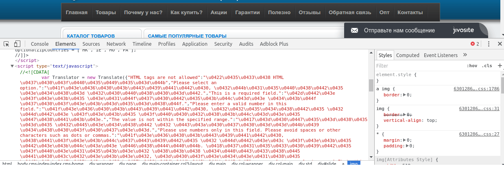
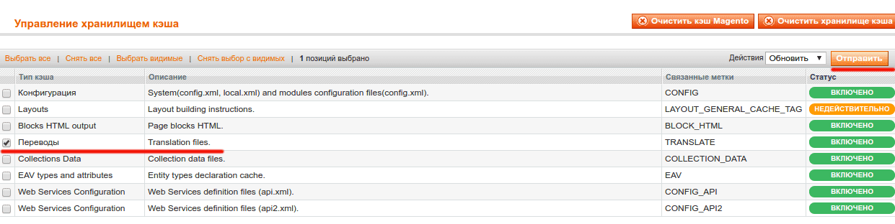

Я уже писал о том, как [увеличить скорость загрузки страницы при помощи HTTP кэша](../../linux/2017-05-10_vklyuchaem-http-keshirovanie-v-nginx-i-apache2), если Вы этого еще не сделали рекомендую посмотреть, так как результирующий файл мы также будем сохранять в браузерном кэше.

В этой же статье, я расскажу как уменьшить результирующий размер HTML страницы, которая отправляется пользователю с севера.

## Исходная ситуация

Не оптимизированная страница выглядит вот так:



Обратите внимание на тэг script и все что внутри. Это переводы сообщений с английского на русский (или любой другой язык соответствующий магазину). В основном они используются для отображения ошибок при помощи JavaScript. Объект Translator имеет метод add, при помощи которого, можно добавить новые переводы динамически, поэтому теоретически в старых версиях Magento переводы могут динамически додаваться разными модулями. Настоятельно советую найти все такие места и вынести переводы в jstranslator.xml файл Вашего модуля (пример можно посмотреть в модуле Mage\_Checkout, папочка etc/).

Чем больше у Вас таких переводов, тем дольше грузится страница и соответственно возрастает вероятность ухода пользователя на другой сайт. А меняются они ведь очень очень очень редко.

## Кэшируем переводы

То самое место которое нужно изменить находится в файле app/design/frontend/base/default/template/page/html/head.phtml

```php
# ....
<?php echo $this->helper('core/js')->getTranslatorScript() ?>
# ...
```

Прежде чем что-то делать, нужно скопировать этот файл в свою тему и [создать отдельный Magento модуль](../2011-01-29_magento-sozdanie-crud-modulya) (назовем его `FI_Optimisation`). Потом в файле head.phtml меняем строчку выше на

```php
<?php echo $this->helper('fi_optimisation/js')->getTranslatorScript() ?>
```

Теперь создадим файл app/code/local/FI/Optimisation/Helper/Js.php

```php
<?php
class FI_Optimisation_Helper_Js extends Mage_Core_Helper_Js
{
    protected function _getTranslatorCacheFilePath($suffix = '')
    {
      return Mage::getBaseDir('media') . '/js/translator' . ($suffix ? '.' . $suffix : '') . '.js';
    }

    public function getTranslatorScript()
    {
        $storeId = Mage::app()->getStore()->getId();
        $pattern = $this->_getTranslatorCacheFilePath($storeId . '.*');
        $files = glob($pattern);

        if (empty($files[0])) {
            $filepath = str_replace('.*', '.' . time(), $pattern);
            $json = $this->getTranslateJson();
            file_put_contents($filepath, 'var Translator = new Translate(' . $json . ');');
        } else {
            $filepath = $files[0];
        }

        return '<script src="' . Mage::getBaseUrl('media') . '/js/' . basename($filepath) . '"></script>';
    }
}
```

Наш хелпер класс наследует класс Magento, который отвечает за выдачу JavaScript переводов и переопределяет метод getTranslatorScript, в котором вместо того чтобы возвращать инлайновый скрипт, я возвращаю закэшированный. Давайте более детально посмотрим на этот метод.

Сначала он ищет файл media/js/translator.${storeId}.\*.js при помощи glob функции (находит файлы по шаблону), если находит - значит есть закэшированная версия и возвращает ее, если нет, тогда создает имя файла, заменяя звездочку в конце шаблона на текущий timestamp (timestamp гарантирует, что пользователь будет получать всегда самую последнюю версию файла), собирает все переводы при помощи метода getTranslateJson и записывает результат в файл при помощи функции file\_put\_contents.

Обратите внимание, что в имени файла присутствует storeId - это значит, что каждый магазин (а с технической точки зрения админка в Magento тоже является магазином) будет иметь отдельный кэш.

Если у Вас на данный момент код не работает, то почистите сначала кэш Magento, если это не помогло то проверьте unix правда доступа на директорию media/js.

Всегда нужно помнить, что если есть кэш, то должен быть механизм его удаления или старения. Конечно же, можно просто заходить по ftp или sftp и удалять файлы вручную, но хотелось бы иметь возможность делать это через админку, просто нажав кнопку.

В Magento есть отдельный тип кэша для переводов и было бы хорошо, чтобы он был ответственным не только за backend-ные переводы, но и за клиентские тоже. Таким образом можно добавить новый ф-нал прозрачно для конечно пользователя - система улучшилась, но пользователю не нужно делать что-то дополнительно или по другому.



## Очистка кэша переводов

Для этого добавим метод clearTranslatorCache в тот же хелпер класс

```php
//.....
    public function clearTranslatorCache()
    {
        $files = glob($this->_getTranslatorCacheFilePath('*'));

        foreach($files as $path) {
          unlink($path);
        }
    }
}
```

Логика очень простая - находим все файлы переводов (на это указывает звездочка) и удаляем их.

Метод то добавили, а кто его вызовет? Для этого нужно подписаться на событие очистки переводов в Magento. К сожалению, отдельного события не предусмотрено, поэтому подпишемся на очистку любого типа кэша, а тип проверим внутри обработчика.

```xml
<config>
  <!-- ..... -->
  <adminhtml>
    <events>
      <adminhtml_cache_refresh_type>
        <observers>
          <fi_optimisation>
            <class>fi_optimisation/observer</class>
            <method>removeTranslatorCache</method>
          </fi_optimisation>
        </observers>
      </adminhtml_cache_refresh_type>
    </events>
  </adminhtml>
</config>
```

Чтобы все это заработало нужно добавить класс Observer-а, который собственно и будет чистить кэш

```php
<?php
class FI_Optimisation_Model_Observer {
  public function removeTranslatorCache(Varien_Event_Observer $observer)
  {
    $type = $observer->getEvent()->getType();

    if ($type === Mage_Core_Model_Translate::CACHE_TAG) {
      Mage::helper('fi_optimisation/js')->clearTranslatorCache();
    }

    return $this;
  }
}
```

Этот же класс просто проверяет тип кэша и делегирует всю работу хелпер класса, который я написал чуть выше.

После добавления этого кода не забудьте почистить кэш Magento!

В конечном итоге, у нас получилось уменьшить результирующую HTML страничку и записать в браузерный кэш этот огромный файл переводов (от 9 kB)!
