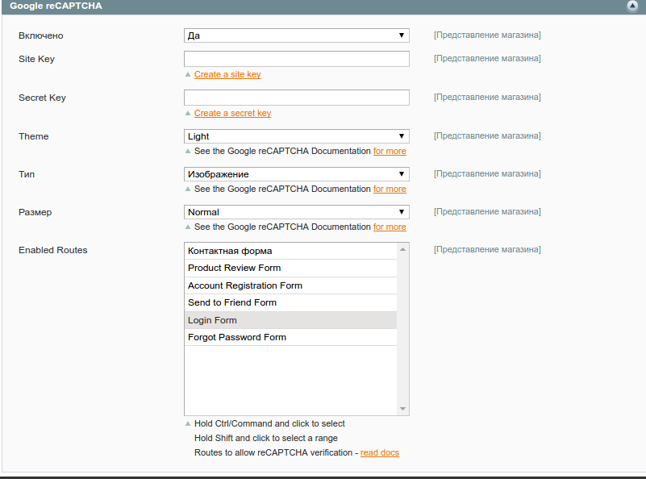
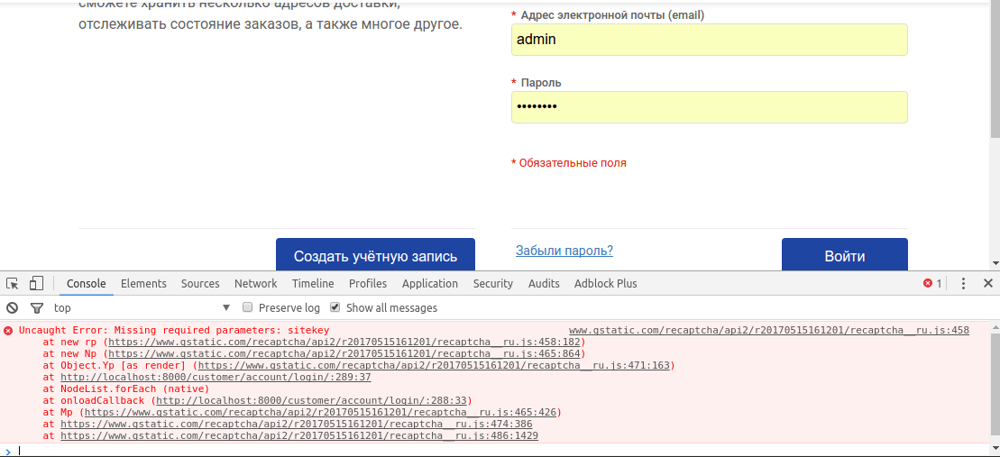
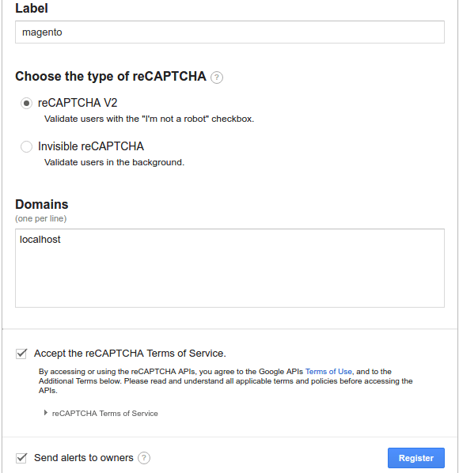
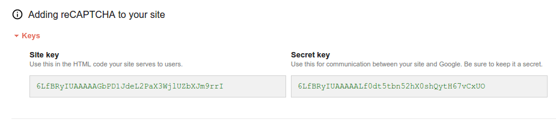
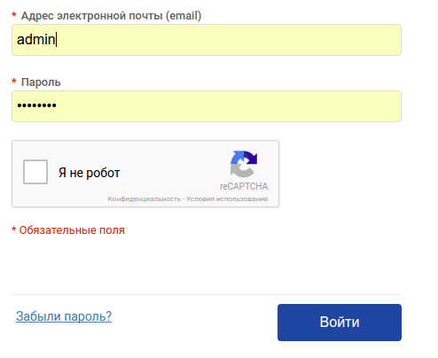
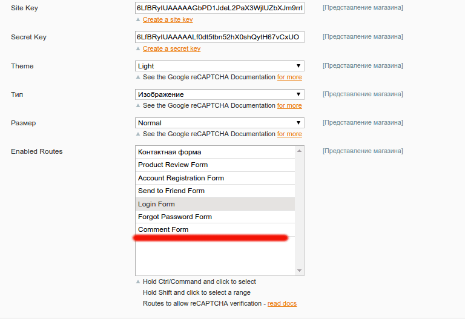
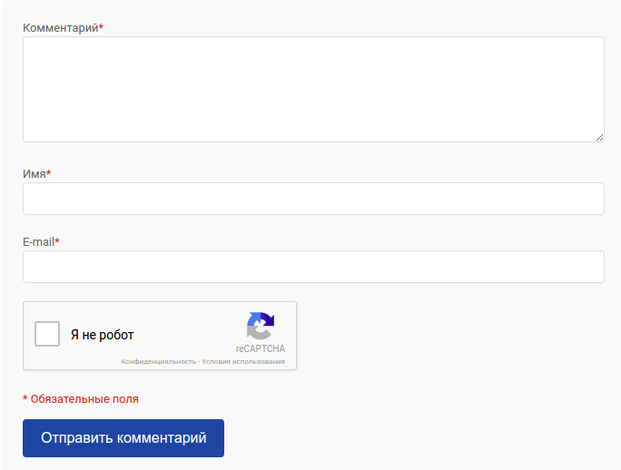

Если говорить о капче простыми словами, то она защищает сайт от роботов. Но если сложность капчи очень большая, то она будет препятствием между Вашими пользователями и сайтом.

## Включаем Google reCaptcha

К счастью, существует [модуль для интеграции Google reCaptcha в Magento 1.x](https://www.magentocommerce.com/magento-connect/recaptcha-1.html). Давайте его подключим через Magento Connect Manager.

После успешной установки, настройки для капчи появятся в Система > Конфигурация > Google API > Google reCaptcha



Как видно из скриншота, капчу можно включить для 6 форм:

*   Контактная форма
*   Форма отзыва
*   Форма регистрации
*   Форма отправка товара другу
*   Форма логина
*   Форма восстановления пароля

Для теста, давайте подключим капчу на форму логина. Захожу на форму логина - капчи не вижу, в таких случаях в первую очередь я проверяю JavaScript Console в Chrome Developer Tools и вижу ошибку:



Ошибка говорит о том, что пропущен обязательный параметр sitekey.

## Регистрация Google reCaptcha

Давайте вернемся в настройки. И действительно, поля Site Key и Site Secret пусты, к счастью под ними есть ссылка, жму на ссылку и отрывается страница регистрации reCaptcha (если Вы не были залогинены в Google, то он попросит Вас войти).



Нужно указать всего несколько полей:

*   Имя - все что придет Вам на ум, но лучше называть по имени сайта или группы сайтов для которых вы будете использовать эту капчу
*   Тип - reCaptcha v2
*   Список доменов - домены, для которых вы создаете капчу. У меня это localhost, так как я все делаю на тестовом сайте

Принимаю условия пользовательского соглашения и жму кнопку Register.

На следующей странице уже сразу вижу нужные мне поля: Site Key и Secret Key.



Копирую их в настройки админки и сохраняю. Захожу обратно на страницу логину и капча там где должна быть :)



## Комментарии и reCaptcha

Тот кто читал [предыдущую статью об обычной капче](../2017-05-18_kak-vklyuchit-kapchu-v-magento-1x), тот знает, что затеял я все это, чтобы защитить форму комментариев. Как и в стандартном модуле, этот предоставляет возможность расширять набор форм для защиты. К сожалению, это сделано не так просто как в случае с обычной капчей, через настройки, а через отдельное событие. Поэтому нам [нужен свой Magento модуль](../2011-02-02_magento-backend-sozdanie-crud-modulya) с обработчиком события `studioforty9_recaptcha_routes`.

```xml
<?xml version="1.0"?>
<config>
    <modules>
        <FI_Recaptcha>
            <version>1.0.0.0</version>
        </FI_Recaptcha>
    </modules>
    <global>
        <models>
            <FI_Recaptcha>
                <class>FI_Recaptcha_Model</class>
            </FI_Recaptcha>
        </models>
        <events>
            <studioforty9_recaptcha_routes>
                <observers>
                    <FI_Recaptcha>
                        <class>FI_Recaptcha/observer</class>
                        <method>addRecaptchaRoutes</method>
                    </FI_Recaptcha>
                </observers>
            </studioforty9_recaptcha_routes>
        </events>
    </global>
</config>
```

И теперь добавляем модель Observer.php в модуль:

```php
<?php
class FI_Recaptcha_Model_Observer {
  public function addRecaptchaRoutes(Varien_Event_Observer $observer)
  {
    $routes = $observer->getEvent()->getRoutes();
    $routes->add('blog_post_view', Mage::helper('blog')->__('Comment Form'));

    return $this;
  }
}
```

Метод $routes->add первым параметром принимает полное имя контроллера (его можно получить при помощи метода getFullActionName()), а вторым - название формы. Обновляем кэш и идем в конфигурацию модуля reCaptcha:



Видим, что появилась дополнительная форма Comment Form, включаем капчу и для нее. Следующим этапом будет обновление настроек layout. Для этого добавим новую секцию в config.xml

```xml
<!-- .... -->
<frontend>
  <layout>
    <updates>
      <studioforty9_recaptcha>
        <file>fi_recaptcha.xml</file>
      </studioforty9_recaptcha>
    </updates>
  </layout>
</frontend>
<!-- .... -->
```

Теперь в файле fi\_recaptcha.xml (который нужно положить в активную тему или в base/layout), добавляем блок для recaptcha

```xml
<?xml version="1.0"?>
<layout version="0.1.0">
  <blog_post_view>
    <reference name="comments.form">
        <block type="studioforty9_recaptcha/explicit" name="captcha" template="studioforty9/recaptcha/explicit.phtml" />
    </reference>
  </blog_post_view>
</layout>
```

И теперь выводим его в шаблоне формы комментария:

```php
<?php if ($captchaHtml = $this->getChildHtml('captcha')): ?>
<ul class="form-group"><?php echo $captchaHtml ?></ul>
<?php endif ?>
```

В результате получается вот это:



По аналогии можно добавить reCaptcha на любую другую форму.
