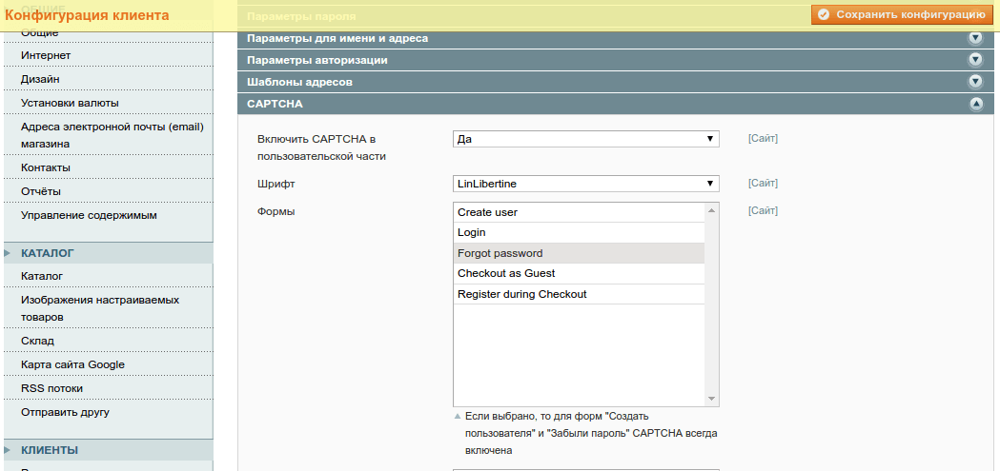
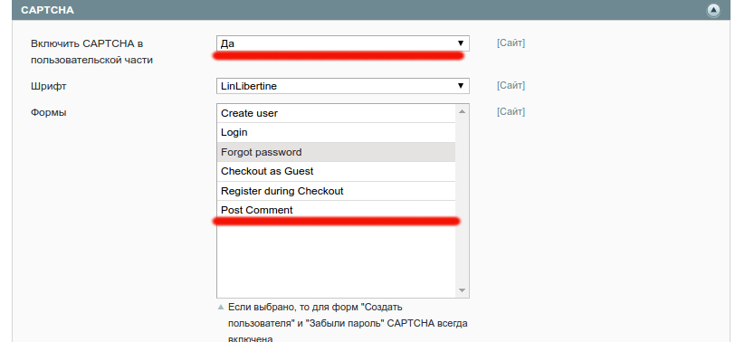
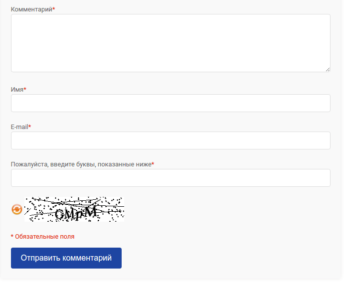
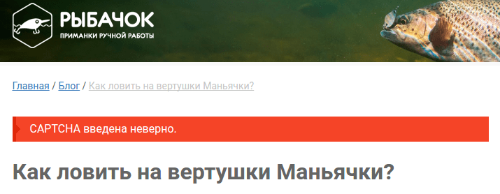

Некоторое время назад я писал блог для Magento с возможностью добавления комментариев. Комментировать можно было всем, включая незарегистрированных пользователей. Через некоторое время я познал все радости прелести борьбы со спамом: в день приходило до 100 комментариев о чем угодно, но только не о статьях, которые там писаны...

Тогда я занялся исследованиями и изобрел [Honey pot protection](https://habrahabr.ru/post/127604/) - защита формы без капчи! Я был в восторге :) К сожалению мой восторг не продлился долго... В наше время спамботы достаточно умны, чтобы определить поля, которые можно не заполнять. Вот тогда и пришлось поискать возможность добавления бото-сложной капчи.

## Что есть в коробке?

В Magento начиная с версии 1.7 появился новый модуль - Mage\_Captcha. По умолчанию, я могу включить капчу для таких форм:

*   Регистрация нового пользователя
*   Вход в личный кабинет
*   Возобновление пароля
*   Оформление заказа гостем
*   Регистрация во время оформления заказа

Для этого достаточно зайти в Система > Конфигурация > Клиенты > Конфигурация клиента > CAPTCHA и выбрать формы, которые нужно защитить при помощи капчи. Выглядит это так:



Я же хочу добавить капчу для формы комментирования статей. Чтобы это сделать, давайте сначала определимся с задачами. Нужно

1.  Создать отдельный модуль, который объединит все вместе
2.  Добавить возможность выбора новой формы в админке (пусть она называется Post Comment)
3.  Показывать пользователю капчу в форме комментария
4.  Проверить правильно ли пользователь ввел капчу, и если неправильно, то отображать ошибку

## Новый модуль

О том [как создать новый модуль в Magento](/php_and_somethings/show-5-magento---sozdanie-crud-modulya), я писал [в других статьях](/php_and_somethings/show-59-magento-konfiguratsiya-ot-a-do-ya-bazovye-nastrojki-modulya), поэтому опустим детали. Сразу добавлю файл в app/etc/modules/FI\_Captcha.xml

```xml
<!-- app/etc/modules/FI_Captcha.xml -->
<config>
    <modules>
        <FI_Captcha>
            <active>true</active>
            <codePool>local</codePool>
        </FI_Captcha>
    </modules>
</config>
```

и создам папку app/code/local/FI\_Captcha, со стандартной структурой и файлом config.xml

```xml
<?xml version="1.0"?>
<config>
    <global>
        <models>
            <fi_captcha>
                <class>FI_Captcha_Model</class>
            </fi_captcha>
        </models>
    </global>
    <frontend>
        <events>
            <controller_action_predispatch_blog_post_view>
                <observers>
                    <captcha>
                        <class>fi_captcha/observer</class>
                        <method>checkCommentCaptchaValidity</method>
                    </captcha>
                </observers>
            </controller_action_predispatch_blog_post_view>
        </events>
        <layout>
            <updates>
                <fi_captcha>
                    <file>fi_captcha.xml</file>
                </fi_captcha>
            </updates>
        </layout>
    </frontend>
</config>
```

В этом модуле я слушаю событие controller\_action\_predispatch\_blog\_post\_view, которое вызывается перед обработкой нового комментария. Там же я проверю правильность введенной информации с рисунка. А при помощи fi\_captcha.xml, [добавлю блок](/php_and_somethings/show-49-magento-konfiguratsiya-ot-a-do-ya-layout-updates "Изменение layout-а в Magento при помощи XML") капчи в статьи. Но давайте по порядку :)

## Капча для формы комментариев

Для того, чтобы добавить новую форму в настройки капчи, нужно обновить config.xml файл и добавить секцию default

```xml
  <default>
    <captcha>
      <frontend>
        <areas>
          <post_comment>
            <label>Post Comment</label>
          </post_comment>
        </areas>
      </frontend>
    </captcha>
  </default>
```

Теперь обновим кэш и откроем страницу настроек



Аналогично можно добавлять форму в настройки админки, заменив frontend на adminhtml, но скорее всего это никогда не понадобится, поэтому и рассматривать не буду.

## Комментарий с капчей

Создаем новый файл обновления layout-тов в своей теме (если же нет такой, тогда в default скоупе и default теме)

```xml
<?xml version="1.0"?>
<layout version="0.1.0">
  <blog_post_view>
    <reference name="head">
      <action method="addJs"><file>mage/captcha.js</file></action>
    </reference>

    <reference name="comments.form">
      <block type="captcha/captcha" name="captcha">
        <action method="setFormId"><formId>post_comment</formId></action>
        <action method="setImgWidth"><width>230</width></action>
        <action method="setImgHeight"><height>50</height></action>
      </block>
    </reference>
  </blog_post_view>
</layout>
```

В качестве formId, указывать нужно ключ формы в секции default (в файле config.xml), высоту и ширину капчи (в пикселях) можно выбрать произвольную. Также добавлю скрипт mage/captcha.js, который позволит пользователю обновлять рисунок капчи, при нажатии на соответствующую кнопку. И последнее, добавлю блок капчи в шаблон статьи

```php
<?php if ($captchaHtml = $this->getChildHtml('captcha')): ?>
<ul class="form-group"><?php echo $captchaHtml ?></ul>
<?php endif ?>
```

И в результате получилось



Осталось только проверять капчу перед сохранением комментария.

## Проверка капчи

Проверять капчу на своих контроллерах - просто, но как быть если хочется добавить проверку на уже существующий функционал или сторонний модуль? Именно для таких случаев [в Magento есть возможность подписываться на события](/php_and_somethings/show-63-magento-modeli-ot-a-do-ya-sobytiya-i-rewrite-klassov). Мой модуль уже подписан на событие controller\_action\_predispatch\_blog\_post\_view, поэтому осталось только написать обработчик.

А для этого я добавлю класс FI\_Captcha\_Model\_Observer и метод checkCommentCaptchaValidity, который будет проверять капчу на валидность

```php
<?php 
class FI_Captcha_Model_Observer {
  public function checkCommentCaptchaValidity(Varien_Event_Observer $observer)
  {
    $controller = $observer->getControllerAction();
    $request = $controller->getRequest();

    if (!$request->isPost()) {
      return $this;
    }

    $formId = 'post_comment';
    $captchaModel = Mage::helper('captcha')->getCaptcha($formId);

    if (!$captchaModel->isRequired()) {
      return $this;
    }

    $captcha = $request->getPost(Mage_Captcha_Helper_Data::INPUT_NAME_FIELD_VALUE);

    if (!$captchaModel->isCorrect($captcha[$formId])) {
      Mage::getSingleton('customer/session')->addError(Mage::helper('captcha')->__('Incorrect CAPTCHA.'));
      $controller->setFlag('', Mage_Core_Controller_Varien_Action::FLAG_NO_DISPATCH, true);
      $controller->getResponse()->setRedirect(Mage::helper('core/url')->getCurrentUrl());
    }

    return $this;
  }
}
```

Как я уже говорил раньше, этот метод запускается перед созданием комментария, если капча введена неверно, тогда комментарий не создастся, а пользователь увидит соответствующее сообщение об ошибке. В случае правильности, комментарий отображается пользователю.



## Итого

Форма комментариев защищена, спама больше нет и все отлично! Прошло пару дней... Сложный рисунок на капче появлялся достаточно часто и приходилось нажимать кнопку обновить, иногда по несколько раз... Я подумал, если это напрягает меня, то точно будет напрягать пользователей магазина, нужно искать другой способ.

И другой способ был найден - использовать Google Recaptcha, но об этом в следующей статье.