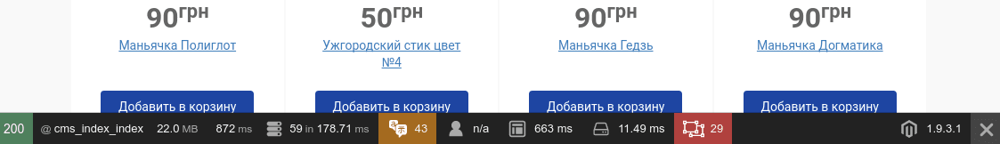
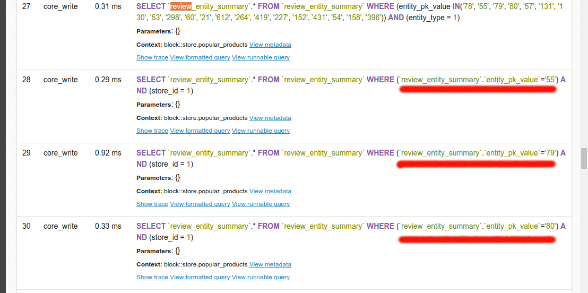
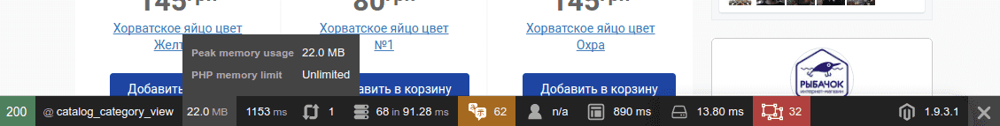

Обычно после реализации своего очередного детища, я трачу некоторое время рассматривая его со всех сторон :) В этот раз все было так же, за исключением того, что я дополнительно решил оптимизировать Magento.

Если с клиентской частью все понятно, то с серверной немного сложнее. Модулей много, зависимостей много, запросов в базу много, нужно понять кто и откуда все это делает. И к моему удивлению, я нашел очень хороший инструмент - [Magento Profiler](https://github.com/ecoco/magento_profiler) от компании Ecoco, который помог разобраться со всем этим зоопарком :)

## Установка

На проекте, я не использовал composer, и не хотел особо углубляться в детали как его подружить с Magento 1.x. Поэтому я просто клонировал репозиторий и скопировал потом файлы в свой проект.

Конечно же, эти файлы я не добавлял в продакшен репозиторий проекта, дабы быть на 100% уверенным, что этот профайлер не будет использован во зло.

## Что, где?

Для того чтобы увидеть панель отладки нужно сразу же после домена, вместо index.php, написать dev.php (например, http://localhost:8000/dev.php). Сайтом можно пользоваться, как обычно, а в панели внизу можно достаточно просто найти, какие модели или блоки используются и какие запросы идут в базу данных, сколько их и т.д. В целом это выглядит вот так



## Отлаживаем

Как видно с рисунка, главная страница сайта отправляет 59 запросов в базу, что достаточно много. Давайте смотреть, что за запросы. Для этого нужно просто нажать на значок базы данных и тогда откроется новая страница, на которой мы увидим конкретные запросы. Пролистав немного вниз, я вижу закономерность в запросах:



Ага, похоже что эти запросы отправляются в цикле на каждый продукт, чтобы отобразить рейтинг. Тут я подумал СТОП! Я ведь специально написал оптимизированный запрос, который получает рейтинг для всех продуктов и он 1!

Чтобы понять кто виновник этого безобразия, нужно нажать на ссылку Show trace. Это покажет обратный стек вызовов, т.е. след, по которому видно, с какой части кода был сделан запрос.

```php
Trace:
Original_Mage_Core_Model_Resource_Db_Abstract::load() (called from MageCoreModelResourceDbAbstract.php at line 30)
Mage_Core_Model_Resource_Db_Abstract::load() (called from Abstract.php at line 225)
Mage_Core_Model_Abstract::load() (called from Review.php at line 102)
Mage_Review_Model_Review::getEntitySummary() (called from Helper.php at line 53)
Mage_Review_Block_Helper::getSummaryHtml() (called from Abstract.php at line 319)
Mage_Catalog_Block_Product_Abstract::getReviewsSummaryHtml() (called from List.php at line 74)
Freaks_Ruba4ok_Block_Product_List::getReviewsSummaryHtml() (called from swiper.phtml at line 33)
```

Дальше смотрим и проверяем каждый блок, на предмет отправки запросов. Через некоторое время я нашел вот такой код:

```php
class Mage_Review_Block_Helper extends Mage_Core_Block_Template
{

    public function getSummaryHtml($product, $templateType, $displayIfNoReviews)
    {
        // pick template among available
        if (empty($this->_availableTemplates[$templateType])) {
            $templateType = 'default';
        }
        $this->setTemplate($this->_availableTemplates[$templateType]);

        $this->setDisplayIfEmpty($displayIfNoReviews);

        if (!$product->getRatingSummary()) {
            Mage::getModel('review/review')
               ->getEntitySummary($product, Mage::app()->getStore()->getId());
        }
        $this->setProduct($product);

        return $this->toHtml();
    }
```

Обратите внимание на второй if. Он проверяет, если продукт не имеет рейтинга, то нужно его взять из базы. Что вроде бы логично, но ведь я знаю что в этого продукта нет рейтинга, тогда зачем делает еще запрос?

Чтобы исправить это нелепое недоразумение, я добавил пустой рейтинг тем продуктам, которые его не имеют. Тогда класс Mage\_Review\_Block\_Helper проверит, что поле не пустое (ведь пустой объект все же объект) и не будет делать запрос в базу:

```php
class Freaks_Ruba4ok_Block_Product_List extends Mage_Catalog_Block_Product_Abstract
{
    protected function _setRatingSummaryFor($product)
    {
        $summaryPerProduct = $this->getData('summaries_per_product');

        if (!is_array($summaryPerProduct)) {
            $summaryPerProduct = $this->helper('freaks_ruba4ok')
                ->indexArrayBy('entity_pk_value', $this->_getSummariesForProducts());
            $this->setData('summaries_per_product', $summaryPerProduct);
        }

        if (isset($summaryPerProduct[$product->getId()])) {
            $product->setRatingSummary($summaryPerProduct[$product->getId()]);
        } else {
            $product->setRatingSummary($this->helper('freaks_ruba4ok')->getEmptyReviewSummary());
        }

        return $this;
    }
```

В своем классе блока я добавил else ветку для случая если в продукт не имеет рейтинга. А в свой класс хелпера добавил метод

```php
class Freaks_Ruba4ok_Helper_Data extends Mage_Core_Helper_Data
{
    public function getEmptyReviewSummary()
    {
        if (!$this->_emptyReviewSummary) {
            $this->_emptyReviewSummary = Mage::getModel('review/review_summary')
                ->setReviewsCount(0)
                ->setRatingSummary(0)
                ->setStoreId(Mage::app()->getStore()->getId());
        }

        return $this->_emptyReviewSummary;
    }
```

С этим изменением количество запросов упало до 40.

Потом я решил зайти на страницу категории, которая отображает продукты и там я увидел 68 запрос в базу! Что? Откуда?



Опять таки, открываем профайлер, ищем тенденцию. Опа :) Запросы шлет все тот же блок. Оказывается он используется во многих местах. В таком случае может помочь только реврайт блока или события. Я выбрал второй вариант.

В конкретном случае, можно слушает события блоков, которые выводят список продуктов. В моем случае их всего 2:

```xml
<!-- .... -->
    <frontend>
        <events>
            <catalog_block_product_list_collection>
                <observers>
                    <freaks_ruba4ok>
                        <class>freaks_ruba4ok/observer</class>
                        <method>addEmptyRatingSummary</method>
                    </freaks_ruba4ok>
                </observers>
            </catalog_block_product_list_collection>
            <catalog_product_upsell>
                <observers>
                    <freaks_ruba4ok>
                        <class>freaks_ruba4ok/observer</class>
                        <method>addEmptyRatingSummary</method>
                    </freaks_ruba4ok>
                </observers>
            </catalog_product_upsell>
        </events>
<!-- .... -->
```

Каждый раз кода перед отрисовкой блоков catalog\_product\_upsell и catalog\_block\_product\_list\_collection, я буду добавлять всем продуктам из коллекции пустой рейтинг если рейтинга у них нет.

```php
class Freaks_Ruba4ok_Model_Observer {
  public function addEmptyRatingSummary(Varien_Event_Observer $observer)
  {
    $productCollection = $observer->getEvent()->getCollection();

    if ($productCollection instanceof Varien_Data_Collection) {
      $productCollection->load();

      foreach ($productCollection as $product) {
        if (!$product->getRatingSummary()) {
          $product->setRatingSummary(Mage::helper('freaks_ruba4ok')->getEmptyReviewSummary());
        }
      }
    }

    return $this;
  }
```

После этого изменения количество запросов упало до 37! Много, но уже лучше :)

Вот таким несложным способом можно идентифицировать узкие места в магазине и почти, что за бесплатно оптимизировать его загрузку.