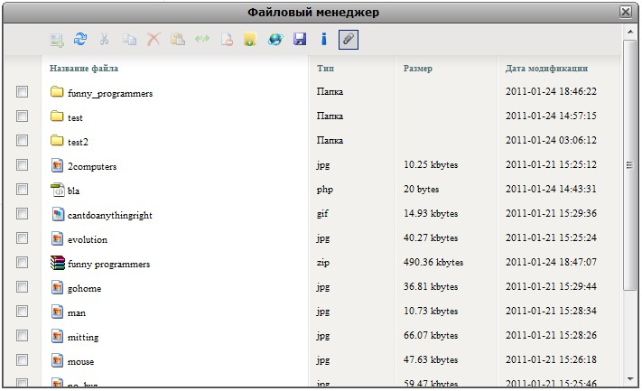
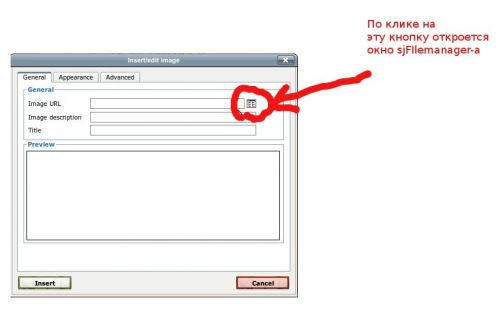

sjFilemanager сначала был разработан в личных целях, для создания чего-то "отличного", что можно будет переносить из проекта в проект. Но потом я решил поделиться им со всеми.

Так вот, где можно его использовать - как в известном rich text редакторе TinyMCE, так и в обычной html форме вместо стандартного тега input с атрибутом type = file. Все фичи реализованы посредством AJAX!

## Возможности

*   copy/cut/paste файлов
*   удаление файлов/папок
*   создание динамеческих (уникальных) имен для файлов
*   переименование файлов/папок
*   изменение прав доступа для файлы/папки
*   создание папки
*   загрузка нескольких файлов с использованием SWFUpload
*   скачивание файлов/папок с использованием zip-компрессора
*   вся доступная информация о папке/файле из файловой системы
*   дружественный интерфейс
*   операции над множеством файлов/папок
*   frontend может работать с backend-ом написаным на любом языке
*   написаны тесты для backend-а

## Тестировалось

*   IE6+
*   FireFox 3.0+
*   Chrome 8.05
*   Opera (9.24, 9.63, 10.52, 10.63)

## Демо

Скачать можно [ЗДЕСЬ](./sjFilemanager.zip).

## Технические детали

Написан с использованием простой javascript библиотеки, имеет в арсенале inline window manager. Backend обслуживает PHP с помощью нескольких классов.

Итак пришла пора немного рассказать об использовании :)

Чтобы все заработало, нужно подключить несколько файлов (или минимизировать и положить в один файл) и создать объект FileManage:

```html
<html xmlns="http://www.w3.org/1999/xhtml">
<head>
    <meta http-equiv="Content-Type" content="text/html; charset=utf-8" />
    <title>sjFilemanager</title>
    <script type="text/javascript" src="%base_url%/js/lang/lang_ru.js"> </script>
    <script type="text/javascript" src="%base_url%/js/pack/sjs.js"> </script>
    <script type="text/javascript" src="%base_url%/js/pack/swfupload.js"> </script>
    <script type="text/javascript" src="%base_url%/js/pack/sjFilemanager.js"> </script>
    <link href="%base_url%/css/desktop.css" rel="stylesheet" type="text/css" />
    <script type="text/javascript" src="/tools/tiny_mce/tiny_mce.js"> </script>
    <script type="text/javascript">
        sjs.ready(function(){
            var w = FileManage.getInstance(null, "%base_url%/?tmpl=window&show_actions=1", {
                dirUrl: '%base_url%/',
                actionUrl: '%base_url%/',
                actionSel: '#sjFmActions',
                events: {
                    onServerError: function(js, html) {
                        FileManage.createWindow({
                            id: this.id,
                            title: $_LANG.TITLE_WARNING,
                            content: '<p>' + js.response.msg + '</p>'
                        });
                    }
                },
                upload: {
                    object:  SWFUpload,
                    onReadyEventName: 'file_dialog_complete_handler',
                    flash_url : "%base_url%/js/swfupload/swfupload.swf",
                    file_post_name:'files',
                    custom_settings : {
                        progressTarget : "sjFmUploadProgress"
                    },
                    file_size_limit : "10MB",
                    file_types : "*.*",
                    file_types_description : "All Files",
                    file_upload_limit : 100,
                    file_queue_limit : 100,

                    button_text_left_padding: 5,
                    button_text_top_padding: 1,
                    button_image_url: "%base_url%/js/swfupload/sbtn.png",
                    button_placeholder_id: "sjFmButtonPlaceHolder",
                    button_text: '<span class="submit">Файлы...</span>',
                    button_width: "65",
                    button_text_style: ".submit { font-size: 11; color:#000000; font-family:Tahoma, Arial, serif; }",
                    button_height: "20",
                    file_queued_handler: fileQueued,
                    file_queue_error_handler: fileQueueError,
                    upload_start_handler: uploadStart,
                    upload_progress_handler: uploadProgress,
                    upload_error_handler: uploadError,
                    upload_success_handler: uploadSuccess
                }
            });
        });
    </script>
</head>
<body>
        <input type="text" name="test_field" /><a href="#" onclick="FileManage.choiseCallback(this.previousSibling,'%url_to_upload_dir%', null, window); return false">open manager</a><br/>
<!-- Window tmemplate -->
    <div id="sjWindowTmpl" class="hide ie6_width_fix">
        <div class="sjs_wtop">
            <div class="sjs_wltitle"></div>
            <div class="sjs_wrtitle"></div>
            <div class="sjs_wtitle">Window title</div>
            
            <div class="sjs_waction">
                <a href="#" class="minimize" onclick="return false;" tabindex="0"></a
                ><a href="#" class="maximize" onclick="return false;" tabindex="0"></a
                ><a href="#" class="close" onclick="return false;" tabindex="0"></a>
            </div>
        </div>
        <div class="window_main">
            <div class="bbottom"></div>
            <div class="bleft"></div>
            <div class="bright"></div>
            <div class="sjs_wcontent"></div>
        </div>
    </div>
<!-- Window tmemplate -->
</body>
</html>
```

Шаблон для попапа можно менять, но при условии сохранения классов на DOM элементах. Параметр "upload" предусмотрен для того, чтобы можно было в качестве uploader-а использовать любой объект-класс в будущем или если кого-то не устраивает SWFUpload.

Метод FileManage.getInstance() создает единственный объект на странице в попап окне. Как же использовать один объект для многих задач? Очень просто. Все, что требуется - это вызывать тот же метод FileManage.getInstance() первым параметром которого есть callback функция.

FileManage.choiseCallback - это простая обертка для FileManage.getInstance(), которая очень удобна, например, для того чтобы можно было вставить только один файл в input\[type="text"\]. Прототипы методов:

```php
FileManage.getInstance = function(function callback, string url, hash fmCfg, hash windowCfg);

FileManage.choiseCallback = function(DOMObject field, string url, string type, object window);
```

Раз так, тогда использовать sjFilemanager в TinyMCE очень просто!

```javascript
tinyMCE.init({
    // General options
    mode : "textareas",
    theme : "advanced",
    plugins : "media,pagebreak,style,layer,table,save,advhr,advimage,advlink,emotions,iespell,inlinepopups,insertdatetime,preview,media,searchreplace,print,contextmenu,paste,directionality,fullscreen,noneditable,visualchars,nonbreaking,xhtmlxtras",
    editor_selector : "mceEditor",
    language : "en",
    convert_urls: false,
    theme : "advanced",
    debug : false,
    paste_auto_cleanup_on_paste : true,
    paste_convert_headers_to_strong : true,
    // Theme options
    theme_advanced_buttons1 :"undo,redo,|,bold,italic,underline,strikethrough,forecolor,backcolor,|,sub,sup,charmap,|,hr,removeformat",
    theme_advanced_buttons2 : "pastetext,pasteword,|,search,|,bullist,numlist,|,outdent,indent,|,link,unlink,image,media,cleanup,code,fullscreen",
    theme_advanced_buttons3 : "tablecontrols",
     theme_advanced_toolbar_location : "top",
    theme_advanced_toolbar_align : "left",
    theme_advanced_statusbar_location : false,
    file_browser_callback: function(field, url, type, win){
        // %root_url% - path to work directory of filemanager. $sjConfig['root_url']
        if (window.FileManage) {
            FileManage.choiseCallback(field, "%root_url%", type, win);
        }
    }
});
```

Открыв обычный advimage plugin увидим следующее (аналогичная ситуация со всеми плагинами в которых используется tinyMCE file\_browser\_callback опция):[](./3b8971deecefbc7defeedecc3a041994.jpeg "advimage")Ну и последнее - пишем свой callback для выбора нескольких файлов и отображения их пользователю:

*   JavaScript:

    ```php
    sjs('#container').onEvent('click', function(e){
        var $this = sjs.event.caller(e);
        if (!sjs.nodeName($this, 'a')) {
            return true;
        }

        $this.parentNode.parentNode.removeChild($this.parentNode);
        return false;
    });
    sjs('#customCallback').onEvent('click', function(e){
        FileManage.getInstance(function(){
            var data = this.getChecked(), i = data.length,
                wr = 0, url = "%url_to_upload_dir%" + this.getCurrentPath(),
                ins = sjs('#container');

            if (!i) {
                return false;
            }

            while (i--) {
                var label = sjs(data[i].cells[1]).first()[0], html = '',
                    file  = url + sjs(data[i]).find('input[type="checkbox"]:checked')[0].value.trim();
                wr = sjs('<div class="wrapps"></div>')

                if (/s+(?:jpe?g|gif|png)s+/i.test(' '+label.className+' ')) {
                    html = '';
                } else {
                    html = '<span>'+file+'</span>';
                }
                html += '<br /><a href="#">delete</a><input type="hidden" name="files[]" value="'+file+'" />';
                ins.append(wr.html(html));
            }
            FileManage.windowInstance.close();
        });
        return false;
    })
    ```

*   HTML:

    ```html
    <html>
    ..........
        <input type="hidden" name="test_field2" />
        <a href="#" id="customCallback">open manager</a>
    .........
    </html>
    ```

Возникли вопросы? Пишите в комментариях - постараюсь всем помочь :)

## Планируется

*   исправление дизайн-бага в ІЕ8 при загрузке файлов
*   создать простой редактор рисунков
*   полная локализация на русский язык
*   preview для медиа файлов
*   создание простой авторизации

А завтра я покажу, как просто создать плагин sjFilemanager для Symfony 1.4
