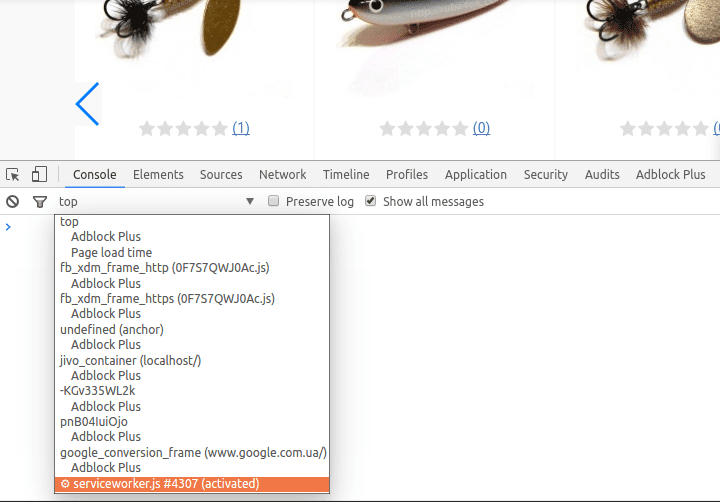
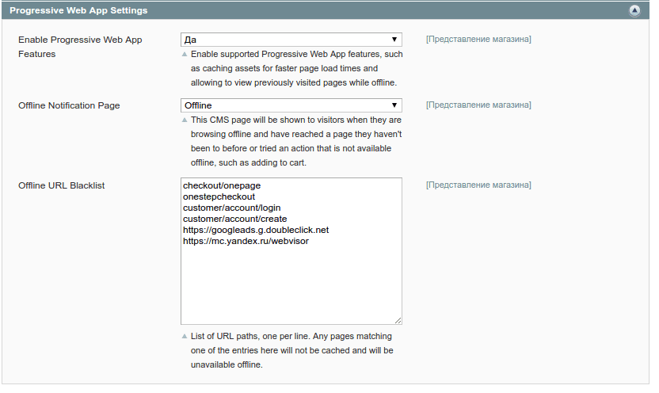

[Progressive Web Applications](https://developers.google.com/web/progressive-web-apps/) - это новый подход для создания Single Page Applications, с поддержкой offline режима. Такие сайты грузятся со скоростью обычных десктопных программ.

Максимальной пользы от PWA получить у нас не получится, поскольку пришлось бы переписать множество кода. Но даже в таком случае, можно кэшировать статьи из блога, все картинки, JavaScript и CSS файлы. Есть правда одно ограничение, Service Worker, который является частью нового стандарта, работает только на localhost домене или же на доменах с SSL поддержкой (или другими словами сайтами с поддержкой HTTPS). Но для моих эксперементов это подходит.

## Что же такое Service Worker?

Service Worker на самом деле просто JavaScript файл, который браузер запускает отдельным процессом (т.е., веб страницы никак не могут взаимодействовать с этим скриптом на прямую). Основная идея этого скрипта - это позволить перехватить все запросы и дополнительно их обработать, в самом простом случае кэшировать. Это в конечном итоге позволят использовать закэшированные файлы, для просмотра сайта на offline устройстве или в случае если сайт упал.

До Service Worker-а был стандарт, который называется [AppCache](https://www.html5rocks.com/en/tutorials/appcache/beginner/). Хотя он и позволял кэшировать файлы для использования в offline режиме, но также имел и ряд серьезных ограничений. Поэтому и был полностью заменен на Service Worker.

Стоит упомянуть несколько важных вещей:

*   Service Worker не имеет доступа к DOM напрямую. Но страницы связанные с Service Worker скриптом, могут обмениваться сообщениями с ним при помощи метода postMessage, получать какой-то результат и в соответствии с этим обновлять DOM.
*   Service Worker - это программируемый сетевой прокси, который позволяет перехватывать любые запросы с сайта и обрабатывать их как угодно
*   Он может быть остановлен, если не используется, и перезапущен позже, так что нельзя полагаться на глобальное состояние скрипта. Если есть информация, которую нужно сохранить между перезапусками, то Service Worker имеет доступ к [IndexedDB API](https://developer.mozilla.org/en-US/docs/Web/API/IndexedDB_API)
*   Service Worker построен на Promise-ах, так что без знаний как правильно использовать последние, написать скрипт будет непросто
*   Service Worker использует новый [Fetch API](https://developer.mozilla.org/en-US/docs/Web/API/Fetch_API) стандарт

## Как зарегистрировать Service Worker

Чтобы запустить скрипт, его нужно зарегистрировать с любой страницы сайта. Следующий код определяет поддерживает ли браузер Service Worker-a и если да, то указывает где находится скрипт:

```javascript
if ('serviceWorker' in navigator) {
  window.addEventListener('load', function() {
    navigator.serviceWorker.register('/serviceworker.js').then(function(registration) {
      console.log('ServiceWorker registration successful with scope: ', registration.scope);
    }, function(error) {
      console.log('ServiceWorker registration failed: ', error);
    });
  });
}
```

Функцию navigator.serviceWorker.register можно вызывать сколько угодно раз, браузер сам проверит был ли запущен этот скрипт ранее или нет. Также стоит обратить внимание, на то что worker находится в корне сайта, поэтому он будет обрабатывать все сетевые запросы. Если поместить скрипт например в папку media/, то он будет обрабатывать только те запросы, которые начинаются с /media.

Проверить был ли запущен worker в браузере Chrome, можно перейдя по ссылке chrome://inspect/#service-workers , там же его можно и остановить.

## Цикл жизни Service Worker-a

Service Worker оживет в момент, когда пользователь впервые зашел на сайт. Фаза оживания начинается с события install, в этом событии рекомендуют кэшировать любые статические ресурсы. Если в этот момент сайт будет недоступен или же по любым другим причинам worker не сможет закэшировать указанные URL, то он не запустится. Но Вы не переживайте, он попробует это сделать еще, но чуть позже (на сколько позже документация умалчивает). Например, это то что я укажу закэшировать для Magento:

```javascript
function updateStaticCache() {
    return caches.open(version)
        .then(cache => {
            return cache.addAll([
                offlinePageUrl,
                '/'
            ]);
        });
}

self.addEventListener('install', event => {
    event.waitUntil(
        updateStaticCache()
    );
});
```

В случае же успеха, запускается фаза activate. В это время рекомендуют удалить старый кэш

```javascript
function clearOldCaches() {
    return caches.keys().then(keys => {
        return Promise.all(
            keys
                .filter(key => key.indexOf(version) !== 0)
                .map(key => caches.delete(key))
        );
    });
}

self.addEventListener('activate', event => {
    event.waitUntil(
        clearOldCaches()
            .then(() => self.clients.claim())
    );
});
```

Потом Service Worker переходит в режим ожидания сообщений fetch или message. fetch - вызывается на любой сетевой запрос, а message предназначен для любого общения между воркером и основной страницей. В данном случае меня больше интересует fetch, потому что именно в нем я и буду кэшировать все запросы.

```javascript
self.addEventListener('fetch', event => {
    const request = event.request;

    if (request.method !== 'GET') {
        return;
    }

    if (isHtmlRequest(request)) {
        event.respondWith(
            fetchAndCache(request)
                .catch(() => {
                    return caches.match(request)
                        .then(response => {
                            if (!response && request.mode == 'navigate') {
                                return caches.match(offlinePage);
                            }
                            return response;
                        });
                })
        );
    } else {
        event.respondWith(
            caches.match(request)
                .then(response => response || fetchAndCache(request))
        );
    }
});
```

В данном примере я кэширую только GET запросы и также разделяю логику обработки HTML страниц и всех других запросов: если приходит запрос на HTML страницу, то пробуем ее запросить из сервера и кэшировать, если я в offline, то взять из кэша, и для всего другого сначала попробовать взять с кэша, если там пусто, то запросить из сервера и закэшировать. Логика достаточно простая, но для полноты картины приведу код всех функций, которые используются в примере выше:

```javascript
function isHtmlRequest(request) {
    return request.headers.get('Accept').indexOf('text/html') !== -1;
}

function isBlacklisted(url) {
    return urlBlacklist.some(bl => url.indexOf(bl) === 0);
}

function isCachableResponse(response) {
    return response && response.ok;
}

function fetchAndCache(request) {
    return fetch(request)
        .then(response => {
            if (!isCachableResponse(response) || isBlacklisted(request.url)) {
                return response;
            }

            const copy = response.clone();
            return caches.open(version)
                .then(cache => cache.put(request, copy))
                .then(() => response);
        })
}
```

## Как отладить Service Worker?

Отладить worker очень просто. Каждый раз когда браузер зайдя на страницу, браузер запросит скрипт worker и если в скрипте помялся хотя бы 1 байт, то он остановит старый и запустит новый.

Для отладки скрипта можно использовать Chrome Developers Tools. На странице где он запущен, откройте devtools и фильтре по фрэймах появится новое значение "serviceworker".



Дальше просто пользуется панелью как обычно. Так же можно перейти по ссылке chrome://inspect/#service-workers и нажать на ссылку Inspect для соответствующего воркера.

## Интеграция Service Worker в Magento

В Magento уже есть [готовый модуль](https://github.com/meanbee/magento-meanbee-pwa), который все сделает за нас. Так что скачиваем, копируем в папку с Magento и обновляем кэш.

Этот модуль позволяет:

*   настраивать Service Worker через админку
*   кэшировать рисунки, файлы CSS, JavaScript и шрифтов
*   кэширование каталога, CMS страниц и блога
*   отобразить страницу с объяснением, если пользователь перешел по URL, который не был кэширован

Все это увеличивает скорость последующей загрузки сайта, а так же позволяет просматривать уже посещенные страницы без подключения к интернету, при условиях плохого покрытия сети и даже когда Ваш сервер упал или находится на обслуживании. Так же это снимет нагрузку с Вашего сервера, что тоже может быть очень важным при большом количестве трафика.

Основные настройки можно найти в Система > Конфигурация > Общие > Интернет > Progressive Web App Settings. В настройки игнорирования, я также добавляю URL на разную аналитику



К сожалению, работать с модулем не очень удобно с выключенным кэшом для блоков (автор модуля решил использовать PHP функцию time() для создания версии кэша). Поэтому я изменил одну строчку кода внутри метода getVersion()

```php
<?php

class Meanbee_PWA_Block_Serviceworker_Js extends Mage_Core_Block_Template
{
    const VERSION = "v1";

    /**
     * Get the service worker version string.
     *
     * @return string
     */
    public function getVersion()
    {
        return implode("-", array(
            static::VERSION,
            md5_file($this->_viewDir . DS . $this->getTemplateFile()), // changed
        ));
    }

    //.....
}
```

Вместо вызова функции time() я использую md5\_file(), которая возвращает md5 hash для файла, и пока файл не изменится, то не изменится и его md5 hash, и соответственно будет использоваться одна версия кэша. Для ротации это не очень удобно, но позволяет работать с отключенным кэшом для блоков в Magento. Но как, я уже говорил в статье [о HTTP кэшировании](../../devops/2017-05-10_vklyuchaem-http-keshirovanie-v-nginx-i-apache2) - нужно чтобы каждый ресурс имел уникальный URL, и если меняется ресурс/файл, то должен изменится и его URL, что позволит получить максимум от кэширования.
