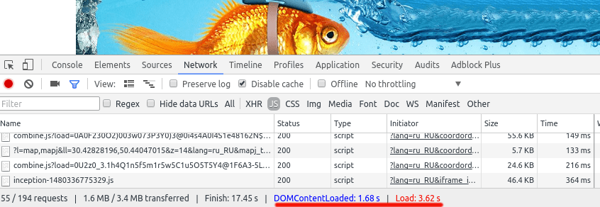
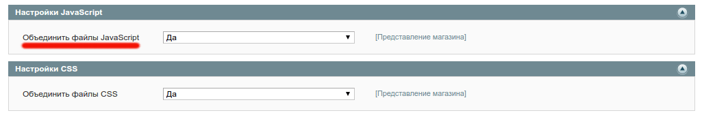
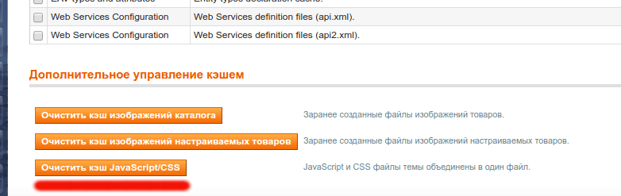
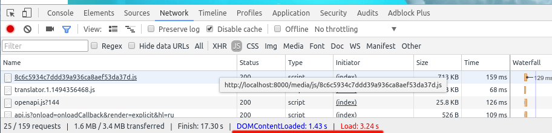
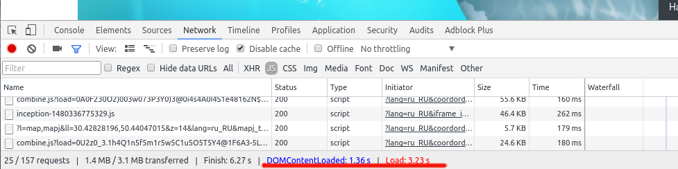

Давайте поразмыслим, что нужно сделать чтобы увеличить скорость загрузки страницы:

1.  Уменьшить количество запросов на сервер.
2.  Уменьшить размер страницы.
3.  [Включить HTTP кэширование](/linux/show-104-vklyuchaem-http-keshirovanie-v-nginx-i-apache2) на веб-сервере.

Для начала замеряем исходную ситуацию. Магазин без каких либо оптимизаций:



К счастью в Magento есть настройки, которые могут уменьшить количество запросов на сервер при помощи объединения JavaScript (в данном случае их 194!). Давайте разберемся как это сделать.

## Объединяем JavaScript файлы

Все что нужно сделать - это зайти в настойки и установить флажок с "Нет" на "Да". Значит открывайте админку и в меню перейдите в Система > Конфигурация > Расширенные > Для разработчика > Настройки JavaScript и установите "Объединить JavaScript файлы" в значение "Да".



Потом обязательно проверьте консоль через Developer Tools, чтобы убедится, что все хорошо и в Вашем JavaScript коде нет синтаксических ошибок (чтобы избежать проблем, будьте внимательны при написание js кода, ставьте точки с запятыми где нужно).

В случае когда будет нужно внести правки в скрипты, то в админке откройте страницу Система Управление Кэшем и нажмите кнопку "Очистить кэш JavaScript/CSS".



Обычно после этого я захожу на главную страницу магазина, чтобы Magento собрал заново все файлы в один. Сборка может занят некоторое время (5-10 секунд) и лучше подождать самому, нежели это сделает клиент магазина :). Во всех последующих случаях файл берется с кэша.



Такое простое изменение позволило сэкономить до 300 мс во время загрузки сайта (в конкретном случае на 250 мс)! Так же уменьшилось количество запросов на сервер до 159. Давайте не будем останавливается на этом.

## Минифицируем объединенный JavaScript

Процесс объединения файлов проходит через класс Mage\_Core\_Model\_Design\_Package. В нем есть метод getMergedJsUrl, именно его я и собираюсь перезаписать.

Во первых, нужно создать свой класс в отдельном модуле, который наследуется от Mage\_Core\_Model\_Design\_Package, назовем его FI\_Optimisation\_Model\_Design\_Package:

```php
<?php
class FI_Optimisation_Model_Design_Package extends Mage_Core_Model_Design_Package
{
}
```

Потом [перезапишем Magento класс своим при помощи rewrite правил](/php_and_somethings/show-63-magento-modeli-ot-a-do-ya-sobytiya-i-rewrite-klassov). Для этого в config.xml модуля прописываем:

```xml
<config>
    <!-- .... -->
    <global>
        <models>
            <fi_optimisation>
                <class>FI_Optimisation</class>
            </fi_optimisation>
            <core>
                <rewrite>
                    <design_package>FI_Optimisation_Model_Design_Package</design_package>
                </rewrite>
            </core>
        </models>
    </global>
    <!-- .... -->
</config>
```

Таким образом я указал, что нужно использовать мой класс, а не стандартный в Magento. Чистите кэш и идем дальше.

Как я уже писал выше, нужно переопределить метод getMergedJsUrl. Т.е., сначала объединяем все файлы, а уже потом их минифицируем. Минификация может занять, некоторое время, поэтому я буду это делать в отдельном процессе, при помощи функции exec в PHP. Пока отдельный процесс работает, я не хочу блокировать работу пользователя с магазином, поэтому в этот период буду отдавать просто объединенный файл.

Я провел достаточно много времени в поисках минификатора написанного на PHP, но все они либо имеют много зависимостей, которые не хочется тащить в проект, либо работают нестабильно. Поэтому для минификации я буду использовать [uglifyjs](https://www.npmjs.com/package/uglify-js), который установлю глобально при помощи [npm](https://docs.npmjs.com/getting-started/what-is-npm).

```bash
$ npm install -g uglify-js
```

Вы же можете использовать то, что больше нравится Вам.

Добавляем логику в класс, который создали ранее:

```php
class Freaks_Ruba4ok_Model_Design_Package extends Mage_Core_Model_Design_Package
{
    public function getMergedJsUrl($files)
    {
        $url = parent::getMergedJsUrl($files);

        if (!$url) {
            return $url;
        }

        $minUrl = str_replace('.js', '.min.js', $url);
        $minPath = str_replace(Mage::getBaseUrl('media'), Mage::getBaseDir('media') . DS, $minUrl);

        if (!file_exists($minPath)) {
            $this->_minifyJs(str_replace('.min.js', '.js', $minPath), $minPath);
            return $url;
        }

        return filesize($minPath) === 0 ? $url : $minUrl;
    }

    protected function _minifyJs($originalPath, $path)
    {
        file_put_contents($path, '');
        $binPath = 'uglifyjs';
        $uglify = $binPath . ' ' . escapeshellarg($originalPath)
            . ' --compress --screw-ie8 '
            . ' -o ' . escapeshellarg($path)
            . ' > /dev/null 2>&1 &';

        exec($uglify);
    }
}
```

Давайте разберемся, что здесь происходит.

Метод getMergedJsUrl вызывает, родительскую логику для объединения JavaScript в один файл. Потом проверяется если URL, который был возвращен пустой, то его же и возвращаем (скорее всего объединение выключено). В противном случае, создаем URL и путь к минифицированному файлу, если такого файла нет, нужно запустить процесс по уменьшению размера. В случае когда он есть, нужно проверить пустой ли он, если пустой значит процесс не закончился и нужно вернуть обычный файл, а если не пустой - значит отдаем этот же файл.

В методе \_minifyJs, я использовал "&" для того, чтобы PHP не ждал завершения работы этого процесса. На сколько мне известно этот метод не будет работать на Windows серверах, но благо большинство людей используют Linux :) Все ошибки и информация по процессу минификации отправляется в "никуда", так как нет нужды это куда либо писать. Более [детально о работе с ошибками в Shell](/linux/show-50-uchimsya-programmirovat-v-shell-obrabotka-oshibok) я писал в другой статье.

После замеров получилось, что удалось сэкономить еще до 100 мс (в конкретном случае на 70 мс).



## Заключение

Конечный результат очень радует, потому что получилось оптимизировать страницу аж на целых 350 мс, это очень много!

Аналогичный процесс можно провести и для CSS файлов и тогда сайт будет грузится еще быстрее, но это уже совсем другая тема :)