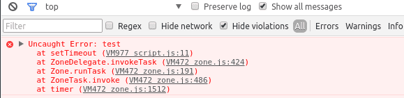
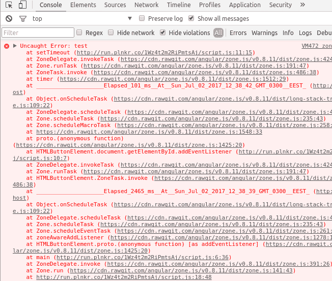

Zone - это контекст выполнения, который сохраняется между выполнением асинхронных задач и позволяет наблюдать и контролировать выполнение кода внутри зоны.

Прочитав это в первый раз у меня был вопрос: зачем? И в последствии поиски привели меня к нескольким ответам:

*   Zone удобная для отладки (зона может показать stack trace начиная с самого начала, т.е. можно увидеть даже код, который запустил асинхронную операцию!)
*   Zone полезная для фреймворков (с ее помощью можно понимать, когда все асинхронные операции закончены и можно отображать пользовательский интерфейс)
*   Zone полезна для отслеживания и автоматического удаления ресурсов, которые сохраняются между асинхронными операциями
*   Zone-ы являются составными

Все это я разберу более подробно, но сначала давайте разберемся с общими понятиями

## Входим в пространство Zone

Для того, чтобы использовать Zone, нужно подключить ее, преждевременно скачав или же [использовав CDN](https://cdn.rawgit.com/angular/zone.js/v0.8.11/dist/zone.js). Для своих тестов я буду использовать [plunker](http://plnkr.co).

И так, после подключения zone.js, появляется новая глобальная функция конструктор Zone. Также, сразу создается корневая зона, в которой по умолчанию выполняются все асинхронные операции и она доступна как readonly свойство Zone.current (или же Zone.root). Каждая зона имеет свойство name, которое используется исключительно в целях отладки. Корневая зона имеет имя <root>.

Зоны могут порождать новые зоны. Рассмотрим пример:

```javascript
const rootZone = Zone.current
const newZone = rootZone.fork({ name: 'new' })

console.log(rootZone.name, newZone.parent.name) // <root> <root>

newZone.run(() => {
  console.log(Zone.current.name, Zone.current === newZone) // new true
})
```

Метод fork создает новую зону, она связана с родительской зоной при помощи свойства parent (зона не имеет доступа к дочерним зонам).

Как видно из примера внутри newZone.run Zone.current ссылается на newZone. Соответственно из этого делаем вывод, что единственный способ изменить Zone.current - это вызвать метод run на одной из зон (Zone.current readonly, если Вы вдруг забыли).

Теперь давайте попробуем запустить асинхронную операцию, внутри зоны:

```javascript
Zone.current.fork({ name: 'new' }).run(() => {
  setTimeout(() => {
    console.log(Zone.current.name) // new
  }, 100)
  
  Zone.current.fork({ name: 'anotherOne' }).run(() => {
    setTimeout(() => {
      console.log(Zone.current.name) // anotherOne
    }, 50)
  })
})
```

Долгое время один вопрос не давал мне покоя: как так, глобальное значение Zone.current разное для разных асинхронных операций? Ведь после вызова метода run, Zone.current перезаписывается новым значением. Но этот пример работает, как ожидается.

А ответ на самом деле очень прост: оказывается, что все асинхронные операции запоминают зону, в которой они были вызваны и потом вызывают соответствующий callback в той же зоне. Выглядит это примерно так:

```javascript
function setTimeout(callback, timeout) {
  const currentZone = Zone.current

  return originalSetTimeout(() => currentZone.run(callback), timeout)
}

Zone.current.fork({ name: 'new' }).run(() => {
  setTimeout(() => {
    console.log(Zone.current.name)
  }, 100)
})
```

ОК, скажете Вы, но ведь мы не пишем никаких setTimeout функций, как тогда zone.js знает, что в браузере произошло событие, или пришел ответ от сервера? И здесь ответ очень прост: zone.js патчит [почти все асинхронные функции и методы доступные в браузере](https://github.com/angular/zone.js/blob/master/STANDARD-APIS.md#browser).

В это время, любой себя уважающий программист назвал бы это все, большим костылем и он был бы прав :) Но команда Angular пошла дальше и предложила внедрить Zone.js как часть [нового JavaScript стандарта](https://domenic.github.io/zones/). Так что этот костыль со временем может стать вполне реальным инструментом, который нужно уметь использовать.

Здесь важно понимать, что асинхронная функция запоминает зону в момент регистрации callback-а. Давайте рассмотрим пример с Promise:

```javascript
const delay = new Promise((resolve) => {
  setTimeout(resolve, 100)
})

delay.then(() => {
  console.log(Zone.current.name) // <root>
})

Zone.current.fork({ name: 'test' }).run(() => {
  delay.then(() => {
    console.log(Zone.current.name) // test
  })
}) 
```

Как видно из примера, один и тот же Promise имеет 2 callback-а, которые запускаются в тех зонах, в которых они были добавлены. Функция resolve/reject не влияет на то в какой зоне будут запущены callback-и!

Разобрав эти детали, мы теперь можем вернутся и рассмотреть способы применения указанные в начале статьи.

## Длинный stack trace

Создатели zone.js утверждают, что при помощи зон можно получить исчерпывающий stack trace, который сохраняется даже между асинхронными операциями. Для того, чтобы это проверить давайте напишем маленький скрипт. Также нам понадобится подключить dist/long-stack-trace-zone.js файл, который предоставляет longStackTrace функциональность.

```javascript
function main() {
  let counter = 0
  document.getElementById('click-me').addEventListener('click', () => {
    counter++
    
    if (counter > 5) {
      setTimeout(() => {
        throw new Error('test')
      }, 100)
    }
  })
}

main()
```

И в HTML добавим просто кнопку с id="click-me". Идея в том, что после 5 нажатий скрипт асинхронно выбросит ошибку. Давайте запустим этот код и попробуем нажать на кнопку 5 раз:



А теперь запустим тот же код, но с длинным stack trace:

```javascript
Error.stackTraceLimit = Infinity
Zone.current.fork(Zone.longStackTraceZoneSpec).run(main)
```

И получили:



Как видите в последнем случае мы имеем куда больше информации, stack trace показывает, что была запущена зона, потом установлен event listener, в котором был установлен таймер и что ошибка произошла именно в таймере. Согласитесь, это очень удобно для отлаживания и понимания откуда пришла ошибка (если не брать во внимание ту часть, которая относится к стеку выполнения внутри zone.js).

## Отслеживание асинхронных задач

До сих пор мы рассматривали как создавать и разветвлять зоны, теперь давайте перейдем к более интересным возможностям - отслеживанию асинхронных задач. Но для начала немного теории.

Во-первых, в zone.js есть понятие "задача". Существует [3 вида задач](https://github.com/angular/zone.js/blob/master/doc/task.md):

1.  **MicroTask**: задача, которая выполнится в первую очередь. Обычно это не отменяемая задача, которая выполняется только один раз (Promise.then).
2.  **MacroTask**: эти задачи гарантированно будут выполняться хотя бы один раз и могут быть отменены (setTimeout, setInterval).
3.  **EventTask**: задачи событий аналогичны макрозадачам, за исключением того, что они могут никогда не запустится (addEventListener и подобные)

Во-вторых, объект, который передается в метод zone.fork называется zone spec. Zone spec может перехватить выполнение асинхронной операции или же всей зоны. Существует [несколько хуков](https://github.com/angular/zone.js/blob/master/dist/zone.js.d.ts#L288):

*   **onInvoke**: вызывается в момент вызова zone.run (можно отслеживать время выполнения каждой зоны)
*   **onFork**: вызывается в момент вызова zone.fork
*   **onScheduleTask**: вызывается при создании новой задачи любого типа (new Promise, XHR, setTimeout, т.д.)
*   **onInvokeTask**: вызывается во время выполнения задачи
*   **cancelTask**: вызывается если задача отменяется (cancelTimeout, xhr.abort, т.д.)
*   **onHasTask**: вызывается каждый раз когда меняется количество задач (задача создается или заканчивается)
*   **onHandleError**: вызывается когда в зоне выбрасывается исключение

onHandlerError как раз и используется в longStackTraceZoneSpec, благодаря чему и создается составной, длинный stack trace.

## Предотвращение нескольких нажатий на кнопку

onHasTask хук, можно использовать для блокировки кнопки после того как был послан запрос на сервер. Для этого нужно создать OncePerTask zone spec.

```javascript
class OncePerTaskSpec {
  constructor() {
    this.hasTasks = false
  }
  
  onHasTask(delegate, currentZone, targetZone, hasTask) {
    delegate.hasTask(targetZone, hasTask)
    this.hasTasks = hasTask.macroTask || hasTask.microTask
  }
}
```

Теперь напишем функцию, которая возвращает wrapper функцию, что вызывает переданный event listener только один раз и только если в его зоне нет задач в ожидании.

```javascript
function callOncePerTask(listener) {
  const spec = new OncePerTaskSpec()
  const zone = Zone.current.fork(spec)
  
  return (...args) => {
    return zone.run(() => {
      if (!spec.hasTasks) {
        return listener(...args)
      }
    })
  }
}
```

Теперь это можно использовать для блокировки вызова event listener-ов пока выполняются асинхронные операции, такие как запрос на сервер, таймеры и прочие.

```javascript
function main() {
  const form = document.forms.user
  let i = 0
  
  form.addEventListener('submit', event => event.preventDefault(), false)
  form.addEventListener('submit', callOncePerTask(event => {
    form.name.nextElementSibling.textContent = ++i
    
    const originalText = form.save.textContent
    form.save.textContent = 'Loading...'
    
    setTimeout(() => {
      localStorage.name = form.name.value
      form.save.textContent = originalText
    }, 1500)
  }), false)
  
  setTimeout(() => console.log('this does not block clicks on Save button'), 10000)
}
```

Рабочий [пример можно посмотреть на plnkr.co](http://embed.plnkr.co/AvggGgXb4VwuGtfTn3My/). Аналогичным способом protractor проверяет закончена отрисовка страницы или нет (NgZone предоставляет информацию о задачах в ожидании на уровне всего приложения).

## Автоматического очищение подписок

Zone.js также может помочь с автоматическим удалением event-listener-ов. Например, можно создавать отдельную зону для каждого компонента, запускать его lifecycle методы внутри этой зоны и на этапе уничтожения вызвать функцию которая удалит все event listener-ы. И больше никогда не беспокоится об очищении глобального состояния (event listener-ов на body или html элемента).

Мы рассмотрим более упрощенный пример: я создам 3 кнопки - Events On, Events Off и Click me. При нажатии на первую будут включатся 2 последние кнопки, при нажатии на вторую - выключаются 2 последние кнопки и при нажатии на последнюю будет отображаться счетчик нажатий.

Для начала напишем TrackEventListenerSpec класс, который будет собирать все EventTask-и и предоставлять метод cleanup для очистки всех подписок.

```javascript
class TrackEventListenerSpec {
  constructor() {
    this.name = this.constructor.name
    this.properties = {
      eventTracker: this
    }
    this.tasks = []
  }
  
  onScheduleTask(delegate, currentZone, targetZone, task) {
    if (task.type === 'eventTask') {
      this.tasks.push(task)
    }
    
    return delegate.scheduleTask(targetZone, task)
  }
  
  cleanup() {
    this.tasks.forEach(task => Zone.current.cancelTask(task))
    this.tasks.length = 0
  }
}
```

Создаем HTML:

```xml
<button id="events-on">Events On</button>
<button id="events-off">Events Off</button>
    
    
<div style="margin-top: 20px">
  <button id="click-me">Click me</button>
  Counter: <span>0</span>
</div>
```

И запускаем зону:

```javascript
function main() {
  const btn = document.getElementById('click-me')
  let i = 0
  
  btn.addEventListener('click', () => {
    btn.nextElementSibling.textContent = ++i
  }, false)
  
  document.getElementById('events-off').addEventListener('click', function() {
    this.previousElementSibling.disabled = false
    Zone.current.get('eventTracker').cleanup()
  })
}

document.getElementById('events-on').addEventListener('click', function() {
  this.disabled = true
  Zone.current.fork(new TrackEventListenerSpec()).run(main)
})
```

Event listener на кнопку Events On я добавляю за пределами зоны, которая следит за всеми подписками, потому что эта кнопка должна работать всегда. Если бы я добавил подписчика внутри зоны, то при нажатии на кнопку Events Off, кнопка Events On тоже перестала бы работать. Рабочий пример такого механизма можно найти [здесь](http://embed.plnkr.co/hoTCEtPRNBVnrYW0BG43/).

## Составные Zone-ы

Zone-ы являются составными, потому что дочерняя зона может переопределять часть поведения родительской. Например, родительская зона может обрабатывать все ошибки, а дочерние зоны каким-то образом обрабатывать задачи. Логика здесь работает приблизительно как и в наследовании, если зона не определяет собственного обработчика, то будет вызван обработчик по умолчанию или же тот, который определен в родительской зоне. Также во все хуки первым аргументом передается parentZoneDelegate, который по сути является аналогом super в ES6 классах.

Давайте рассмотрим пример с обработкой ошибок, где все ошибки кроме UserError обрабатываются родительской зоной:

```javascript
class UserError extends Error {
}

Zone.current.fork({ 
  onHandleError(parent, currentZone, targetZone, error) {
    document.getElementById('all-messages').textContent += error.message + '\n'
  }
}).run(() => {
  Zone.current.fork({ 
    onHandleError(parent, currentZone, targetZone, error) {
      if (error instanceof UserError) {
        document.getElementById('user-messages').textContent += error.message + '\n'
      } else {
        parent.handleError(targetZone, error)
      }
    }
  }).run(() => {
    document.getElementById('gen-error').addEventListener('click', () => {
      throw new Error('general error ' + Date.now())
    }, false)
    
    document.getElementById('user-error').addEventListener('click', () => {
      throw new UserError('user error ' + Date.now())
    }, false)
  })
})
```

В конкретном примере, ошибки которые являются экземплярами класса UserError, отображаются в блоке "user-messages", все другие ошибки обрабатываются родительской зоной. В конкретном случае, ошибки отображаются в блоке "all-messages". Рабочий пример можно посмотреть [здесь](http://embed.plnkr.co/ocPxH2qYxzg69aOOipXW/).

## Заключение

В Интернете достаточно мало информации о Zone.js, надеюсь моя статья хоть немного пролила свет на темном пути изучения Angular 2+ :) Если остались вопросы - задавайте их в комментариях.

**По материалам**:

*   [Zone Primer](https://docs.google.com/document/d/1F5Ug0jcrm031vhSMJEOgp1l-Is-Vf0UCNDY-LsQtAIY/edit#)
*   [Zone.js Typescript definition](https://github.com/angular/zone.js/blob/master/dist/zone.js.d.ts)