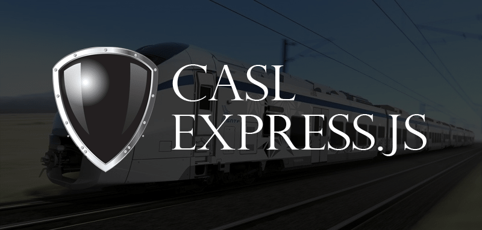

В современных приложениях, которые поддерживают аутентификацию, мы часто хотим изменить то, что видимо для пользователя, в зависимости от его роли. Например, гостевой пользователь может видеть статью, но только зарегистрированный пользователь или администратор видит кнопку для удаления этой статьи.

Управление этой видимостью может стать полным кошмаром с увеличением количества ролей. Вероятно, вы уже писали или видели код вроде этого:

```javascript
if (user.role === ADMIN || user.auth && post.author === user.id) {
  res.send(post)
} else {
  res.status(403).send({ message: 'You are not allowed to do this!' })
}
```

Такой код распространяется по приложению и обычно становится большой проблемой, когда заказчик изменяет требования или просит добавить дополнительные роли. В конце концов вам нужно пройти все такие _if_\-s и добавить дополнительные проверки.

В этой статье я покажу альтернативный способ реализации управления разрешениями в [Expressjs](https://expressjs.com/) API с помощью библиотеки, которая называется [CASL](https://github.com/stalniy/casl). Она намного упрощает управление правами доступа и позволяет переписать предыдущий пример на что-то вроде этого:

```javascript
if (req.ability.can('read', post)) {
  res.send(post)
} else {
  res.status(403).send({ message: 'You are not allowed to do this!' })
}
```

**Впервые слышете о CASL?** Рекомендую прочесть [Что такое CASL?](/show-133-chto-takoe-casl-ili-kak-vnedrit-proverku-prav-dostupa-v-vashe-prilozhenie)

## Демо-приложение

В качестве тестового приложения я сделал достаточно простой [REST API для блога](https://github.com/stalniy/casl-express-example). Приложение состоит из 3 сущностей (User, Post и Comment) и 4 модулей (по одному модулю для каждой сущности и еще один - для проверки авторизации). Все модули можно найти в папке _src/modules_. Приложение использует [mongoose](http://mongoosejs.com/) модели, аутентификацию [passportjs](http://www.passportjs.org/) и авторизацию (или проверку прав доступа) на базе CASL. При помощи API, пользователь может:

*   читать все статьи и комментарии
*   создавать пользователя (т.е., регистрироваться)
*   управлять собственными статьями (создавать, редактировать, удалять), если авторизован
*   обновлять персональную информацию, если авторизован
*   управлять собственными комментариями, если авторизован

Чтобы установить это приложение, просто склонируйте его из [github](https://github.com/stalniy/casl-express-example) и запустите _npm install_ и _npm start_. Также нужно запустить MongoDB сервер, приложение подключается к _mongodb://localhost:27017/blog_. После того, как все будет готово, можно немного поиграться, а чтобы было веселее, заимпортите базовые данные с папки _db/_:

```bash
mongorestore ./db
```

В качестве альтернативы, Вы можете следовать инструкциям в [README файле проекта](https://github.com/stalniy/casl-express-example) или использовать [мою Postman коллекцию](https://www.getpostman.com/collections/a39c622e1c9401e32c51).

## В чем фишка?

Во-первых, большим плюсом CASL является, то что он позволяет определить права доступа в одном месте, для всех пользователей! Во-вторых, CASL концентрирует внимание не на том кем является пользователь, а на том что он может делать, т.е. на его возможностях. Это позволяет распределять эти возможности разным ролям или группам пользователей без лишних усилий. Это значит, что мы можем прописать права доступа для авторизованных и не авторизованных пользователей:

```javascript
const { AbilityBuilder, Ability } = require('casl')

function defineAbilitiesFor(user) {
  const { rules, can } = AbilityBuilder.extract()

  can('read', ['Post', 'Comment'])
  can('create', 'User')

  if (user) {
    can(['update', 'delete', 'create'], ['Post', 'Comment'], { author: user._id })
    can(['read', 'update'], 'User', { _id: user._id })
  }

  return new Ability(rules)
}

const ANONYMOUS_ABILITY = defineAbilitiesFor(null)

module.exports = function createAbilities(req, res, next) {
  req.ability = req.user.email ? defineAbilitiesFor(req.user) : ANONYMOUS_ABILITY
  next()
}
```

Давайте теперь разберем код написанный выше. В функции _defineAbilitiesFor(user)_ создается экземпляр _AbilityBuilder_\-a, его метод extract разбивает этот объект на 2 простые функции _can_ и _cannot_ и массив _rules_ (в данном коде cannot не используется). Далее при помощи вызовов функции _can_ мы определяем, что пользователь может делать: первым аргументом передает действие (или массив действий), вторым аргументом - тип объекта над которым проводится действие (или массив типов) и третьим необязательным аргументом можно передать объект условий. Объект условий используется при проверке прав доступа на экземпляре класса, т.е. он проверяет равняется ли свойство _author_ объекта _post user.\_id_, если не равняется, то вернется _false_, в противном случае _true_. Для большей наглядности приведу пример:

```javascript
// Post is a mongoose model
const post = await Post.findOne()
const user = await User.findOne()

const ability = defineAbilitiesFor(user)

console.log(ability.can('update', post)) // если post.author === user._id, то вернется true
```

Далее при помощи _if (user)_ мы определяем права доступа для авторизованного пользователя (если пользователь не авторизован, то мы не знаем кто он и не имеем объекта с информацией о пользователе). В конце возвращаем экземпляр класса _Ability_, с помощь которого мы и будем проверять права доступа.

Далее создаем константу _ANONYMOUS\_ABILITY_, она является инстансом _Ability_ класса для не авторизованных пользователей. В конце, экспортируем express middleware, которое отвечает за создание _Ability_ экземпляра для конкретного пользователя.

## Тестируем API

Давайте протестируем, что у нас получилось используя [Postman](https://www.getpostman.com/). Для начала нужно получить accessToken, для этого отправьте запрос

```bash
POST /session

{
  "session": {
    "email": "casl@medium.com",
    "password": "password"
  }
}
```

В ответ получите что-то вроде этого:

```javascript
{ "accessToken": "...." }
```

Этот токен нужно вставить в _Authorization header_ и отправлять со всеми последующими запросами.

Теперь давайте попробуем обновить статью

```javascript
PATCH http://localhost:3030/posts/597649a88679237e6f411ae6

{
  "post": {
    "title": "[UPDATED] my post title"
  }
}

200 Ok

{
  "post": {
    "_id": "597649a88679237e6f411ae6",
    "updatedAt": "2017-07-24T19:53:09.693Z",
    "createdAt": "2017-07-24T19:25:28.766Z",
    "title": "[UPDATED] my post title",
    "text": "very long and interesting text",
    "author": "597648b99d24c87e51aecec3",
    "__v": 0
  }
}
```

Все хорошо работает. А что если обновим чужую статью?

```javascript
PATCH http://localhost:3030/posts/59761ba80203fb638e9bd85c

{
  "post": {
    "title": "[EVIL ACTION] my post title"
  }
}

403 Ok

{
  "status": "forbidden",
  "message": "Cannot execute \"update\" on \"Post\""
}
```

Получили ошибку! Как и ожидалось :)

А теперь давайте представим, что для авторов нашего блога мы хотим создать страницу, где они смогут видеть все посты которые они могут обновлять. С точки зрения конкретной логики это несложно, просто нужно выбрать все статьи в которых _author_ равняется _user.\_id_. Но мы ведь уже прописали такую логику при помощи CASL, было бы очень удобно получить все такие статьи из базы без написания лишних запросов, да и если права поменяются, то придется менять и запрос - лишняя работа :).

К счастью, CASL имеет дополнительный npm пакет - [@casl/mongoose](https://github.com/stalniy/casl/tree/master/packages/casl-mongoose). Этот пакет позволяет запрашивать записи из MongoDB в соответствии с определенными правами доступа! Для mongoose этот пакет предоставляет плагин, который добавляет метод _accessibleBy(ability, action)_ в модельку. С помощью этого метода мы и будем запрашивать записи из базы (больше об этом читайте [в документации CASL](https://stalniy.github.io/casl/abilities/database/integration/2017/07/22/database-integration.html "CASL Mongoose") и README файле пакета).

Это именно, то как реализован hander для /posts (я также добавил возможность указывать, для какого действия нужно проверять права доступа):

```php
Post.accessibleBy(req.ability, req.query.action)
```

Так вот, для того чтобы решить задачу описанную ранее, достаточно добавить параметр _action=update_:

```javascript
GET http://localhost:3030/posts?action=update

200 Ok
{
  "posts": [
    {
      "_id": "597649a88679237e6f411ae6",
      "updatedAt": "2017-07-24T19:53:09.693Z",
      "createdAt": "2017-07-24T19:25:28.766Z",
      "title": "[UPDATED] my post title",
      "text": "very long and interesting text",
      "author": "597648b99d24c87e51aecec3",
      "__v": 0
    }
  ]
}
```

**В заключение**

Благодаря CASL у нас есть действительно хороший способ управления правами доступа. Я более чем уверен, что конструкция типа

```javascript
if (ability.can('read', post)) ...
```

намного понятнее и проще чем

```javascript
if (user.role === ADMIN || user.auth && todo.author === user.id) ...
```

При помощи CASL мы можем быть более четкими в отношении того, что делает наш код. Кроме того, такие проверки, безусловно, будут использоваться в другом месте нашего приложения, и именно здесь CASL поможет избежать дублирования кода.

Я надеюсь, Вам было на столько же интересно читать о CASL, на сколько мне было интересно его создавать. [CASL имеет довольно хорошую документацию](https://stalniy.github.io/casl/), Вы наверняка найдете там много полезной информации, но не стесняйтесь задавать вопросы если что в [gitter чате](https://gitter.im/stalniy-casl/casl?utm_source=badge&utm_medium=badge&utm_campaign=pr-badge&utm_content=badge) и добавить звездочку на [гитхабе](https://github.com/stalniy/casl) ;)

**P.S.**: оригинальная статья была опубликована на [Medium.com](https://medium.com/dailyjs/authorization-with-casl-in-express-app-d94eb2e2b73b)